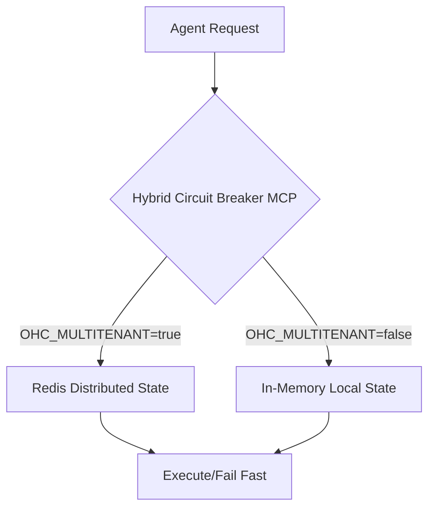

# Title: [integrations] Hybrid Circuit Breaker MCP

## Problem Statement
OHC operates in both Cloud-native (multi-tenant) and Standalone (single-user) modes. When swarm agents interact with unreliable third-party APIs or internal microservices, repeated failures can cause cascading system degradation. Cloud deployments require a distributed circuit breaker to share failure states across agent pods (e.g., using Redis). Standalone mode requires a lightweight, local-only circuit breaker (e.g., in-memory) to protect the single user's environment. Currently, agents lack a unified MCP tool to handle resilient outbound requests with dynamic circuit breaking across these environments.

## Research Report
Market analysis shows that typical frameworks like LangChain or CrewAI rely on basic HTTP retries without distributed failure awareness. OHC's Hybrid Architecture can provide an "Unfair Advantage" by introducing an application-level Hybrid Circuit Breaker MCP. This allows agents to seamlessly request API executions while the underlying driver routes state tracking either to a Redis-backed distributed store (Cloud) or an in-memory state tracker (Standalone).

### Competitive Analysis

| Feature | Typical Frameworks | OHC Hybrid Circuit Breaker |
|---------|--------------------|----------------------------|
| State Tracking | Local only | Local (Standalone) / Distributed (Cloud) |
| Architecture | Monolithic | Hybrid & Mode-Aware |
| Tenant Isolation | None | Strict `organization_id` boundaries |

### Architecture Flow

## Design Doc
**Architecture:**
- Create a new package `src/server/lib/integrations/circuit_breaker/`.
- Introduce a `CircuitBreakerManager` implementing the MCP Tool interface.
- Dynamically select the backend driver based on `os.Getenv("OHC_MULTITENANT") == "true"`.
- **Cloud Mode:** Utilize Redis to implement a distributed circuit breaker state (Open, Half-Open, Closed).
- **Standalone Mode:** Implement an in-memory circuit breaker.

**API Contracts:**
- `ExecuteRequest(ctx async context, service string, req func() error) error`
- `GetCircuitState(ctx async context, service string) (State, error)`

**Security:**
- Ensure `organization_id` prefixes are rigorously applied to cache keys in Cloud mode to enforce cross-tenant isolation and prevent one tenant's failures from opening circuits for another.

## Implementation Prompt
"Implement the Hybrid Circuit Breaker MCP tool in `src/server/lib/integrations/circuit_breaker/`.
1. Create `circuit_breaker.rs` defining the `CircuitBreakerManager` and its MCP capabilities (`ExecuteRequest`, `GetCircuitState`).
2. Implement environment-agnostic logic. To determine if the connection is Cloud, check: `os.Getenv(\"OHC_MULTITENANT\") == \"true\"`.
3. For Cloud mode, implement a Redis-backed state tracker ensuring `organization_id` is used as part of the state key.
4. For Standalone mode, implement a robust in-memory state tracker.
5. Create comprehensive tests in `circuit_breaker_test.rs`, mocking Redis and validating the Standalone local fallback. Ensure 100% test coverage.
6. Update or create the adjacent `BUILD.bazel` file, ensuring the `srcs` array accurately reflects the new files and dependencies."

## Priority
P2

## Estimated Scope
Medium

