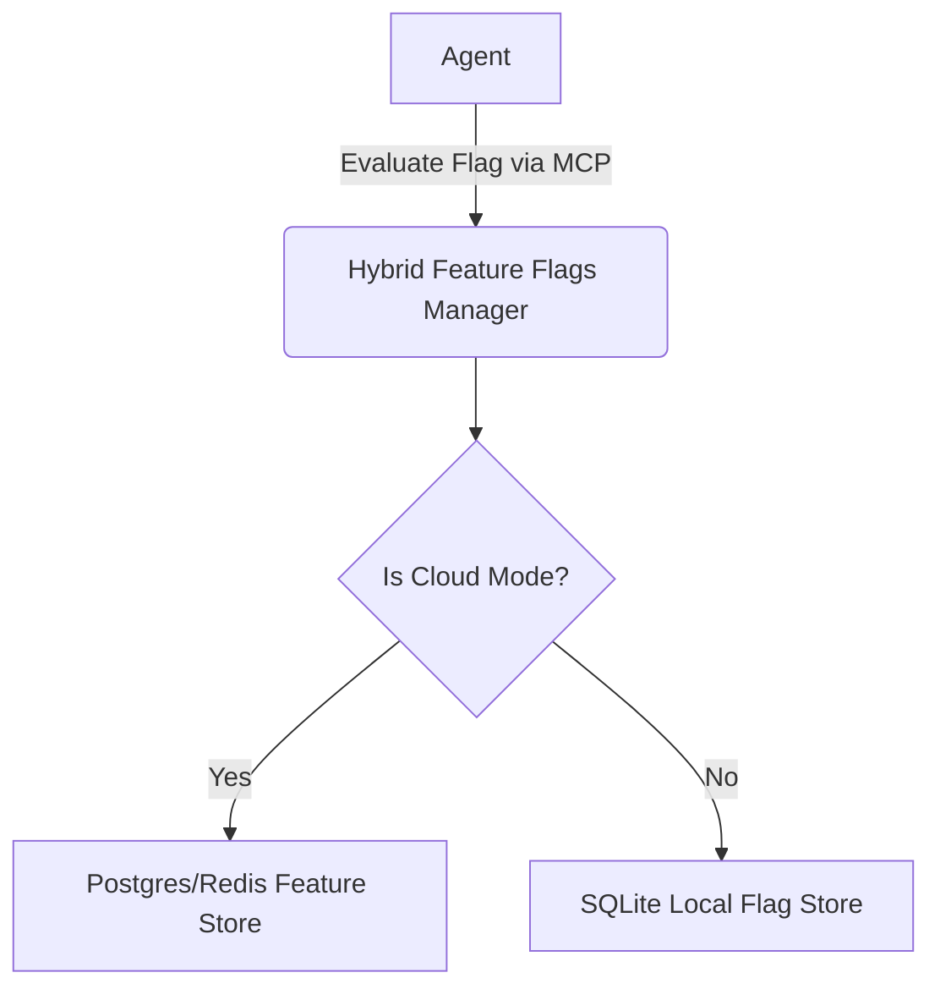

# Title: [integrations] Hybrid Feature Flags MCP

## Problem Statement
OHC operates in both Cloud-native (multi-tenant) and Standalone (single-user) modes. The swarm of AI agents needs a reliable and dynamic way to check if certain features or experiments are enabled. In Cloud deployments, this is typically handled by an external feature flag service (e.g., LaunchDarkly, Unleash) or a centralized Redis/Postgres store. In Standalone mode, requiring such heavy dependencies or network calls contradicts the lightweight, offline-first design philosophy. Agents currently lack a unified MCP Tool for feature flag evaluation that dynamically adapts to the deployment mode while maintaining an "Unfair Advantage".

## Research Report
Current agentic orchestration systems often hardcode their dependency on a specific feature management service or use static configuration files. Our analysis of the market reveals:

| Feature | OHC Hybrid Feature Flags MCP | Traditional Cloud Brokers (e.g., LaunchDarkly) | Local-Only Configs |
| :--- | :--- | :--- | :--- |
| **Cloud Scale & Centralized Control** | ✅ Yes (Postgres/Redis backed) | ✅ Yes | ❌ No |
| **Local Zero-Dependency** | ✅ Yes (SQLite/In-Memory) | ❌ No | ✅ Yes |
| **Dynamic Mode Switching** | ✅ Yes | ❌ No | ❌ No |
| **Multi-Tenant Isolation** | ✅ Yes | ✅ Yes | N/A |

By introducing a Hybrid Feature Flags MCP, OHC agents can evaluate feature toggles dynamically. The implementation will route the payload to the Cloud-native feature store in Cloud mode, or to a local SQLite-backed flag store in Standalone mode, ensuring smooth local-to-cloud handoffs without code changes.

### Architecture Diagram

## Design Doc
**Architecture:**
- Create a new package `src/server/lib/integrations/feature_flags/`.
- Introduce a `FeatureFlagsManager` implementing the MCP Tool interface.
- Dynamically select the backend driver based on `os.Getenv("OHC_MULTITENANT") == "true"`.
- **Cloud Mode:** Utilize Postgres/Redis to fetch and evaluate feature flags for a given context and organization.
- **Standalone Mode:** Implement an SQLite-backed flag store for local evaluation.

**API Contracts:**
- `EvaluateFlag(ctx async context, flagKey string, userContext map[string]interface{}) (bool, error)`
- `ListFlags(ctx async context) ([]string, error)`

**Security:**
- Ensure `organization_id` is strictly used in Cloud mode to scope feature flag evaluation and prevent cross-tenant data leakage.

## Implementation Prompt
"Implement the Hybrid Feature Flags MCP tool in `src/server/lib/integrations/feature_flags/`.
1. Create `feature_flags.rs` defining the `FeatureFlagsManager` and its MCP capabilities (`EvaluateFlag`, `ListFlags`).
2. Implement environment-agnostic logic. To determine if the connection is Cloud, check: `os.Getenv(\"OHC_MULTITENANT\") == \"true\"`.
3. For Cloud mode, implement the flag evaluation using Postgres, ensuring `organization_id` is used to scope the query.
4. For Standalone mode, implement a robust SQLite-backed flag store.
5. Create comprehensive tests in `feature_flags_test.rs`, mocking Postgres and validating the Standalone local fallback. Ensure 100% test coverage.
6. Create at least one comprehensive E2E test to verify the flag evaluation capability.
7. Update or create the adjacent `BUILD.bazel` file, ensuring the `srcs` array accurately reflects the new files and dependencies."

## Priority
P1

## Estimated Scope
Medium

