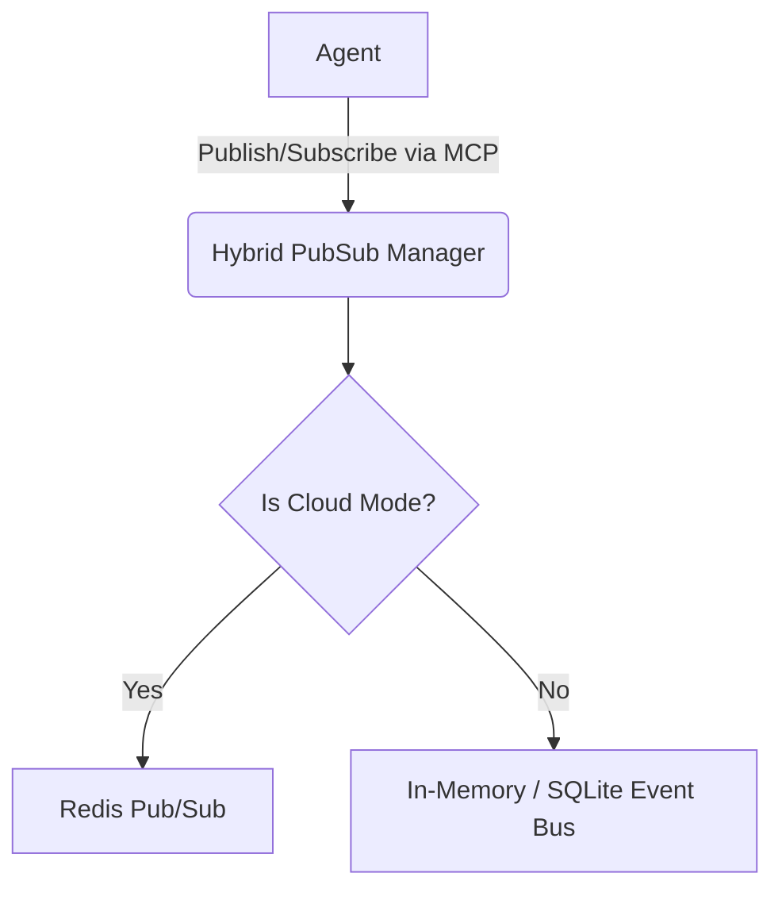

# Title: [integrations] Hybrid PubSub MCP

## Problem Statement
OHC operates in both Cloud-native (multi-tenant) and Standalone (single-user) modes. The swarm of AI agents requires a reliable mechanism for asynchronous communication, event distribution, and state synchronization. In Cloud deployments, this is typically handled by a robust message broker like Redis Pub/Sub or Kafka to synchronize events across distributed agent pods. However, in Standalone mode, requiring such heavy dependencies contradicts the lightweight design philosophy. Agents currently lack a unified MCP Tool for PubSub operations that dynamically adapts to the deployment mode.

## Research Report
Current agentic orchestration systems often hardcode their dependency on a specific message broker, making it difficult to scale down for local execution. Our analysis of the market reveals:

| Feature | OHC Hybrid PubSub MCP | Traditional Cloud Brokers (e.g., Redis) | Local-Only Event Buses |
| :--- | :--- | :--- | :--- |
| **Cloud Scale** | ✅ Yes (Redis backed) | ✅ Yes | ❌ No |
| **Local Zero-Dependency** | ✅ Yes (SQLite/In-Memory) | ❌ No | ✅ Yes |
| **Dynamic Mode Switching** | ✅ Yes | ❌ No | ❌ No |
| **Multi-Tenant Isolation** | ✅ Yes | ✅ Yes | N/A |

By introducing a Hybrid PubSub MCP, OHC agents can publish and subscribe to events dynamically. The implementation will route the payload to Redis in Cloud mode, or to a local event bus (e.g., SQLite or in-memory) in Standalone mode, ensuring an "Unfair Advantage" for smooth local-to-cloud handoffs without code changes.

## Design Doc
**Architecture:**
- Create a new package `src/server/lib/integrations/pubsub/`.
- Introduce a `PubSubManager` implementing the MCP Tool interface.
- Dynamically select the backend driver based on `os.Getenv("OHC_MULTITENANT") == "true"`.
- **Cloud Mode:** Utilize Redis Pub/Sub (e.g., via `go-redis`) to implement distributed event broadcasting.
- **Standalone Mode:** Implement an in-memory event bus or SQLite-backed queue for local event distribution.

**API Contracts:**
- `Publish(ctx context.Context, topic string, payload []byte) error`
- `Subscribe(ctx context.Context, topic string) (<-chan []byte, error)`

**Security:**
- Ensure `organization_id` prefixes are strictly applied to topics in Cloud mode to enforce cross-tenant data isolation and prevent cross-talk between instances.

## Implementation Prompt
"Implement the Hybrid PubSub MCP tool in `src/server/lib/integrations/pubsub/`.
1. Create `pubsub.go` defining the `PubSubManager` and its MCP capabilities (`Publish`, `Subscribe`).
2. Implement environment-agnostic logic. To determine if the connection is Cloud, check: `os.Getenv(\"OHC_MULTITENANT\") == \"true\"`.
3. For Cloud mode, implement Redis Pub/Sub integration using `go-redis`, ensuring `organization_id` is used as part of the topic key for isolation.
4. For Standalone mode, implement a robust in-memory event bus.
5. Create comprehensive tests in `pubsub_test.go`, mocking Redis and validating the Standalone local fallback. Ensure 100% test coverage.
6. Update or create the adjacent `BUILD.bazel` file, ensuring the `srcs` array accurately reflects the new files and dependencies."

## Priority
P1

## Estimated Scope
Medium

