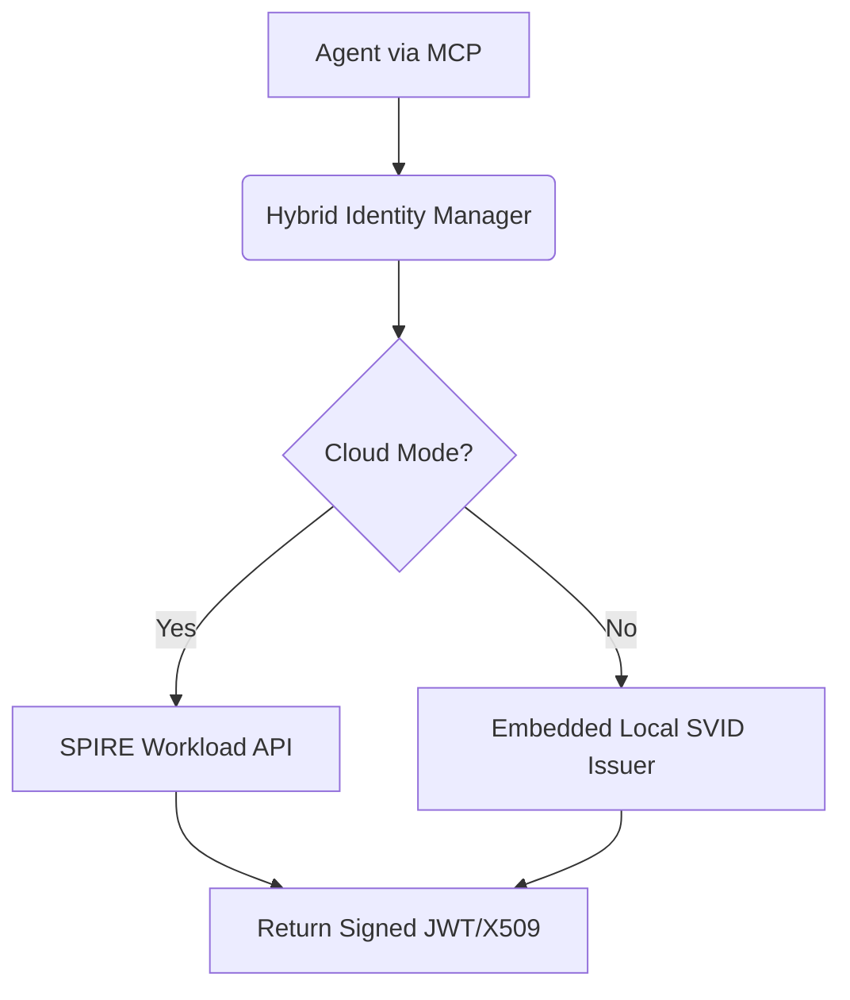

# Title: [integrations] Hybrid SPIFFE Identity MCP

## Problem Statement
The OHC Hybrid Architecture relies on a "Zero Secrets" mandate, requiring agents to authenticate to internal and external services without static credentials. In Cloud-native mode, robust SPIFFE/SPIRE infrastructure provides secure, short-lived SVIDs for identity and auth. However, in Standalone mode (local SQLite setups), deploying a full SPIRE server is unacceptably heavy and complex, violating the low resource consumption principle. Currently, local agents either fallback to static keys or fail to interact with services requiring mTLS/JWTs, fracturing the "Zero Secrets" guarantee.

## Research Report
A seamless transition between environments requires an MCP that abstracts identity acquisition. The tool must interface with a standard SPIRE Agent API in Cloud environments and fallback to a lightweight, embedded SVID issuer in Standalone mode.

### Competitive Analysis
| Feature | Static Secrets | Full SPIRE (Cloud) | Embedded SVID (Standalone) | Hybrid Identity MCP |
| :--- | :--- | :--- | :--- | :--- |
| **Zero Secrets Compliance** | ❌ No | ✅ Yes | ✅ Yes | ✅ Yes |
| **Low Resource Overhead** | ✅ Yes | ❌ No | ✅ Yes | ✅ Yes |
| **Dynamic Environment Support** | ❌ No | ❌ No | ❌ No | ✅ Yes |

### Architecture Diagram

## Design Doc
**Architecture:**
- Create a new package `src/server/lib/integrations/spiffe_identity/`.
- Implement an `IdentityManager` MCP Tool.
- Determine mode via `os.Getenv("OHC_MULTITENANT") == "true"`.
- **Cloud Mode:** Integrate with `spiffe/go-spiffe/v2/workloadapi` to fetch identity documents.
- **Standalone Mode:** Implement a lightweight, embedded Certificate Authority (CA) that issues compliant SPIFFE IDs (`spiffe://local.ohc.io/...`) and signs JWTs in-memory.

**API Contracts:**
- `GetIdentityToken(ctx async context, audience string) (string, error)` (Returns JWT).
- `GetX509Certificate(ctx async context) ([]byte, error)` (Returns mTLS materials).

## Implementation Prompt
"Implement the Hybrid SPIFFE Identity MCP tool in `src/server/lib/integrations/spiffe_identity/`.
1. Create `identity.rs` defining the `IdentityManager` MCP capabilities.
2. Use `os.Getenv(\"OHC_MULTITENANT\") == \"true\"` to toggle modes.
3. For Cloud mode, implement a client calling the SPIFFE Workload API.
4. For Standalone mode, write an embedded, in-memory SVID issuer generating valid SPIFFE IDs.
5. Add 100% test coverage in `identity_test.rs`, mocking the Workload API and validating the local CA.
6. Write an E2E test proving an agent can acquire an identity in Standalone mode without a running SPIRE server.
7. Update `BUILD.bazel` to include new dependencies."

## Priority
P1

## Estimated Scope
Medium

