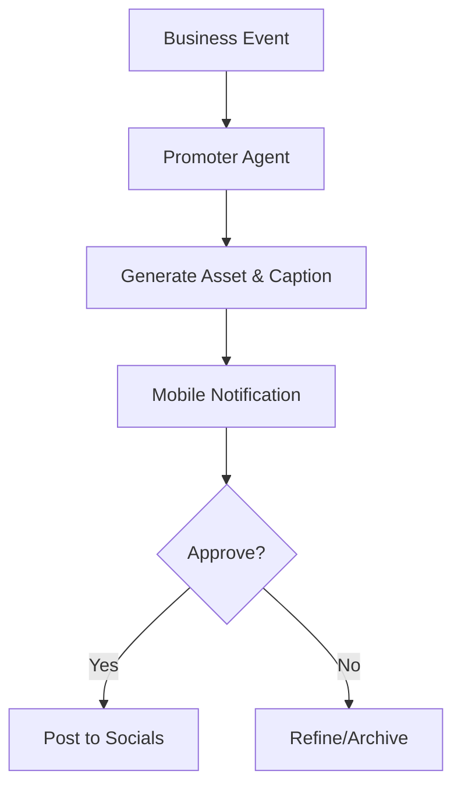

# [Marketing] AI Social Media Autopilot

## Problem Statement
Small business owners lack the time and creative skills to maintain a consistent social media presence. Platforms like Shopify require manual effort or third-party apps for social posting.

## Research Report
- **Shopify Magic:** Can write captions but doesn't handle the full loop of scheduling and cross-platform posting ([Source](https://www.shopify.com/magic)).
- **Wix:** Has a social poster, but it's not autonomous. Users report "burnout" trying to keep up with multiple platforms ([Source: Reddit r/ecommerce](https://www.reddit.com/r/ecommerce/)).
- **OHC Opportunity:** The Promoter agent (Marketing) should autonomously identify "Postable Moments" (e.g., a new 5-star review, a new product, a sold-out item) and draft social content.

### Social Content Pipeline

## Design Doc
- **Entity Types:** `SocialPost`, `CreativeAsset`, `PlatformAccount`.
- **Workflow:**
  1. **Event Trigger:** Operations signals a "New 5-star Review".
  2. **Creation:** Promoter agent generates a beautiful graphic and caption.
  3. **Approval:** User gets a notification: "Want to post this to Instagram?"
  4. **Distribution:** One-tap posting to IG, FB, TikTok.

## Implementation Prompt
**Outcome:** Autonomous social media drafting system.
**CUJ:** Leo (music tutor) gets a new student booking. The Promoter agent drafts a "New Student Welcome" post to share on his Instagram story.
**Acceptance Criteria:**
- Event-driven content generation.
- Support for OHC glassmorphic brand assets.
- Integration with external social APIs (mocked for initial E2E).

## Priority
P1

## Estimated Scope
Medium

