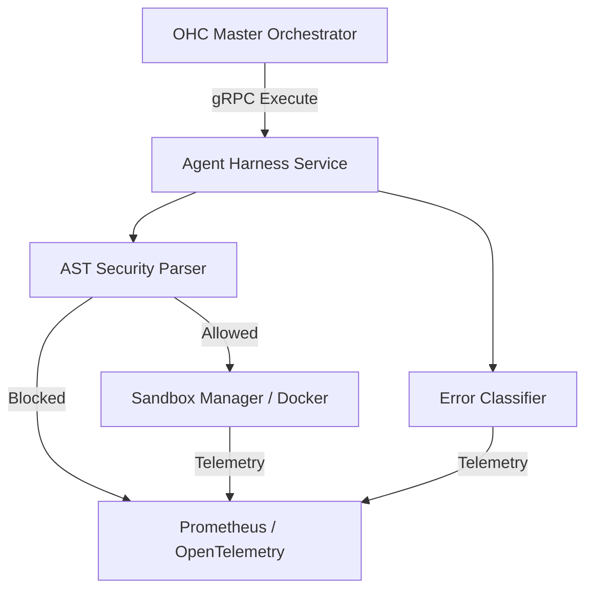

# [research] Architect Advanced Agent Harness based on OpenClaw, Hermes & Claude Code

Parent: #1000

## Problem Statement
OHC currently requires an advanced, robust Agent Harness. By inspecting the open source "OpenClaw", "Hermes Agent", and the leaked "Claude Code", we have identified critical features and gaps in OHC's execution architecture. The current harness lacks fine-grained sandbox control, AST-based permission systems, error recovery loops, and comprehensive execution telemetry, making it less secure and observable than state-of-the-art frameworks.

## Research Report
**Targets**: OpenClaw (`/tmp/research/openclaw`), Hermes Agent (`/tmp/research/hermes-agent`), and Claude Code (`/tmp/claude-code/CC-Source`)

1.  **Claude Code Harness (AST-based Security & Permissions)**:
    -   *Architecture*: Relies on a `SandboxManager` that enforces `network` and `filesystem` rules via `@anthropic-ai/sandbox-runtime`. Uses a dynamic `tengu_sandbox_disabled_commands` system for bypassing sandbox execution.
    -   *Security*: Features a `bashPermissions` and `bashSecurity` layer that heavily analyzes commands with `tree_sitter` AST parsing before allowing execution, explicitly looking for malicious patterns (e.g., obfuscated flags, unicode whitespace, backslash-escaped operators).
    -   *Telemetry*: Employs robust `tengu_*` event logging (e.g., `tengu_bash_security_check_triggered`, `tengu_bash_tool_command_executed`) to track the lifecycle and potential breaches of the sandbox.

2.  **OpenClaw Harness (Containerized Isolation)**:
    -   *Architecture*: Uses isolated Docker containers (`Dockerfile.sandbox`) built on Debian-slim with non-interactive frontend defaults, ensuring environment purity.
    -   *Telemetry & Security*: Validates interactions by enforcing container execution, inherently limiting the agent to the scope set by the container boundary.

3.  **Hermes Agent Harness (Execution Loop & Tool Engine)**:
    -   *Architecture*: Defines a highly configurable execution loop (`run_agent.py` and `agent/hermes_state.py`) that handles retries, message history, trajectory saving, and dynamic tool definitions based on API contracts.
    -   *Telemetry*: Exposes error boundaries inside `agent/error_classifier.py` allowing the harness to recover from malformed AI tool outputs gracefully.

## Design Doc

### 1. Unified Harness Containerization
- **OpenClaw & Claude Code Parity**: Implement `src/server/harness/sandbox.rs` to handle dynamic container lifecycle (spin up/down) acting as the execution boundary.
- **Contract**: gRPC interface to stream standard input/output from the sandbox container back to the host system securely, similar to Claude Code's `SandboxManager`. Define explicit configurations for `NetworkRestrictionConfig` and `FsWriteRestrictionConfig`.

### 2. AST-Based Security Parsing
- **Claude Code Parity**: Integrate a Tree-sitter AST parser before command execution in `src/server/harness/security.rs` to dynamically analyze bash commands for security check events (e.g., `tengu_bash_security_check_triggered`).

### 3. Error Recovery and Execution Loop
- **Hermes Parity**: Implement `src/server/harness/loop.rs` mapping to Hermes' robust state and error management, handling LLM tool format errors (e.g., JSON malformations) without panicking.

### 4. OpenTelemetry Integration
- **Claude Code Parity**: Incorporate OpenTelemetry metrics (`harness_sandbox_started`, `harness_tool_error_recovered`, `harness_tool_executed`, `harness_sandbox_bypass_attempted`) into Prometheus.

| Feature Area | OHC Current | Target State (Claude Code/OpenClaw/Hermes) | Gap |
| --- | --- | --- | --- |
| **Isolation** | Basic Go `exec.Command` | Dedicated Docker Sandboxes & Network/FS Restrictions | High |
| **Security** | None | AST-based Bash Command Verification | High |
| **Recovery** | Hard fail | Automated classification & retry | Medium |
| **Telemetry** | Basic HTTP logs | Granular sandbox state & security event metrics | High |

## Implementation Prompt
Implementer Agent: Please build out the Unified Harness based on the Claude Code, OpenClaw, and Hermes paradigms.

1. Implement `src/server/harness/sandbox.rs` providing a Docker-backed sandbox environment with explicit Network/FS restrictions. Ensure the execution boundary intercepts container metrics.
2. Implement `src/server/harness/security.rs` adding an AST-based shell parser to block destructive or obfuscated commands.
3. Implement `src/server/harness/loop.rs` with a built-in error classifier for handling malformed tool responses from AI models gracefully.
4. Integrate OpenTelemetry to trace every step of the sandbox execution and security validation (`harness_sandbox_started`, `harness_tool_executed`, `harness_sandbox_bypass_attempted`). Include 100% unit test coverage.
5. Ensure code handles `RedactInterfacePII` where applicable before logging.

## Priority
P1

## Estimated Scope
Large
