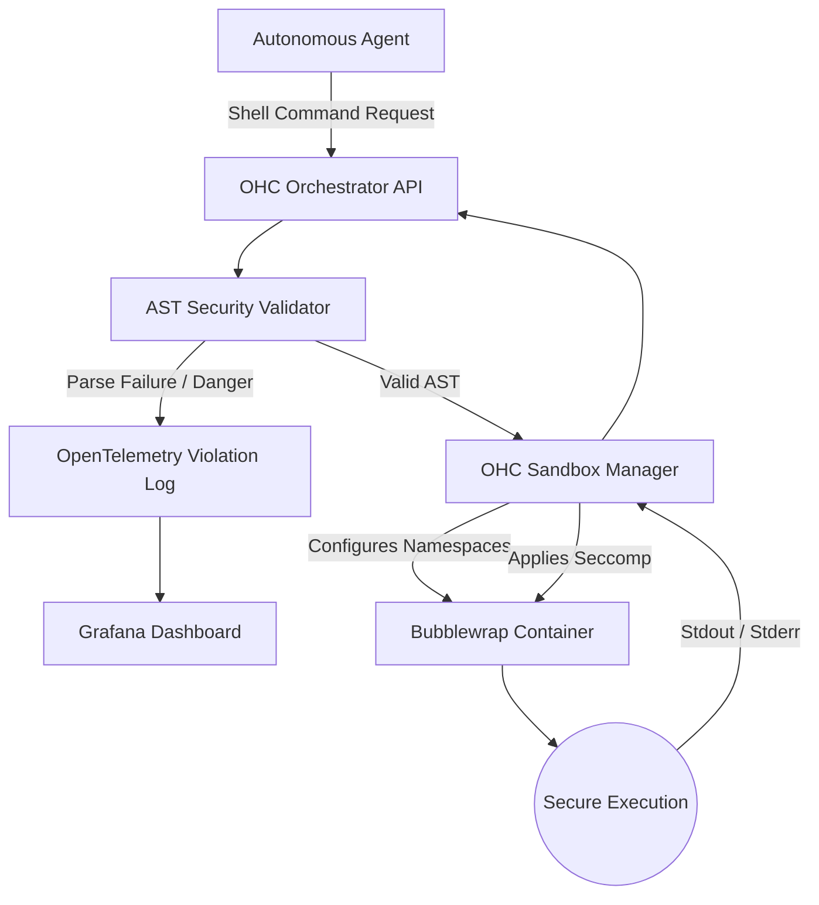

# 🔬 Research Brief: Claude Code Agent Harness Architecture & OHC Integration

## Title
[research] Implement Bubblewrap-Based Agent Execution Sandbox & AST-Level Security Analysis

## Problem Statement
OHC currently lacks a true zero-trust execution sandbox for autonomous agents. As OHC agents run arbitrary shell commands to accomplish tasks, they inherently pose severe security risks to the host OS if they hallucinate malicious commands, or if an external model injection attack occurs. Without strict execution boundaries and real-time AST-level command validation, our swarm intelligence architecture is vulnerable. By extracting the exact methodologies used by Anthropic's Claude Code, we can implement an ironclad Agent Harness.

## Research Report
We conducted a deep technical audit of the leaked Claude Code (v2.1.88) codebase, specifically targeting its Agent Harness and execution environments.

### Core Discoveries
1. **The Sandbox Runtime Adapter (`@anthropic-ai/sandbox-runtime`)**:
    - Claude Code implements a rigid boundary around agent tool execution. On Linux environments, it heavily leverages **Bubblewrap (`bwrap`)** to create unprivileged containers for command execution.
    - Instead of just blocking bash strings, the runtime creates isolated namespaces (`--unshare-net`, `--unshare-ipc`, `--unshare-pid`).
    - The `SandboxManager` acts as an adapter, intercepting all `exec` and `spawn` calls triggered by the Agent, and routing them through `wrapWithSandbox`.

2. **Seccomp BPF Filtering for Unix Sockets**:
    - The sandbox blocks unauthorized IPC by generating and applying specific Seccomp BPF filters. The `generateSeccompFilter` utility dynamically builds BPF rules that block system calls related to Unix socket creation unless explicitly allowed, ensuring an agent cannot secretly communicate with local services like Docker or Systemd.

3. **AST-Level Bash Security (`bashSecurity.ts`)**:
    - Simple regex is insufficient for bash parsing. Claude Code uses `Tree-sitter` to parse shell commands into an Abstract Syntax Tree (AST) before execution.
    - It enforces structural security rules, blocking Zsh process substitution (`<()`, `>()`), Zsh dangerous built-ins (`zmodload`, `sysopen`), and command substitutions (`$()`) that could bypass high-level filters.
    - Special attention is paid to tracking "Quote Extraction" to prevent attackers from bypassing filters using quote desync or escaped whitespaces.

4. **Telemetry & Execution Observability**:
    - Security violations are intercepted by `SandboxViolationStore` and trigger specific telemetry events (e.g., `tengu_bash_security_check_triggered`) via OpenTelemetry, containing exact error sub-IDs for real-time dashboard tracking.

## Comparative Table: OHC vs Market

| Feature | Current OHC | Market (Claude Code/Gstack) | Required OHC Enhancement |
| :--- | :--- | :--- | :--- |
| **Execution Boundary** | Raw `os/exec` / `child_process` | Bubblewrap (`bwrap`) Unprivileged Sandbox | **Implement `ohc-sandbox` leveraging `bwrap`** |
| **Command Validation** | Basic Regex / Deny Lists | AST Parsing via Tree-Sitter (`bashSecurity.ts`) | **Adopt `go-bash-parser` or Tree-Sitter AST Filters** |
| **Network & IPC Isolation**| None (Host access) | Namespace unsharing (`--unshare-net`, `--unshare-ipc`) | **Default Network/IPC Isolation inside Harness** |
| **Unix Socket Control** | Unrestricted | Dynamic Seccomp BPF filters | **Implement `seccomp` profile generation** |
| **Telemetry (Violations)** | Standard Error Logging | OpenTelemetry integration per AST node | **Prometheus + OTel integration for violations** |

## Design Doc
To implement these protections in OHC Hybrid Architecture (OHC-HA), we will build the **OHC Zero-Trust Harness**.

### Architecture Overview

### Architecture Details:
1. **OHC Sandbox Runtime (Linux focus)**:
    - Dependency: We will require `bubblewrap` and `socat` on the host OS.
    - Implementation: A new Go/Rust service `ohc-sandbox` that wraps agent executions.
    - Features:
        - Network isolation by default. HTTP/SOCKS proxies controlled by the orchestrator will handle allowable external I/O.
        - Mount `/` as read-only, mounting only specific scratch directories as read-write.
2. **OHC Command AST Validator**:
    - All shell commands emitted by the Swarm must pass through a strict AST-parsing pipeline (e.g., using `go-bash-parser` or tree-sitter).
    - Block lists for process substitution, nested execution (`eval`, `zmodload`), and unquoted variables.
3. **Telemetry Integration**:
    - Any command rejected by the AST Validator or blocked by Bwrap will emit a Prometheus metric `ohc_agent_harness_violation_total` and an OpenTelemetry trace with the raw command snippet, strictly following OHC's Visual Excellence Mandate for Grafana dashboards.

## Implementation Prompt
**Role**: Principal Systems Engineer & Bolt (L7)
**Task**: Implement the OHC Zero-Trust Harness using Bubblewrap and AST Validation.

1. **Sandbox Layer**: Create a new package `src/harness/sandbox/bwrap.go`. Implement a wrapper that takes an arbitrary shell command and executes it inside a `bwrap` container. The container must have `--unshare-all`, mount `/` as ro-bind, and mount a temporary `workspace` directory as rw-bind.
2. **AST Security Filter**: Create `src/harness/security/ast_filter.go`. Integrate a tree-sitter or native bash parser to evaluate the command before it enters `bwrap`. Block process substitution (`<()`), `eval`, and any backtick/`$()` substitutions. Return detailed Go error structs on violation.
3. **Telemetry**: In `src/harness/telemetry/metrics.go`, add Prometheus counters for `ohc_harness_executions_total` and `ohc_harness_violations_total`. Ensure all blocked commands log an OpenTelemetry span with `violation_reason`.
4. **Testing**: Provide 100% unit test coverage for the AST parser preventing at least 10 different bash injection attacks. Add an E2E test verifying a malicious command fails to touch the real filesystem.

## Priority
P0 (Critical)

## Estimated Scope
Large

