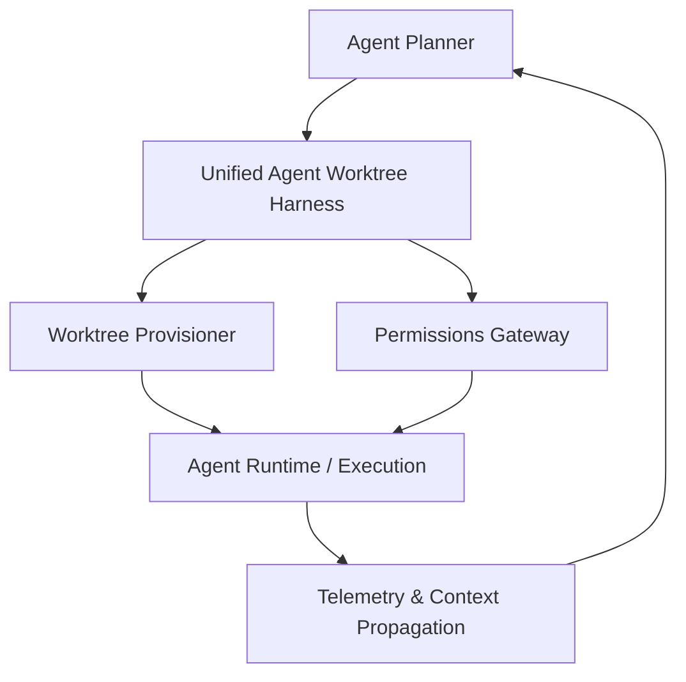

# [backend] Agent Harness Isolation Architecture

## Problem Statement
OHC currently lacks a robust, standardized isolation harness for agents to safely execute code, test commands, and manipulate the environment. Currently, basic sandboxing mechanisms rely on simplistic regex checks (e.g., in `bash_sandbox/sandbox.go`), which is not a secure or scalable security boundary. A failure in environment isolation could allow an agent to manipulate files outside of its workspace or modify the core system, compromising user data or application stability.

## Research Report
An analysis of leading agent architectures, including the leaked Claude Code project (`CC-Source/src/tools/BashTool`), reveals a mature approach to agent sandboxing.
Key findings from analyzing Claude Code's agent harness:
1. **Dynamic Sandboxing**: It uses a layered configuration to allow/deny filesystem reads and writes (`SandboxManager`).
2. **Execution Telemetry**: It captures and propagates violations directly via stderr (`<sandbox_violations>`) so the LLM is contextually aware of the sandbox constraints.
3. **Pervasive Security Enforcement**: Access boundaries aren't just limited to regex; they enforce deep process-level constraints and dynamic path resolution to intercept unauthorized accesses (`resolvePathPatternForSandbox`).
4. **Git Worktree Isolation:** Safe experimental changes utilizing temporary git worktrees (`isolation: "worktree"`).

Currently, OHC's `bash_sandbox.go` only does rudimentary regex matching for things like `rm -rf /` and `sudo`. For macOS specifically, OHC has a start on process isolation via the `sandbox-exec` utility (`sandbox_darwin.go`), but the system lacks cross-platform worktree isolation and true dynamic path restriction per execution context.

### Comparative Matrix

| Feature | OHC Current State (`src/server/bash_sandbox/sandbox.go`) | Claude-Class State | Gap |
|---------|------------------------------------------------------|-------------------|-----|
| Sandboxing | Simple Regex Checks | Dynamic Sandboxing, OS-level hooks | Critical |
| Branch Safety | Manual Git execution | `isolation: "worktree"` automated | High |
| Execution Telemetry | Basic execution counters | Rich context-aware violation propagation (`<sandbox_violations>`) | Medium |

## Design Doc
To elevate OHC's agent isolation to "Premium" Claude-level capability, we must implement a **Unified Agent Worktree Harness (UAWH)**.

### Architecture Changes
1. **Worktree Abstraction**: Agents must operate in isolated directories (Git worktrees or ephemeral mounts), tracking modifications securely without colliding with other agents.
2. **Process Sandboxing**:
   - Expand OS-level sandboxing. For macOS, stabilize `sandbox-exec` configurations. For Linux, implement `bwrap` (Bubblewrap) or `nsjail`.
3. **Execution Telemetry**: Enhance `telemetry/telemetry.go` and `orchestration/harness.go` to capture detailed metrics (time taken, sandbox violations, peak memory usage).
4. **Contextual Sandbox Failure Propagation**: Any violations must be intercepted and formatted identically to the `<sandbox_violations>` output convention, ensuring the agent model accurately interprets restriction boundaries.

### Architecture Diagram

## Implementation Prompt
Implement the Unified Agent Worktree Harness (UAWH) for the OHC platform.
1. Create a new `worktree_sandbox.go` inside `src/server/agents/harness/` that securely mounts temporary directories for agent execution context.
2. Enhance `src/server/bash_sandbox/sandbox.go` to integrate with the OS-level isolation harnesses in `src/server/agents/harness/`, replacing simple regex checks with strict OS-level filesystem constraints where possible.
3. Update `src/server/telemetry/telemetry.go` to explicitly log `SandboxWorktreeMountFailed`, `SandboxViolationDetected`, and execution timing metrics.
4. Add comprehensive unit tests and E2E coverage for the sandbox logic in `src/server/bash_sandbox/sandbox_test.go` and `src/server/agents/harness/sandbox_test.go` to hit 100% test coverage.

## Estimated Scope
Large

## Priority
P0

