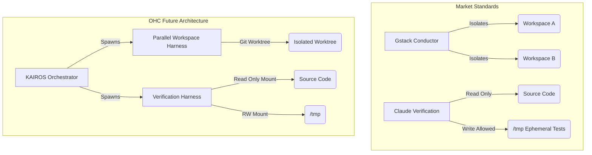

# 🔬 OHC Oracle Research Report: Gstack & Claude Verification Harness Audit

## 1. Executive Summary
This report audits the advanced Agent Harness implementations of **Gstack (Conductor)** and **Claude Code (Verification Agent)** to identify architectural gaps in the OHC Hybrid AI OS (OHC-HA).

## 2. Deep Technical & Harness Audit

### 2.1 Gstack Conductor: Parallel Sprint Workspaces
Gstack enables parallel agent execution by isolating each agent's environment.
*   **Harness Isolation**: Conductor runs 10-15 parallel agent sprints by placing each session in its own isolated workspace, preventing collisions.

### 2.2 Claude Code: Verification Agent Harness
Claude Code implements a strict Verification Agent (`verificationAgent.ts`) that runs post-implementation.
*   **Harness Restriction**: The Verification Agent is strictly prohibited from creating, modifying, or deleting any files in the project directory, installing dependencies, or running git write operations.
*   **Ephemeral Testing**: Allowed to write test scripts to `/tmp` via bash redirection to test functionality without polluting the workspace.

## 3. OHC vs Market Reality

| Feature | OHC Current State | Gstack / Claude Code | Gap Priority |
|---|---|---|---|
| **Parallel Workspaces** | Agents share the same local filesystem, leading to race conditions. | Gstack Conductor isolates workspaces per sprint. | 🚨 P0 |
| **Verification Sandboxing** | Reviewer agents have full write access, risking untested changes. | Claude Verification Agent is strictly read/test only. | 🟡 P1 |

## 4. Architectural Gap Visualization

## 5. Actionable Roadmap & Missions

Based on this audit, we must implement the following missions:

1.  **[harness] Implement KAIROS Parallel Workspace Harness via Git Worktrees**
    *   To allow true horizontal agent scaling locally, OHC must isolate agent tasks using `git worktree` under the KAIROS harness, preventing file collisions.
2.  **[harness] Implement Read-Only Verification Agent Harness**
    *   Create a strict capability policy where Verification agents are denied write access to `src/` but allowed to write ephemeral scripts to `/tmp`.

