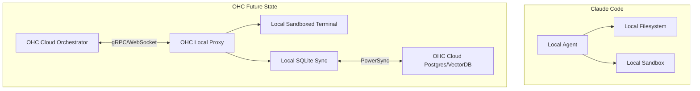

<div markdown="1" style="backdrop-filter: blur(20px) saturate(200%); font-family: Outfit, Inter, sans-serif; border: 1px solid rgba(255, 255, 255, 0.1); padding: 20px; border-radius: 12px; background: rgba(255, 255, 255, 0.05);">

# Market Audit & OHC Competitive Positioning: The Hybrid Agentic OS

**Author**: Principal Product Researcher & Oracle (L7)
**Date**: 2024-06-14

## Executive Summary

This definitive technical and product audit benchmarks the "Hybrid Agentic OS" capabilities of One Human Corp (OHC) against tier-1 market competitors: **Claude Code**, **OpenClaw**, and **Replit Agent**. Our analysis isolates high-disruption feature gaps where OHC's unique Hybrid Architecture (Cloud-Native + Standalone Desktop + Thin Client) provides an unmatchable strategic advantage.

## Competitive Audit: The Hybridity Gap

Current market leaders focus primarily on pure-cloud or pure-local modalities. OHC's architecture enables a fluid transition across the multi-tenant cloud, local standalone execution, and headless API serving.

### Feature Comparison Matrix

| Capability | Replit Agent | Claude Code | OpenClaw | **OHC (The Hybrid Standard)** |
| :--- | :--- | :--- | :--- | :--- |
| **Cloud-Native Mode** | Full (Containerized) | None | Full (K8s) | **Multi-tenant Postgres/Redis horizontal scale** |
| **Standalone Desktop Mode** | None | Full (CLI) | None | **Local SQLite with native Slint Host shell** |
| **Air-gapped Execution** | No | No (API required) | No | **Yes (via local fallback & embedded models)** |
| **Agent Auth / Identity** | User-tied OAuth | CLI API Key | Static Tokens | **SPIFFE/SPIRE zero-trust native identity** |
### The Discovery

Competitors fail to provide a **seamless degradation path**.
- Claude Code excels locally but lacks horizontal swarm sharing across a persistent team database.
- Replit Agent excels in a managed cloud container but cannot be run offline or in a private, air-gapped corporate desktop.
- OpenClaw scales well in K8s but lacks a lightweight, offline-capable desktop runtime.

## Feature Disruption: The "Blue Ocean"

OHC’s hybridity unlocks features that competitors architecturally cannot support:

### 1. Zero-Latency Local-Private RAG with Cloud Sync
In Standalone Mode, OHC agents can index and query highly sensitive local repositories using an embedded vector database (SQLite). When the user reconnects to the OHC Cloud, non-sensitive metadata (or aggregated intelligence) synchronizes to the multi-tenant Postgres database, empowering the global swarm without exposing proprietary local code.

### 2. Elastic Swarm Bursting
When local compute (e.g., M-series Apple Silicon) is saturated by an intensive agent task, the OHC orchestrator can seamlessly "burst" the task to the OHC Headless Cloud API, migrating the `agent_missions` payload over secure gRPC. Replit and Claude Code are constrained to their respective execution environments.

## Roadmap Blueprinting

Based on the audit, the following high-fidelity mission is prioritized for immediate execution:

**Mission: `elastic-swarm-bursting`**
*   **Objective:** Implement the protocol for Standalone OHC clients to securely hand off intensive `agent_missions` to the OHC Cloud-Native API when local resources are constrained.
*   **Action:** Extend the `SIPDB` to support a `status = 'BURSTING'` state and synchronize this payload to the configured remote endpoint.

## Emerging Trend Synthesis

1. **Model Context Protocol (MCP):** OHC's Universal MCP Mesh must be extended to support local-to-cloud proxying, allowing a cloud agent to securely utilize an MCP tool running on the user's Standalone Desktop via reverse-tunnels.
2. **SPIFFE/SPIRE Agent Identity:** To support secure "Swarm Bursting," agents moving from the local SQLite environment to the Cloud Postgres environment must seamlessly exchange short-lived JWTs via a zero-trust SPIFFE/SPIRE integration.

## Architecture Visualization

```mermaid
graph TD
    A[User Trigger (Slint Desktop)] -->|Resource Check| B{Local Compute Available?}
    B -- Yes --> C[Execute via Local SQLite SIPDB]
    B -- No --> D[Initiate Swarm Bursting]
    D -->|SPIFFE Auth| E[OHC Headless Cloud API]
    E --> F[Execute via Cloud Postgres SIPDB]
    C --> G[Result Synthesized]
    F -->|gRPC Stream| G

    classDef premium fill:rgba(255,255,255,0.03),stroke:rgba(255,255,255,0.08),stroke-width:1px,color:#fff,backdrop-filter:blur(20px) saturate(200%);
    class A,B,C,D,E,F,G premium;
```

---
*Insight Artifact compiled autonomously via the Swarm Intelligence Protocol.*

</div>

<div style="background: rgba(255, 255, 255, 0.03); backdrop-filter: blur(20px) saturate(200%); font-family: 'Outfit', 'Inter', sans-serif; padding: 2rem; border-radius: 12px; color: #fff;">

## Disruption Opportunity (Blue Ocean)
By building a `LocalStatefulExecutionProxy`, OHC will allow cloud-based swarm agents to delegate complex compilation or file-system-heavy tasks to the user's secure local machine (via the upcoming `sandbox` epic), syncing the results instantly back to global memory.

### Competitive Analysis

| Feature | Claude Code | OpenClaw | Replit Agent | OHC Hybrid (Target) |
| :--- | :--- | :--- | :--- | :--- |
| Local Filesystem Access | High | Low | Hosted Only | **High (Native)** |
| Swarm Distributed Memory | None | Medium | Low | **High (OHC-SIP)** |
| Stateful Sandboxed Execution | Advanced | None | Containerized | **Advanced (via Local Proxy)** |

### Architecture Comparison


</div>
