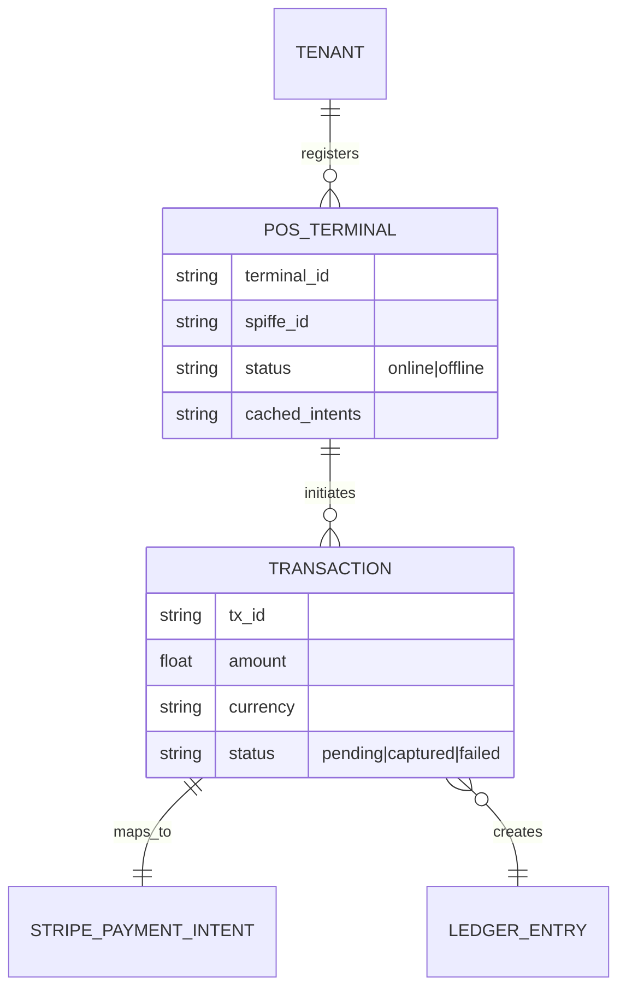
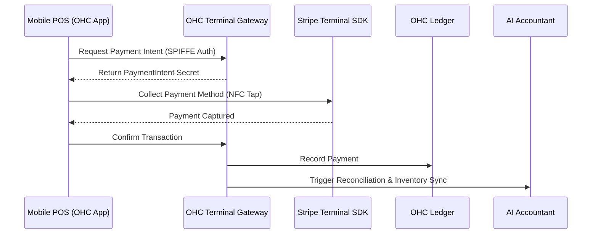

# [Architecture] Native Mobile Tap-to-Pay POS & Offline Ledger

## Problem Statement
Small business owners who operate in person—like Priya (boutique owner) taking payments at her counter, or Carlos (handyman) taking payments at a client's house—need a way to accept physical credit card and mobile wallet payments instantly without purchasing, pairing, or carrying extra hardware dongles. A seamless, native point-of-sale (POS) system is critical for OneHumanCorp to fully serve omnichannel and field-service merchants. The current lack of this capability forces users to rely on disjointed third-party apps, breaking the "zero to live business in under 10 minutes" promise.

## Research Report
**Evaluated Tool:** Stripe Terminal (Tap to Pay SDKs for iOS and Android)
**Alternatives Considered:** Square API, Adyen POS
**Findings:**
- **Market Standard:** Shopify and Wix both offer robust POS applications, but they often require dedicated hardware or separate apps.
- **Stripe Terminal:** Offers "Tap to Pay" SDKs that turn standard NFC-enabled iPhones and Android devices into contactless payment terminals. This eliminates the need for physical card readers.
- **Ease of Use:** For a non-technical owner, the UX must be frictionless. They open the OHC app, enter an amount, tap "Charge," and hold their phone out for the customer to tap their card.
- **Security Context:** OHC's strict multi-tenant and Zero-Trust architecture requires that each mobile device acting as a POS terminal be securely authenticated via SPIFFE/SPIRE, ensuring that transactions are tightly scoped to the correct tenant's ledger.

## Design Doc

### Architecture Diagram

### Mobile-First UX Flow (375px viewport)
1. **Initiation Screen:** A clean, ubiquitous numeric keypad utilizing macOS-style Translucent Glass materials. A large, high-contrast "Charge $0.00" button at the bottom.
2. **NFC Tap State:** The screen blurs, displaying a simple NFC icon and "Hold card or phone near the top of your device." It must pass the "grandmother test"—no technical jargon, just a clear instruction.
3. **Success State:** A satisfying checkmark animation appears. A modular dashboard card slides up offering two options: "New Sale" or "Send Receipt" (which defaults to entering a phone number or email).
4. **Offline Mode:** If there's no internet (e.g., Carlos in a basement), the app displays a subtle "Offline - Transactions will sync automatically" banner but allows the charge to queue locally.

### AI Agent Integration Points
- **The Accountant:** Invisibly monitors the transaction stream. Upon a successful charge, it automatically reconciles the payment in the owner's dashboard ledger and handles localized currency conversions if necessary.
- **The Operations Manager:** If the payment is linked to a physical product from the catalog (e.g., Priya selling a dress in-store), this agent immediately decrements the inventory.

### Performance & Offline Targets
- **Latency:** The keypad and POS initiation must load in under 200ms.
- **Offline Capability:** Payment intents must be cacheable locally. If connectivity drops, the app must safely queue the encrypted transaction state and seamlessly sync it in the background via a CRDT-based sync mechanism when the device comes back online.

### Zero Trust & Security
- Each mobile device running the OHC app must be provisioned with a secure identity (SPIFFE/SPIRE).
- The mobile client acts as a strictly isolated node. Multi-tenant isolation is enforced at the edge; the OHC Terminal Gateway explicitly validates the device's SPIFFE ID against the owner's `organization_id` before allowing any ledger modifications or Stripe API calls.

## Implementation Prompt
Implement the Native Mobile Tap-to-Pay POS capability within the OHC mobile client. Integrate the Stripe Terminal SDK to support contactless payments directly on the user's iOS or Android device. Build a secure Terminal Gateway in the OHC backend that authenticates mobile devices via SPIFFE and isolates transactions strictly by tenant. The client must support offline transaction queuing with automatic background synchronization. Ensure that the AI Operations and Accounting agents are triggered seamlessly to update inventory and ledgers upon transaction completion. The UI must follow the translucent glass design system and prioritize a frictionless, 30-second checkout flow.

## Priority
P0

## Estimated Scope
Large
