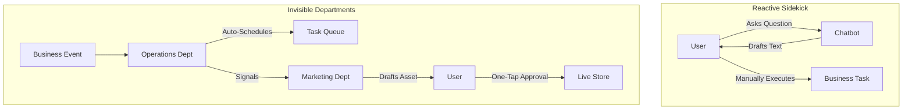

# OHC AI Differentiation Manifesto

## Strategy
OHC does not build "AI Assistants." We build **Invisible Departments.** While competitors like Shopify and Wix focus on chat-based sidekicks, OHC treats AI as autonomous infrastructure that proactively manages the business.

### Autonomous Infrastructure Model

## Top 5 Leapfrog Automations

1. **The Proactive Protector (Legal & Compliance):**
   - *Competitor:* Generic templates.
   - *OHC:* Active scanning of catalog to draft bespoke disclaimers and track license renewals autonomously.
2. **The Always-On Promoter (Marketing):**
   - *Competitor:* Manual caption generation.
   - *OHC:* Autonomous identification of "Postable Moments" (sales, reviews) and drafting of social assets without being asked.
3. **The Visionary Catalog (Operations/Marketing):**
   - *Competitor:* Form-based product entry.
   - *OHC:* "Photo-to-Live" pipeline where Vision AI handles all metadata, tagging, and SEO from a single image.
4. **The Mission Manager (Operations):**
   - *Competitor:* Disconnected booking/order tools.
   - *OHC:* Unified gRPC-backed fulfillment stream where every business event is a shared mission across AI departments.
5. **The Monday Coffee Chat (Advisory):**
   - *Competitor:* Complex dashboards.
   - *OHC:* Proactive, plain-language business strategy reports delivered weekly to the phone.

