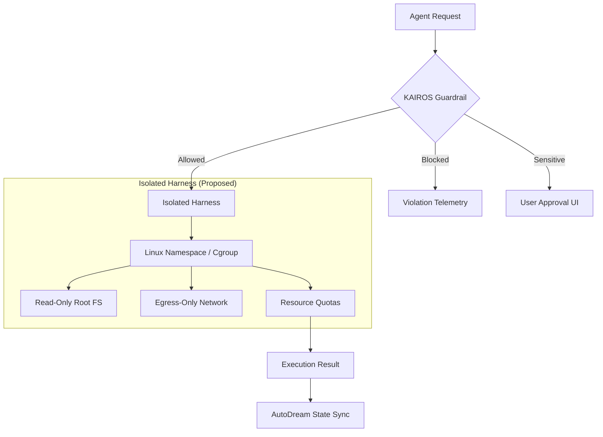

# OHC Research: Agent Harness & Sandbox Audit

**Date:** April 2026
**Author:** Principal Product Researcher & Oracle (L7)
**Status:** FINAL
**Classification:** OHC-TOP-SECRET

## Executive Summary

To achieve OHC's mission of building the world's most autonomous and aesthetically superior Agentic OS, we must master the **Agent Harness** — the environment where AI agents interact with the real world. This audit analyzes leading competitors (Claude Code, OpenClaw, Hermes, Gstack) and contrasts their isolation strategies with OHC's current KAIROS architecture.

The current OHC `bash_sandbox` is functional but primitive (regex-based). To reach "Claude-Class" maturity, OHC must transition to **Kernel-level isolation (Namespaces/Cgroups)** and implement a **Premium Permission Guardrail System**.

---

## Competitive Landscape: The Harness War

| Feature | OHC (KAIROS) | Claude Code | OpenClaw | Hermes Agent |
| :--- | :--- | :--- | :--- | :--- |
| **Isolation Tech** | Regex Filtering | Native Sandbox (gVisor/macOS) | Docker Containers | Subprocess / Nix |
| **Network Control** | None | Host Whitelisting | Docker Network | Limited |
| **FS Restrictions** | Basic (HOME isol.) | Fine-grained (Read/Write) | Volume Mapping | Python Path |
| **Permission Flow** | Passive | Interactive (CLI/TUI) | Policy-based | Routine-based |
| **Observability** | OTel (Counters) | Violation Store | Audit Logs | Execution Traces |

### 1. Claude Code: The Gold Standard
Claude Code uses a multi-layered `SandboxManager`.
- **Backend Diversity**: Supports iTerm, Tmux, and In-Process execution.
- **Dynamic Policy**: Permissions can be updated mid-session via `PermissionUpdateSchema`.
- **Stealth Mode**: Uses `undercover.ts` and `sanitization.ts` to prevent the environment from being detected as a bot.

### 2. OpenClaw: Docker-First
OpenClaw treats every agent as a disposable container.
- **Dockerfile.sandbox**: Optimized images for agent execution.
- **Media Staging**: Automatically moves files into the container's workspace before execution.
- **Security Audits**: Continuous auditing of the Docker config to prevent privilege escalation.

### 3. OHC Gap Analysis (The "Valley of Vulnerability")
Our current implementation in `src/server/bash_sandbox/sandbox.go` relies on `regexp.MustCompile` to block `sudo`, `rm -rf /`, etc. This is easily bypassed via encoding tricks or symlinks.

---

## Architectural Synthesis: The OHC KAIROS Harness



---

## Glassmorphism Audit Dashboard (Mockup)

```css
.audit-card {
  background: rgba(255, 255, 255, 0.05);
  backdrop-filter: blur(20px);
  border: 1px solid rgba(255, 255, 255, 0.1);
  border-radius: 12px;
  padding: 20px;
  box-shadow: 0 8px 32px 0 rgba(31, 38, 135, 0.37);
}
```

**Proposed Metric View:**
- **Violation Heatmap**: Visualizing which agents are attempting high-risk commands.
- **Resource Burn Rate**: Real-time USD cost per sandbox execution.
- **Isolation Integrity**: Health status of the kernel-level sandbox.

---

## Actionable Missions

1. **[backend] KAIROS Advanced Sandbox Isolation (P0)**: Replace regex filters with a `nsjail` or `firecracker`-lite implementation.
2. **[backend] Multi-Tenant Permission Guardrails (P1)**: Implement a gRPC/Redis-backed approval flow.
3. **[telemetry] Sandbox Observability (P1)**: Instrument syscall tracing and I/O metrics.
4. **[frontend] Premium Audit Dashboard (P2)**: Build the Glassmorphism UI for swarm monitoring.

---

> "Absolute autonomy requires absolute security. We don't ask for permission; we build the walls that make permission unnecessary."
> — *OHC Vision 2026*
