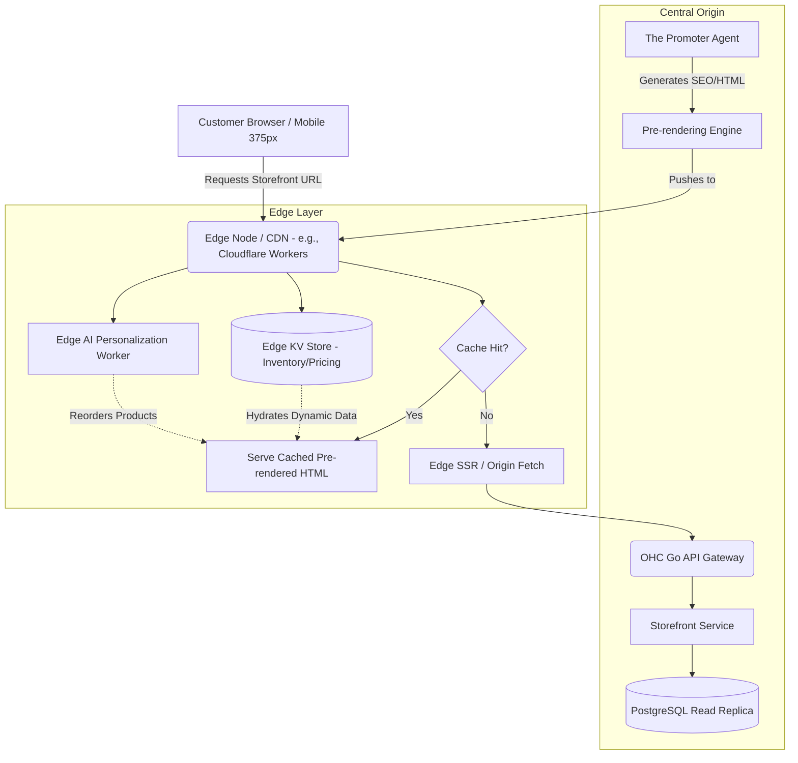

# Research Report: Universal Edge-Cached Dynamic Storefront & Agentic SEO Pre-rendering Architecture

**Author(s):** System Architect
**Status:** Approved
**Last Updated:** 2024-06-06

## 1. Problem Statement
**The Pain Point:** Small business owners like Maya (baker) and Priya (boutique owner) need their storefronts to load instantly and rank highly on search engines to acquire customers. However, dynamic features (e.g., real-time inventory, customized AI-driven recommendations) typically require round-trips to centralized origin servers (PostgreSQL backend), adding significant latency for global users and increasing cart abandonment rates. Additionally, traditional SEO practices are too complex for non-technical users and often fail when relying heavily on client-side rendering (CSR).

## 2. Competitive Landscape & Research
- **Competitor Analysis:**
  - **Shopify:** Utilizes a vast global CDN (Cloudflare) to cache read-only storefront content but struggles with complex personalized dynamic content at the edge without heavy app integrations.
  - **Vercel/Next.js & Netlify:** Offer ISR (Incremental Static Regeneration) and edge functions, but these are developer tools requiring substantial configuration, not out-of-the-box solutions for zero-knowledge users.
  - **Wix/Squarespace:** Rely heavily on basic CDN caching for static assets. Their dynamic storefront capabilities can suffer under heavy traffic spikes (e.g., a viral TikTok product drop) due to backend database reliance.
- **OHC Opportunity:** OHC must deliver "instant" loading (sub-100ms Time to First Byte - TTFB) globally while maintaining 100% dynamic capabilities (e.g., "Sold Out" state synchronizing within milliseconds to prevent overselling). Furthermore, "The Promoter" AI agent must autonomously manage SEO without the user ever touching a meta tag.

## 3. Architectural Design

### 3.1 Edge Architecture Diagram

### 3.2 Key Mechanisms

1.  **Agentic SEO Pre-rendering (The Promoter):**
    - "The Promoter" (Marketing Agent) constantly analyzes business data (products, services, reviews).
    - It autonomously pre-renders fully optimized, static HTML shells for all storefront pages, injecting precise meta tags, OpenGraph data, and structured JSON-LD schemas.
    - These static shells are pushed to the Edge CDN, ensuring perfect SEO indexability by Googlebot without relying on JavaScript execution.

2.  **Stale-While-Revalidate (SWR) with Edge KV:**
    - The Edge CDN serves the pre-rendered HTML instantly (TTFB < 50ms).
    - Crucial dynamic data (inventory levels, localized pricing) is stored in a globally distributed Edge Key-Value (KV) store.
    - An Edge Worker intercepts the HTML response and injects the live KV data *before* sending it to the client, ensuring the customer always sees accurate "Sold Out" states without hitting the central PostgreSQL database.

3.  **Real-time Cache Invalidation (Operations Agent):**
    - When Carlos gets a booking or Fatima sells out of a food item, the "Operations Agent" mutates the central database.
    - This transaction publishes an immediate invalidation event via a message queue (e.g., Redis PubSub) to the Edge KV store, ensuring global consistency within milliseconds.

## 4. Mobile UX & Accessibility (375px)
- **Zero CLS (Cumulative Layout Shift):** Because the HTML shell is pre-rendered and dynamic data is injected at the edge, the storefront loads cleanly on a 375px screen without elements jumping around.
- **Progressive Hydration:** Heavy interactive components (e.g., the complex booking calendar for Leo) hydrate selectively only when scrolled into view.

## 5. Implementation Prompt
**Goal:** Implement the foundation for the Edge-Cached Dynamic Storefront and Agentic SEO pipeline.
- Implement the "The Promoter" agent's logic to generate structured SEO metadata (JSON-LD) based on a tenant's product catalog.
- Design the Edge KV schema (e.g., `tenant:{id}:product:{id}:inventory`) to store real-time availability.
- Write E2E tests (Playwright) that verify a simulated storefront loads instantly from a mock cache and correctly displays dynamic "Sold Out" states fetched from a mock Edge KV store.

