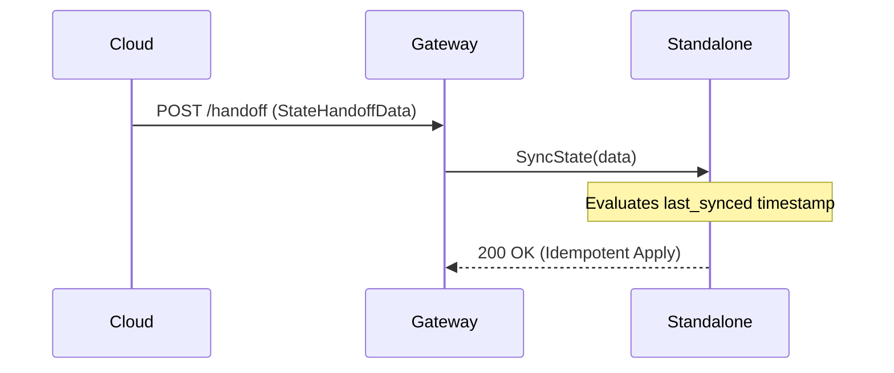

# KAIROS AI OS - System Design & Hybrid Interoperability

**Author(s):** Principal Interoperability Engineer & Link
**Status:** Approved
**Last Updated:** 2026-04-23

## 1. Overview
The Hybrid Interoperability Protocol defines how the One Human Corp Swarm communicates seamlessly whether running in the distributed Cloud architecture (Redis Pub/Sub) or in Standalone mode on a single machine (In-Memory).

## 2. Universal Protocol Principles
- **Transport Agnostic**: The `TeammateMesh` acts as an abstraction layer. All mesh events utilize `srcs/proto/interop.proto` to ensure strong typing.
- **Reliable Dispatch**: `ReliableMesh` wraps `TeammateMesh` to inject deterministic `JobAck` and retry logic, preventing dropped tasks during network partitions or temporary saturation.
- **Distributed Locking**: Using `DistributedLock`, Cloud mode delegates to Redis Redlock while Standalone mode uses an in-process Mutex.

## 3. Hybrid Synchronization
When a user switches between Cloud and Standalone mode, their context needs to transition flawlessly.

### State Handoff Manager
The `StateHandoffManager` provides idempotent synchronization of critical Mission states, AI vector contexts, and Customer data.

## 4. Cross-Mode Health Probes
The `HealthMonitor` periodically broadcasts a `HealthProbe` packet over the TeammateMesh.
Agents running in either Cloud or Standalone mode asynchronously answer with `HealthStatus`. This provides real-time visibility into Swarm degradation across complex deployment topologies.

