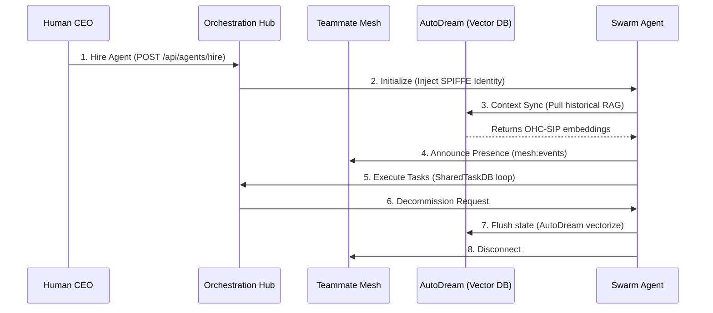

# Agent Lifecycle Walkthrough

Welcome to the Agent Lifecycle walkthrough. This guide details the complete journey of an OHC Agent, from provisioning (hiring) to decommissioning (archival), ensuring absolute autonomy and continuous evolution within the Swarm.

## 1. The Lifecycle Overview

The lifecycle of an agent within the OHC Hybrid Agentic OS consists of four distinct phases: Initialization, Context Sync, Execution, and Archival.

## 2. Phase Details

### Phase 1: Initialization
Upon hiring, the Agent is provisioned within the K8s cluster (Cloud Mode) or as a local sub-process (Standalone Mode). It receives its SPIFFE/SPIRE x509-SVID, granting it zero-trust access to the Teammate Mesh and Orchestration Hub.

### Phase 2: Context Sync (Orientation)
The Agent reaches into the `AutoDream` memory pipeline (backed by `pgvector` or local SQLite). It queries historical embeddings to understand architectural decisions, stylistic mandates (e.g., Glassmorphism), and past task resolutions to avoid repeated mistakes.

### Phase 3: Execution
The Agent enters the Master Loop (Think → Act → Observe → Decide). It claims available decomposed tasks from the `SharedTaskDB` using `FOR UPDATE SKIP LOCKED` and communicates intermediate statuses to its peers via the Teammate Mesh.

### Phase 4: Archival (Termination)
Once its mission is complete or it is instructed to decommission, the Agent gracefully shuts down. It flushes any ephemeral `.agent-task/memory/` and `agent_session_data` state into the AutoDream pipeline for long-term consolidation. It then disconnects from the Mesh and is terminated, returning the Swarm to a "Zero WIP" state.

