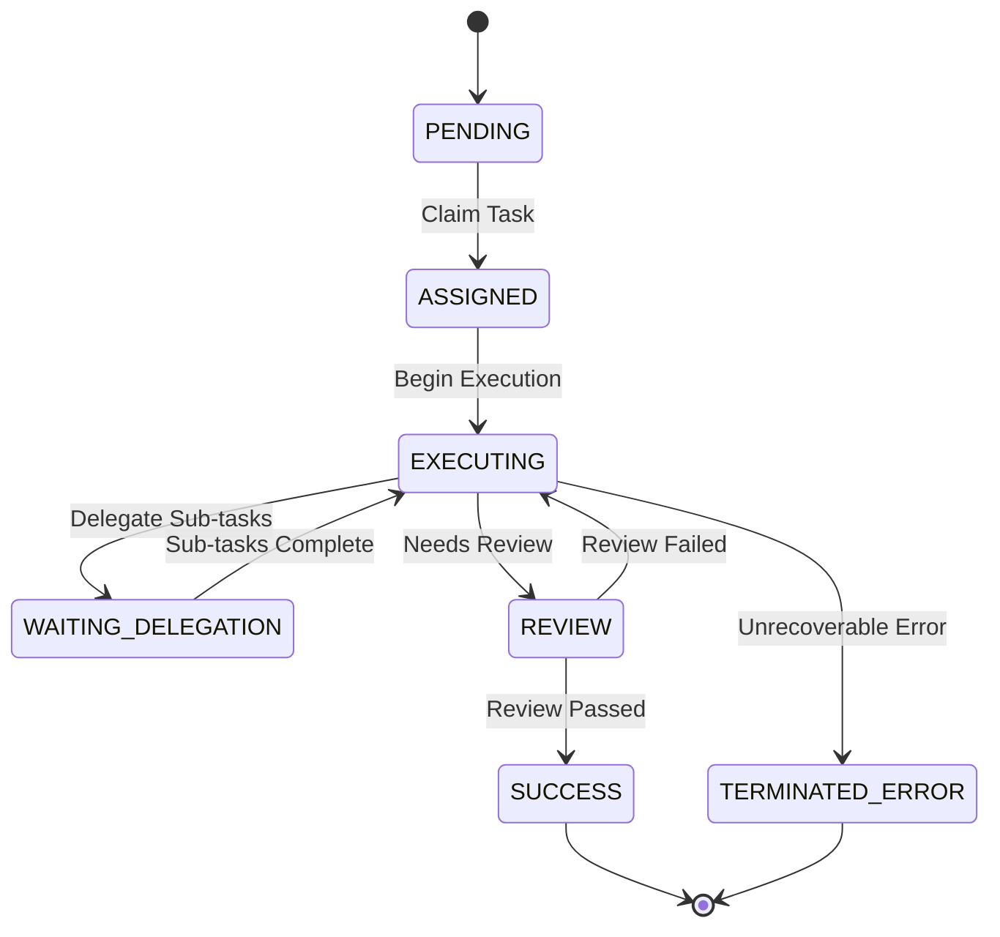
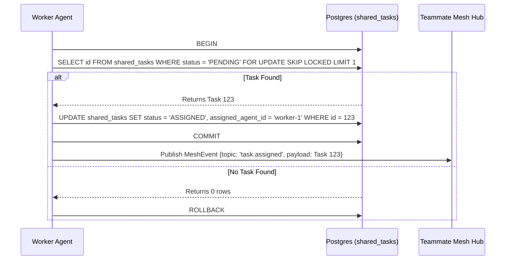

<div markdown="1" style="backdrop-filter: blur(20px) saturate(200%); font-family: 'Outfit', 'Inter', sans-serif; background: rgba(255, 255, 255, 0.05); color: #fff; padding: 20px; border-radius: 12px; border: 1px solid rgba(255, 255, 255, 0.1);">

# KAIROS API Playbook Visual Walkthrough

Welcome to the visual walkthrough of the One Human Corp API, the central nervous system of the Agentic OS. This guide provides interactive, diagram-driven insights into the Swarm Intelligence Protocol (OHC-SIP).

## 1. Zero Secrets Authentication Flow

All endpoints in OHC are secured via SPIFFE/SPIRE zero-trust principles. We eliminate static API keys to ensure maximum security.

```mermaid
graph TD
    Client[Human CEO / External Tools] --> API[OHC Gateway]
    API --> Auth{SPIFFE / OIDC}
    Auth -->|Valid| Hub[Orchestration Hub]
    Auth -->|Invalid| 401[401 Unauthorized]
    Hub --> K8s[K8s Operator]
    Hub --> Agents[Swarm Intelligence]

    classDef premium fill:rgba(255,255,255,0.03),stroke:rgba(255,255,255,0.08),stroke-width:1px,color:#fff,backdrop-filter:blur(20px) saturate(200%);
    class Client,API,Auth,Hub,401,K8s,Agents premium;
```

## 2. Distributed State Machine

The KAIROS Orchestration API uses a robust Distributed State Machine to track task execution without race conditions.



## 3. Sub-Agent Queuing Workflow

The API queues and routes tasks to the appropriate sub-agents depending on your deployment mode (Cloud-Native or Standalone).

```mermaid
graph TD
    Manager[Task Manager] -->|Enqueues| API[POST /api/queue/subagent]
    API --> QueueInterface{SubAgent Queue Interface}
    QueueInterface -->|Cloud-Native| Redis[(Redis ZSETs)]
    QueueInterface -->|Standalone| SQLite[(SQLite Mutexed Table)]
    Redis -->|Dequeues| Worker[Sub-Agent Worker]
    SQLite -->|Dequeues| Worker
    Worker -->|State Transition| V2Mesh[POST /api/mesh/v2/broadcast]
    V2Mesh --> Centrifuge[Centrifuge Node Pub/Sub]
    Centrifuge --> Swarm[Teammate Swarm]

    classDef premium fill:rgba(255,255,255,0.03),stroke:rgba(255,255,255,0.08),stroke-width:1px,color:#fff,backdrop-filter:blur(20px) saturate(200%);
    class Manager,API,QueueInterface,Redis,SQLite,Worker,V2Mesh,Centrifuge,Swarm premium;
```

## 4. Shared Task Claiming

Agents explicitly claim tasks to prevent duplicate work, using advanced locking mechanisms (`FOR UPDATE SKIP LOCKED`).



## 5. AutoDream Vector Embedding

Agent memory is continuously vectorized and indexed into the central knowledge base by the AutoDream background worker via the API.

```mermaid
graph TD
    Trigger[POST /api/v1/autodream/] --> Hub[Orchestration Hub]
    Hub --> Parser[Memory Artifact Parser]
    Parser --> Embedding[Minimax / Anthropic Embedding Model]
    Embedding --> VectorDB[(pgvector / Pinecone)]
    VectorDB --> RAGSync[RAG Sync Engine]
    RAGSync --> Mesh[Teammate Mesh Broadcast]

    classDef premium fill:rgba(255,255,255,0.03),stroke:rgba(255,255,255,0.08),stroke-width:1px,color:#fff,backdrop-filter:blur(20px) saturate(200%);
    class Trigger,Hub,Parser,Embedding,VectorDB,RAGSync,Mesh premium;
```

</div>
