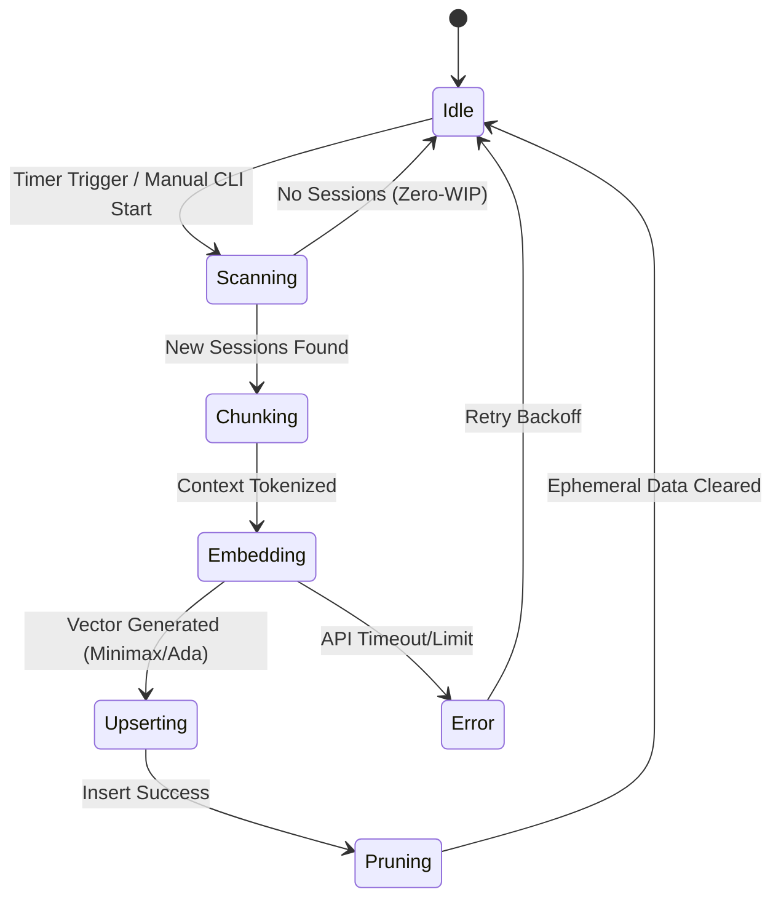

<div markdown="1" style="backdrop-filter: blur(20px) saturate(200%); font-family: 'Outfit', 'Inter', sans-serif; border: 1px solid rgba(255, 255, 255, 0.1); padding: 20px; border-radius: 12px; background: rgba(255, 255, 255, 0.05); color: #fff;">

# KAIROS AutoDream CLI: Interactive Guide

Welcome to the AutoDream CLI interactive guide. This tool allows developers and administrators to interface with the AutoDream memory consolidation engine directly from the command line, enabling robust testing, debugging, and manual operations within the OHC ecosystem.

## AutoDream Proactive State Machine

The AutoDream pipeline operates autonomously using a robust internal state machine. You can observe and trace these state transitions directly via the CLI.



## Core Commands and Visual Walkthrough

This interactive guide outlines the primary CLI commands for interacting with the AutoDream pipeline. Use the `ohc-cli autodream` namespace for all operations.

```mermaid
graph TD
    CLI[CLI User] -->|ohc-cli autodream status| Status[Check Pipeline Status]
    CLI -->|ohc-cli autodream start --force| Run[Force Memory Consolidation]
    CLI -->|ohc-cli autodream query "agent config"| Query[Query Vector Memory]
    CLI -->|ohc-cli autodream prune| Prune[Manual Cleanup]

    Status --> DB[(pgvector / SQLite)]
    Run --> LLM[Embedding Service]
    LLM --> DB
    Query --> DB
    Prune --> FS[Local Context Files]

    classDef premium fill:rgba(255,255,255,0.03),stroke:rgba(255,255,255,0.08),stroke-width:1px,color:#fff,backdrop-filter:blur(20px) saturate(200%);
    class CLI,Status,Run,Query,Prune,DB,LLM,FS premium;
```

### 1. Checking Pipeline Status

To view the current status of the AutoDream memory consolidation pipeline:

```bash
$ ohc-cli autodream status
Status: Running (State: Chunking)
Mode: Cloud (pgvector)
Last Consolidation: 5 mins ago
Pending Sessions: 2
Queue Health: Stable
```

### 2. Forcing Memory Consolidation

If you need to force an immediate embedding pass (e.g., after an important agent session), bypassing the normal scheduling timer:

```bash
$ ohc-cli autodream start --force
[INFO] State Transition: Idle -> Scanning
[INFO] Scanning for new session context...
[INFO] Found 2 pending sessions.
[INFO] State Transition: Scanning -> Chunking -> Embedding
[INFO] Generating embeddings via Minimax...
[SUCCESS] State Transition: Embedding -> Upserting
[SUCCESS] 2 sessions vectorized and upserted to autodream_memories.
```

### 3. Querying Vector Memory

To interactively query the memory space to verify what the swarm currently "knows":

```bash
$ ohc-cli autodream query "KAIROS Master Architecture" --limit 3
Top semantic results:
- [0.92] KAIROS Master Design Doc (Session ID: abc-123)
- [0.89] Distributed State Machine (Session ID: xyz-789)
- [0.85] Hybrid Execution Engine Setup (Session ID: def-456)
```

### 4. Pruning Ephemeral Data

Enforce the "Zero-WIP" protocol by clearing out old ephemeral contexts that have already been vectorized. This is normally handled by the state machine, but can be manually triggered.

```bash
$ ohc-cli autodream prune --max-age 2h
[INFO] Scanning for stale session files > 2h old...
[INFO] Removed 14 processed session logs from .ohc/runtime/memory/
[SUCCESS] Local state cleaned.
```

## Integrating with the Hybrid Architecture

The CLI automatically detects the running environment and degrades gracefully in Standalone Mode, defaulting to local embedding generation and SQLite storage.
Learn more about the core pipeline in the [AutoDream Walkthrough](kairos_autodream_walkthrough.md).

</div>