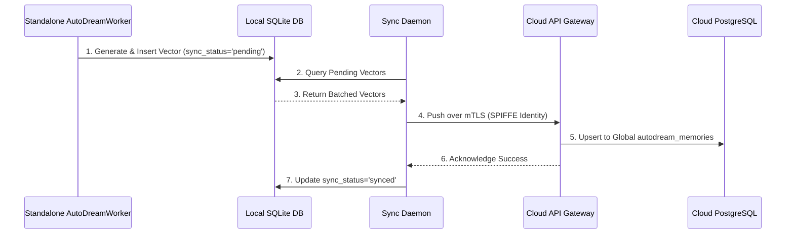

# AutoDream Sync Daemon Walkthrough

Welcome to the AutoDream Sync Daemon guide. This walkthrough explains how the OHC Hybrid Architecture synchronizes local Standalone intelligence (SQLite) up to the multitenant Cloud (PostgreSQL).

## 1. The Sync Lifecycle

The Hybrid AutoDream Synchronization enables "Infinite Scaling" while retaining local privacy. Local intelligence vectors are periodically batch-synced.

## 2. API Endpoints for Sync

The sync daemon relies on internal APIs to safely transmit vectorized data.

- **Endpoint:** `POST /api/v1/autodream/sync`
- **Purpose:** Transmit batch updates from local nodes to the cloud hub.

For full API specifications, please refer to the [API Playbook](../api/playbook.md).

