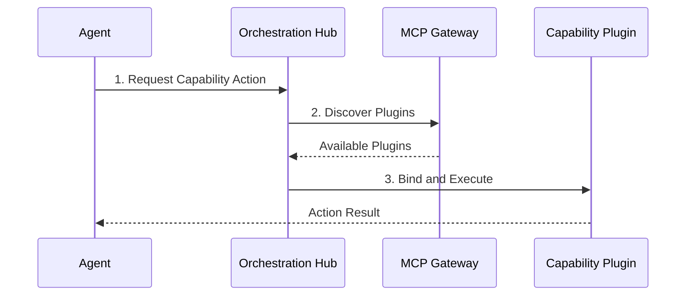

# Capability Plugin Mesh Visual Walkthrough

This guide walks through the integration and usage of the Capability Plugin Mesh within the OHC Hybrid Architecture.

## Plugin Lifecycle

## Capability Comparison

| Feature | Legacy System | Capability Plugin Mesh |
| :--- | :--- | :--- |
| **Discovery** | Hardcoded | Dynamic via MCP |
| **Execution** | Centralized | Decentralized / Sandboxed |
| **Update Cycle**| Monolithic Release | Independent Plugin Deployment |

