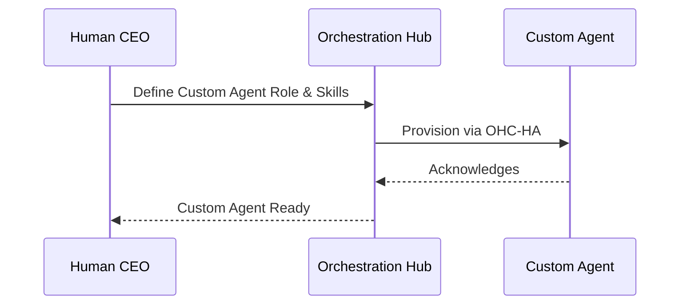

# OHC Walkthrough: Custom Agent Creation

Welcome to the Custom Agent Creation walkthrough!

## Flow

```mermaid
sequenceDiagram
    participant CEO as Human CEO
    participant Hub as Orchestration Hub
    participant Agent as Custom Agent
    CEO->>Hub: Define Custom Agent Role & Skills
    Hub->>Agent: Provision via OHC-HA
    Agent-->>Hub: Acknowledges
    Hub-->>CEO: Custom Agent Ready
```

## Steps
1. Define Role.
2. Assign domain expertise.
3. Deploy!

