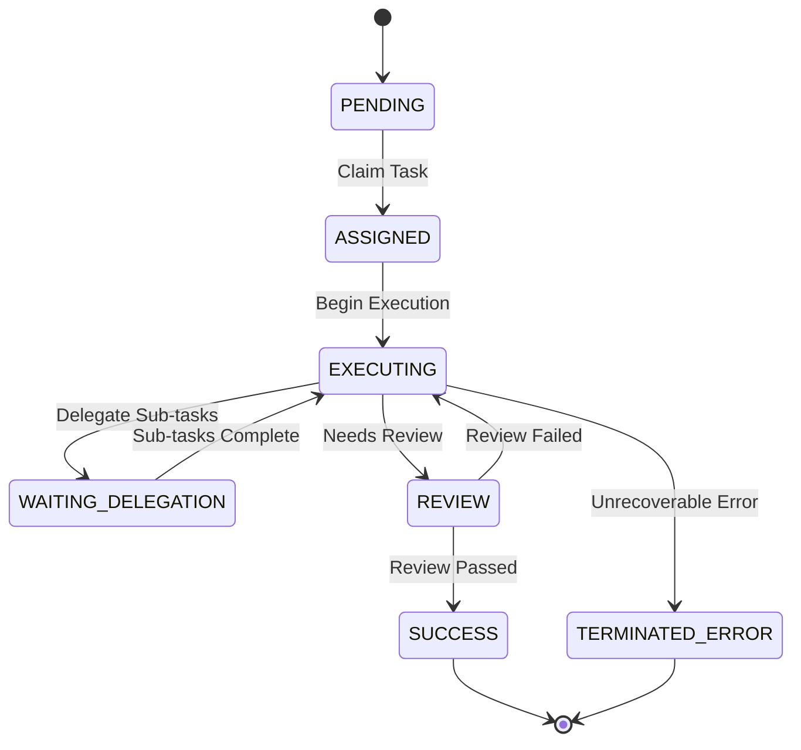

<div markdown="1" style="backdrop-filter: blur(20px) saturate(200%); font-family: 'Outfit', 'Inter', sans-serif; border: 1px solid rgba(255, 255, 255, 0.1); padding: 20px; border-radius: 12px; background: rgba(255, 255, 255, 0.05); color: #fff;">

# Distributed State Machine Walkthrough

Welcome to the Distributed State Machine guide. This walkthrough explains how autonomous agents manage task states dynamically across the Hybrid OS.

## 1. Lifecycle of a Task

The state machine manages sub-agent transitions, ensuring durability across the distributed Swarm environment.



## 2. API Transitions
Tasks are transitioned via the API endpoint, triggering mesh broadcasts.

```mermaid
graph TD
    API[POST /api/v1/state/transition] --> Hub[State Machine]
    Hub --> DB[(Postgres/SQLite)]
    DB --> Mesh[Teammate Mesh / Centrifuge]
    Mesh --> Worker[Swarm Agents]

    classDef premium fill:rgba(255,255,255,0.03),stroke:rgba(255,255,255,0.08),stroke-width:1px,color:#fff,backdrop-filter:blur(20px) saturate(200%);
    class API,Hub,DB,Mesh,Worker premium;
```

</div>
