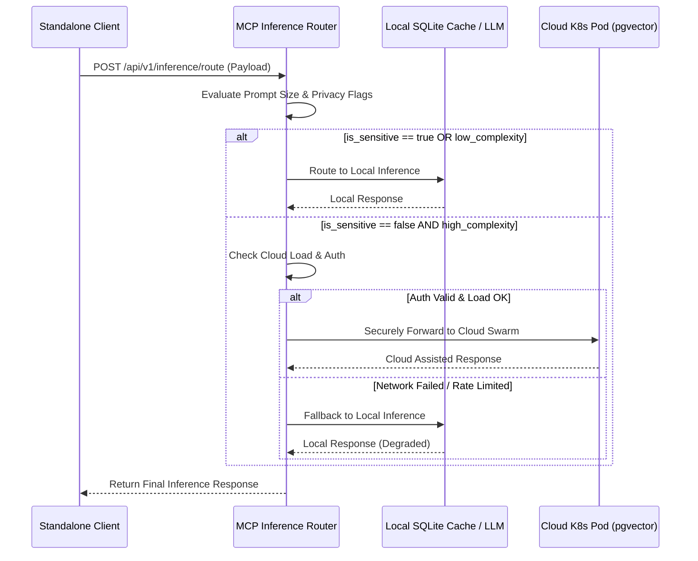

# Edge LLM Offloading Protocol

This interactive walkthrough demonstrates the Edge LLM Offloading Protocol, a critical feature of the OHC Hybrid Architecture that dynamically routes LLM inference requests between the local edge device and the cloud based on task complexity and privacy requirements.

## Protocol Flow

The following Mermaid sequence diagram illustrates the decision-making process for edge LLM offloading:

## Setup & Configuration

To enable the Edge LLM Offloading Protocol, you must configure the `mcp_inference_router` tool in your Standalone Desktop Client.

1.  Ensure you are authenticated via SPIFFE/SPIRE.
2.  Set the environment variable `OHC_EDGE_OFFLOADING_ENABLED=true`.

For a full breakdown of the API endpoints, see the [Hybrid MCP Integration API Playbook](../../walkthroughs/hybrid_mcp_rag_protocol.md).

