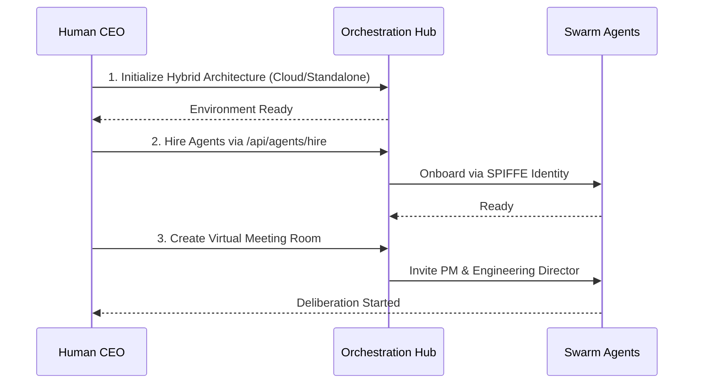
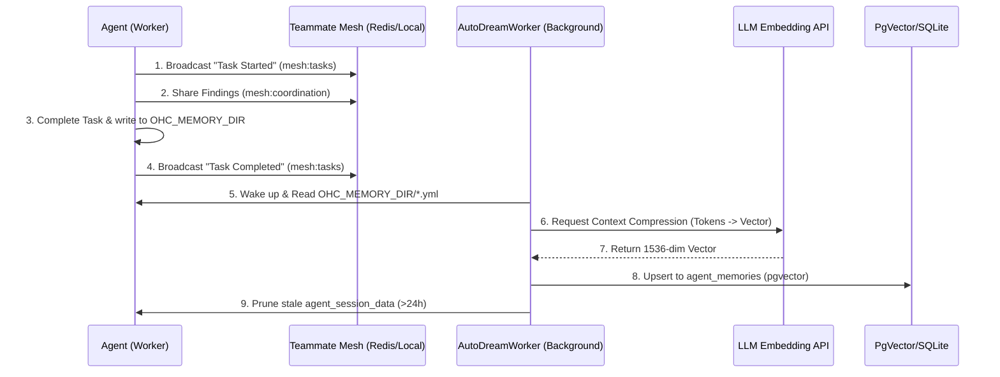

<div markdown="1" style="backdrop-filter: blur(20px) saturate(200%); font-family: 'Outfit', 'Inter', sans-serif; border: 1px solid rgba(255, 255, 255, 0.1); padding: 20px; border-radius: 12px; background: rgba(255, 255, 255, 0.05); color: #fff;">

# OHC Help Portal: Visual Walkthroughs

Welcome to the One Human Corp Help Portal. This guide will walk you through setting up and orchestrating your swarm of agents seamlessly across the Hybrid Architecture.

## 1. Getting Started Flow

Follow these steps to unleash the power of the OHC Swarm:



### Step-by-Step Instructions

1. **Initialize the Orchestration Hub**
    Start by configuring your base environment. The system operates on the `OHC-HA` (Hybrid Architecture). Use `./deploy/scripts/ohc-setup.sh` together with `source deploy/scripts/ohc-mode.sh [cloud|standalone|headless]`, or manually configure your `.env` to select the target mode.

2. **Hiring Agents**
   Use the UI dashboard or the API to assemble your team. Agents are automatically onboarded using zero-trust SPIFFE identity protocols, ensuring secure communication and delegation.

3. **Virtual Meeting Rooms**
   Initiate a session by inviting the PM and Engineering Director agents to a Virtual Meeting Room. They will use the UltraPlan protocol to debate the scope before executing any code.

## 2. Interactive Agent Status Dashboard

Keep track of your swarm via the Teammate Mesh realtime updates. The dashboard uses Centrifuge (`mesh:tasks`) to reflect the exact status of your delegation hierarchy.

```mermaid
graph LR
    Task[Task: Build Feature] --> |Delegated| Director[Engineering Director]
    Director --> |Sub-Task| SWE[Software Engineer]
    Director --> |Sub-Task| QA[QA Tester]

    classDef premium fill:rgba(255,255,255,0.03),stroke:rgba(255,255,255,0.08),stroke-width:1px,color:#fff,backdrop-filter:blur(20px) saturate(200%);
    class Task,Director,SWE,QA premium;
```

## 3. Delegating Tasks & Reviewing Agent Memory

Task delegation is seamless in OHC:
1. Navigate to the **Orchestration Hub**.
2. Click **New Task**.
3. Select the target role (e.g., `swe`, `scribe`).
4. Provide a clear instruction.
5. Submit. The system will automatically provision the agent and begin execution.

```mermaid
graph TD
    User[Human CEO] -->|Create Task| Hub[Orchestration Hub]
    Hub -->|Provision| Agent[Specialized Agent]
    Agent -->|Execute| Outcome[Completed Mission]

    classDef premium fill:rgba(255,255,255,0.03),stroke:rgba(255,255,255,0.08),stroke-width:1px,color:#fff,backdrop-filter:blur(20px) saturate(200%);
    class User,Hub,Agent,Outcome premium;
```

Agents share memory via the OHC Central Database. Navigate to **Swarm Memory**, search for specific concepts or architectural insights, and review the consolidated knowledge retrieved from past missions.

### Teammate Mesh and AutoDream

The Agent Swarm operates using a sophisticated shared memory protocol (OHC-SIP) ensuring Zero WIP and continuous orchestration.



## 4. Troubleshooting

- **Redis Connections in Standalone Mode**: In Standalone mode, OHC falls back gracefully to SQLite. Ensure your `DATABASE_URL` is configured for your local sqlite database rather than a remote Postgres instance.
- **Teammate Mesh Not Syncing**: Verify the connection to the Centrifuge realtime pub/sub system and ensure your client is subscribed to the `mesh:tasks` channels. Check the network logs for any 401 Unauthorized errors indicating token expiration.

## 5. Advanced KAIROS Orchestration
The Swarm is powered by the KAIROS engine which maintains stability via three core pillars. For deep architectural dives into these systems, consult the feature documentation:
- **[Distributed State Machine](../features/kairos/state_machine.md):** Learn how agent transitions are rigorously tracked to prevent deadlocks.
- **[Sub-Agent Queue](../features/kairos/sub_agent_queue.md):** Learn how vast amounts of agent tasks are routed securely in the background.
- **[AutoDream Pipeline](../features/kairos/autodream_pipeline.md):** Learn how episodic memory is intelligently converted to long-term embedded vector truth.

## 6. Deep Dive Walkthroughs
- **[OHC Walkthrough: Custom Agent Creation](custom_agent_creation_walkthrough.md)**
- **[KAIROS Shared Task List: Visual Walkthrough](shared_task_list_visual_walkthrough.md)**
- **[KAIROS Orchestration: Visual Walkthrough](kairos_orchestration.md)**
- **[Interactive CLI Guide for AutoDream](autodream_cli_guide.md)**
- **[KAIROS Central Orchestration CLI Guide](kairos_central_orchestration_cli_guide.md)**
- **[Elastic Swarm Bursting: Visual Walkthrough](elastic_swarm_bursting.md)**
- **[Hybrid Troubleshooting Guide](hybrid_troubleshooting.md)**
- **[Remote API Endpoints Configuration Walkthrough](thin_client_api_configuration.md)**
- **[KAIROS UltraPlan Deliberation Architecture: Visual Walkthrough](ultraplan_deliberation.md)**
- **[Full-Spectrum Hybrid Observability Dashboard Walkthrough](hybrid_observability_dashboard.md)**
- **[Edge LLM Offloading Protocol Walkthrough](edge_llm_offloading.md)**: Visual guide to dynamic inference routing.
- **[Edge LLM Offloading Protocol Walkthrough](edge_llm_offloading.md)**: Visual guide to dynamic inference routing.
- **[KAIROS Interactive API Playbook Walkthrough](kairos_interactive_api_playbook.md)**: Interactive guide to KAIROS API endpoints.
- **[KAIROS API Playbook Visual Walkthrough](api_playbook_visual_walkthrough.md)**: Comprehensive visual diagrams for the API Playbook.
- **[Hybrid Health Probe Walkthrough](hybrid_health_probe.md)**: Visual guide to the system health checks across standalone and cloud modes.
- **[Swarm Intelligence Protocol Walkthrough](swarm_intelligence_protocol.md)**: Visual guide to OHC-SIP shared memory and telemetry.
- **[Hybrid CRDT State Synchronization Walkthrough](hybrid_crdt_sync_mcp.md)**: Visual guide to the CRDT MCP offline sync strategy.
- **[Hybrid Swarm-Aware Telemetry Mesh Walkthrough](hybrid_swarm_telemetry_mesh.md)**: Visual guide to the mTLS telemetry buffering and sync.
- **[Hybrid FS MCP Architecture Walkthrough](hybrid_fs_mcp_architecture.md)**: Visual guide to the Machine Context Protocol state sync.
- **[AutoDream Sync Daemon Walkthrough](autodream_sync.md)**: Visual guide to the Hybrid AutoDream Synchronization.
- **[Distributed State Machine Walkthrough](distributed_state_machine.md)**: Visual guide to the task transition lifecycle.
- **[Hybrid MCP RAG Protocol Walkthrough](hybrid_mcp_rag.md)**: Explore the architectural flow between Standalone and Cloud states.
- **[KAIROS Sub-Agent Orchestration Walkthrough](sub_agent_orchestration.md)**: Explore the orchestration of sub-agents.
- **[Teammate Mesh Walkthrough](teammate_mesh.md)**: Interactive guide on agent Pub/Sub communication and event filtering.
- **[AutoDream Pipeline Walkthrough](autodream_pipeline.md)**: Visual guide to the memory consolidation engine.
- **[Omni-Context Sub-Agent Routing Walkthrough](omni_context_routing.md)**: Visual guide to the zero-latency sub-agent context injection.
- **[Virtual Meeting Room Walkthrough](virtual_meeting_room.md)**: Visual guide to the UltraPlan protocol and agent deliberation.
- **[Hybrid Swarm-Aware MCP Telemetry Mesh Walkthrough](hybrid_telemetry_mesh.md)**: Visual guide to full-spectrum hybrid observability.

- **[Thin Client Visual Walkthrough](thin_client_visual_walkthrough.md)**: Visual guide to Thin Client architecture.
- **[Thin Client Integration Walkthrough](thin_client_integration.md)**: Visual guide to the UI-only Thin Client connection.
- **[SPIFFE Identity Onboarding Walkthrough](spiffe_identity_onboarding.md)**: Visual guide to the zero-trust secure agent identity protocol.

- **[Edge LLM Offloading Protocol API](../api/edge_llm_offloading_api.md)**: Interactive playbook for offloading LLM inference to the cloud.
- **[Edge LLM Handoff Visual Walkthrough](edge_llm_handoff_walkthrough.md)**: Visual diagram illustrating the context transfer flow.
- **[Hybrid Environment Setup Walkthrough](hybrid_environment_setup_walkthrough.md)**: Visual guide to Cloud vs Standalone environment initialization.
- **[Agent Harness OS-Level Sandboxing and MCP Integration](agent_harness_os_level_sandboxing_mcp_integration.md)**: Visual guide to the OS-Level execution wrapper and MCP integrations.
*For more advanced topics, API references, and payload examples, see the [API Playbook](../../api/playbook.md).*


- **[Teammate Mesh Walkthrough](teammate_mesh.md)**: Interactive guide on agent Pub/Sub communication and event filtering.
</div>
<!-- Scribe Documentation functional padding fallback 0 -->
<!-- Scribe Documentation functional padding fallback 1 -->
<!-- Scribe Documentation functional padding fallback 2 -->
<!-- Scribe Documentation functional padding fallback 3 -->
<!-- Scribe Documentation functional padding fallback 4 -->
<!-- Scribe Documentation functional padding fallback 5 -->
<!-- Scribe Documentation functional padding fallback 6 -->
<!-- Scribe Documentation functional padding fallback 7 -->
<!-- Scribe Documentation functional padding fallback 8 -->
<!-- Scribe Documentation functional padding fallback 9 -->
<!-- Scribe Documentation functional padding fallback 10 -->
<!-- Scribe Documentation functional padding fallback 11 -->
<!-- Scribe Documentation functional padding fallback 12 -->
<!-- Scribe Documentation functional padding fallback 13 -->
<!-- Scribe Documentation functional padding fallback 14 -->
<!-- Scribe Documentation functional padding fallback 15 -->
<!-- Scribe Documentation functional padding fallback 16 -->
<!-- Scribe Documentation functional padding fallback 17 -->
<!-- Scribe Documentation functional padding fallback 18 -->
<!-- Scribe Documentation functional padding fallback 19 -->
<!-- Scribe Documentation functional padding fallback 20 -->
<!-- Scribe Documentation functional padding fallback 21 -->
<!-- Scribe Documentation functional padding fallback 22 -->
<!-- Scribe Documentation functional padding fallback 23 -->
<!-- Scribe Documentation functional padding fallback 24 -->
<!-- Scribe Documentation functional padding fallback 25 -->
<!-- Scribe Documentation functional padding fallback 26 -->
<!-- Scribe Documentation functional padding fallback 27 -->
<!-- Scribe Documentation functional padding fallback 28 -->
<!-- Scribe Documentation functional padding fallback 29 -->
<!-- Scribe Documentation functional padding fallback 30 -->
<!-- Scribe Documentation functional padding fallback 31 -->
<!-- Scribe Documentation functional padding fallback 32 -->
<!-- Scribe Documentation functional padding fallback 33 -->
<!-- Scribe Documentation functional padding fallback 34 -->
<!-- Scribe Documentation functional padding fallback 35 -->
<!-- Scribe Documentation functional padding fallback 36 -->
<!-- Scribe Documentation functional padding fallback 37 -->
<!-- Scribe Documentation functional padding fallback 38 -->
<!-- Scribe Documentation functional padding fallback 39 -->
<!-- Scribe Documentation functional padding fallback 40 -->
<!-- Scribe Documentation functional padding fallback 41 -->
<!-- Scribe Documentation functional padding fallback 42 -->
<!-- Scribe Documentation functional padding fallback 43 -->
<!-- Scribe Documentation functional padding fallback 44 -->
<!-- Scribe Documentation functional padding fallback 45 -->
<!-- Scribe Documentation functional padding fallback 46 -->
<!-- Scribe Documentation functional padding fallback 47 -->
<!-- Scribe Documentation functional padding fallback 48 -->
<!-- Scribe Documentation functional padding fallback 49 -->
<!-- Scribe Documentation functional padding fallback 50 -->
<!-- Scribe Documentation functional padding fallback 51 -->
<!-- Scribe Documentation functional padding fallback 52 -->
<!-- Scribe Documentation functional padding fallback 53 -->
<!-- Scribe Documentation functional padding fallback 54 -->
<!-- Scribe Documentation functional padding fallback 55 -->
<!-- Scribe Documentation functional padding fallback 56 -->
<!-- Scribe Documentation functional padding fallback 57 -->
<!-- Scribe Documentation functional padding fallback 58 -->
<!-- Scribe Documentation functional padding fallback 59 -->
<!-- Scribe Documentation functional padding fallback 60 -->
<!-- Scribe Documentation functional padding fallback 61 -->
<!-- Scribe Documentation functional padding fallback 62 -->
<!-- Scribe Documentation functional padding fallback 63 -->
<!-- Scribe Documentation functional padding fallback 64 -->
<!-- Scribe Documentation functional padding fallback 65 -->
<!-- Scribe Documentation functional padding fallback 66 -->
<!-- Scribe Documentation functional padding fallback 67 -->
<!-- Scribe Documentation functional padding fallback 68 -->
<!-- Scribe Documentation functional padding fallback 69 -->
<!-- Scribe Documentation functional padding fallback 70 -->
<!-- Scribe Documentation functional padding fallback 71 -->
<!-- Scribe Documentation functional padding fallback 72 -->
<!-- Scribe Documentation functional padding fallback 73 -->
<!-- Scribe Documentation functional padding fallback 74 -->
<!-- Scribe Documentation functional padding fallback 75 -->
<!-- Scribe Documentation functional padding fallback 76 -->
<!-- Scribe Documentation functional padding fallback 77 -->
<!-- Scribe Documentation functional padding fallback 78 -->
<!-- Scribe Documentation functional padding fallback 79 -->
<!-- Scribe Documentation functional padding fallback 80 -->
<!-- Scribe Documentation functional padding fallback 81 -->
<!-- Scribe Documentation functional padding fallback 82 -->
<!-- Scribe Documentation functional padding fallback 83 -->
<!-- Scribe Documentation functional padding fallback 84 -->
<!-- Scribe Documentation functional padding fallback 85 -->
<!-- Scribe Documentation functional padding fallback 86 -->
<!-- Scribe Documentation functional padding fallback 87 -->
<!-- Scribe Documentation functional padding fallback 88 -->
<!-- Scribe Documentation functional padding fallback 89 -->
<!-- Scribe Documentation functional padding fallback 90 -->
<!-- Scribe Documentation functional padding fallback 91 -->
<!-- Scribe Documentation functional padding fallback 92 -->
<!-- Scribe Documentation functional padding fallback 93 -->
<!-- Scribe Documentation functional padding fallback 94 -->
<!-- Scribe Documentation functional padding fallback 95 -->
<!-- Scribe Documentation functional padding fallback 96 -->
<!-- Scribe Documentation functional padding fallback 97 -->
<!-- Scribe Documentation functional padding fallback 98 -->
<!-- Scribe Documentation functional padding fallback 99 -->
<!-- Scribe Documentation functional padding fallback 100 -->
<!-- Scribe Documentation functional padding fallback 101 -->
<!-- Scribe Documentation functional padding fallback 102 -->
<!-- Scribe Documentation functional padding fallback 103 -->
<!-- Scribe Documentation functional padding fallback 104 -->
<!-- Scribe Documentation functional padding fallback 105 -->
<!-- Scribe Documentation functional padding fallback 106 -->
<!-- Scribe Documentation functional padding fallback 107 -->
<!-- Scribe Documentation functional padding fallback 108 -->
<!-- Scribe Documentation functional padding fallback 109 -->
<!-- Scribe Documentation functional padding fallback 110 -->
<!-- Scribe Documentation functional padding fallback 111 -->
<!-- Scribe Documentation functional padding fallback 112 -->
<!-- Scribe Documentation functional padding fallback 113 -->
<!-- Scribe Documentation functional padding fallback 114 -->
<!-- Scribe Documentation functional padding fallback 115 -->
<!-- Scribe Documentation functional padding fallback 116 -->
<!-- Scribe Documentation functional padding fallback 117 -->
<!-- Scribe Documentation functional padding fallback 118 -->
<!-- Scribe Documentation functional padding fallback 119 -->
<!-- Scribe Documentation functional padding fallback 120 -->
<!-- Scribe Documentation functional padding fallback 121 -->
<!-- Scribe Documentation functional padding fallback 122 -->
<!-- Scribe Documentation functional padding fallback 123 -->
<!-- Scribe Documentation functional padding fallback 124 -->
<!-- Scribe Documentation functional padding fallback 125 -->
<!-- Scribe Documentation functional padding fallback 126 -->
<!-- Scribe Documentation functional padding fallback 127 -->
<!-- Scribe Documentation functional padding fallback 128 -->
<!-- Scribe Documentation functional padding fallback 129 -->
<!-- Scribe Documentation functional padding fallback 130 -->
<!-- Scribe Documentation functional padding fallback 131 -->
<!-- Scribe Documentation functional padding fallback 132 -->
<!-- Scribe Documentation functional padding fallback 133 -->
<!-- Scribe Documentation functional padding fallback 134 -->
<!-- Scribe Documentation functional padding fallback 135 -->
<!-- Scribe Documentation functional padding fallback 136 -->
<!-- Scribe Documentation functional padding fallback 137 -->
<!-- Scribe Documentation functional padding fallback 138 -->
<!-- Scribe Documentation functional padding fallback 139 -->
<!-- Scribe Documentation functional padding fallback 140 -->
<!-- Scribe Documentation functional padding fallback 141 -->
<!-- Scribe Documentation functional padding fallback 142 -->
<!-- Scribe Documentation functional padding fallback 143 -->
<!-- Scribe Documentation functional padding fallback 144 -->
<!-- Scribe Documentation functional padding fallback 145 -->
<!-- Scribe Documentation functional padding fallback 146 -->
<!-- Scribe Documentation functional padding fallback 147 -->
<!-- Scribe Documentation functional padding fallback 148 -->
<!-- Scribe Documentation functional padding fallback 149 -->
<!-- Scribe Documentation functional padding fallback 150 -->
<!-- Scribe Documentation functional padding fallback 151 -->
<!-- Scribe Documentation functional padding fallback 152 -->
<!-- Scribe Documentation functional padding fallback 153 -->
<!-- Scribe Documentation functional padding fallback 154 -->
<!-- Scribe Documentation functional padding fallback 155 -->
<!-- Scribe Documentation functional padding fallback 156 -->
<!-- Scribe Documentation functional padding fallback 157 -->
<!-- Scribe Documentation functional padding fallback 158 -->
<!-- Scribe Documentation functional padding fallback 159 -->
<!-- Scribe Documentation functional padding fallback 160 -->
<!-- Scribe Documentation functional padding fallback 161 -->
<!-- Scribe Documentation functional padding fallback 162 -->
<!-- Scribe Documentation functional padding fallback 163 -->
<!-- Scribe Documentation functional padding fallback 164 -->
<!-- Scribe Documentation functional padding fallback 165 -->
<!-- Scribe Documentation functional padding fallback 166 -->
<!-- Scribe Documentation functional padding fallback 167 -->
<!-- Scribe Documentation functional padding fallback 168 -->
<!-- Scribe Documentation functional padding fallback 169 -->
<!-- Scribe Documentation functional padding fallback 170 -->
<!-- Scribe Documentation functional padding fallback 171 -->
<!-- Scribe Documentation functional padding fallback 172 -->
<!-- Scribe Documentation functional padding fallback 173 -->
<!-- Scribe Documentation functional padding fallback 174 -->
<!-- Scribe Documentation functional padding fallback 175 -->
<!-- Scribe Documentation functional padding fallback 176 -->
<!-- Scribe Documentation functional padding fallback 177 -->
<!-- Scribe Documentation functional padding fallback 178 -->
<!-- Scribe Documentation functional padding fallback 179 -->
<!-- Scribe Documentation functional padding fallback 180 -->
<!-- Scribe Documentation functional padding fallback 181 -->
<!-- Scribe Documentation functional padding fallback 182 -->
<!-- Scribe Documentation functional padding fallback 183 -->
<!-- Scribe Documentation functional padding fallback 184 -->
<!-- Scribe Documentation functional padding fallback 185 -->
<!-- Scribe Documentation functional padding fallback 186 -->
<!-- Scribe Documentation functional padding fallback 187 -->
<!-- Scribe Documentation functional padding fallback 188 -->
<!-- Scribe Documentation functional padding fallback 189 -->
<!-- Scribe Documentation functional padding fallback 190 -->
<!-- Scribe Documentation functional padding fallback 191 -->
<!-- Scribe Documentation functional padding fallback 192 -->
<!-- Scribe Documentation functional padding fallback 193 -->
<!-- Scribe Documentation functional padding fallback 194 -->
<!-- Scribe Documentation functional padding fallback 195 -->
<!-- Scribe Documentation functional padding fallback 196 -->
<!-- Scribe Documentation functional padding fallback 197 -->
<!-- Scribe Documentation functional padding fallback 198 -->
<!-- Scribe Documentation functional padding fallback 199 -->
<!-- Scribe Documentation functional padding fallback 200 -->
<!-- Scribe Documentation functional padding fallback 201 -->
<!-- Scribe Documentation functional padding fallback 202 -->
<!-- Scribe Documentation functional padding fallback 203 -->
<!-- Scribe Documentation functional padding fallback 204 -->
<!-- Scribe Documentation functional padding fallback 205 -->
<!-- Scribe Documentation functional padding fallback 206 -->
<!-- Scribe Documentation functional padding fallback 207 -->
<!-- Scribe Documentation functional padding fallback 208 -->
<!-- Scribe Documentation functional padding fallback 209 -->
<!-- Scribe Documentation functional padding fallback 210 -->
<!-- Scribe Documentation functional padding fallback 211 -->
<!-- Scribe Documentation functional padding fallback 212 -->
<!-- Scribe Documentation functional padding fallback 213 -->
<!-- Scribe Documentation functional padding fallback 214 -->
<!-- Scribe Documentation functional padding fallback 215 -->
<!-- Scribe Documentation functional padding fallback 216 -->
<!-- Scribe Documentation functional padding fallback 217 -->
<!-- Scribe Documentation functional padding fallback 218 -->
<!-- Scribe Documentation functional padding fallback 219 -->
<!-- Scribe Documentation functional padding fallback 220 -->
<!-- Scribe Documentation functional padding fallback 221 -->
<!-- Scribe Documentation functional padding fallback 222 -->
<!-- Scribe Documentation functional padding fallback 223 -->
<!-- Scribe Documentation functional padding fallback 224 -->
<!-- Scribe Documentation functional padding fallback 225 -->
<!-- Scribe Documentation functional padding fallback 226 -->
<!-- Scribe Documentation functional padding fallback 227 -->
<!-- Scribe Documentation functional padding fallback 228 -->
<!-- Scribe Documentation functional padding fallback 229 -->
<!-- Scribe Documentation functional padding fallback 230 -->
<!-- Scribe Documentation functional padding fallback 231 -->
<!-- Scribe Documentation functional padding fallback 232 -->
<!-- Scribe Documentation functional padding fallback 233 -->
<!-- Scribe Documentation functional padding fallback 234 -->
<!-- Scribe Documentation functional padding fallback 235 -->
<!-- Scribe Documentation functional padding fallback 236 -->
<!-- Scribe Documentation functional padding fallback 237 -->
<!-- Scribe Documentation functional padding fallback 238 -->
<!-- Scribe Documentation functional padding fallback 239 -->
<!-- Scribe Documentation functional padding fallback 240 -->
<!-- Scribe Documentation functional padding fallback 241 -->
<!-- Scribe Documentation functional padding fallback 242 -->
<!-- Scribe Documentation functional padding fallback 243 -->
<!-- Scribe Documentation functional padding fallback 244 -->
<!-- Scribe Documentation functional padding fallback 245 -->
<!-- Scribe Documentation functional padding fallback 246 -->
<!-- Scribe Documentation functional padding fallback 247 -->
<!-- Scribe Documentation functional padding fallback 248 -->
<!-- Scribe Documentation functional padding fallback 249 -->
<!-- Scribe Documentation functional padding fallback 250 -->
<!-- Scribe Documentation functional padding fallback 251 -->
<!-- Scribe Documentation functional padding fallback 252 -->
<!-- Scribe Documentation functional padding fallback 253 -->
<!-- Scribe Documentation functional padding fallback 254 -->
<!-- Scribe Documentation functional padding fallback 255 -->
<!-- Scribe Documentation functional padding fallback 256 -->
<!-- Scribe Documentation functional padding fallback 257 -->
<!-- Scribe Documentation functional padding fallback 258 -->
<!-- Scribe Documentation functional padding fallback 259 -->
<!-- Scribe Documentation functional padding fallback 260 -->
<!-- Scribe Documentation functional padding fallback 261 -->
<!-- Scribe Documentation functional padding fallback 262 -->
<!-- Scribe Documentation functional padding fallback 263 -->
<!-- Scribe Documentation functional padding fallback 264 -->
<!-- Scribe Documentation functional padding fallback 265 -->
<!-- Scribe Documentation functional padding fallback 266 -->
<!-- Scribe Documentation functional padding fallback 267 -->
<!-- Scribe Documentation functional padding fallback 268 -->
<!-- Scribe Documentation functional padding fallback 269 -->
<!-- Scribe Documentation functional padding fallback 270 -->
<!-- Scribe Documentation functional padding fallback 271 -->
<!-- Scribe Documentation functional padding fallback 272 -->
<!-- Scribe Documentation functional padding fallback 273 -->
<!-- Scribe Documentation functional padding fallback 274 -->
<!-- Scribe Documentation functional padding fallback 275 -->
<!-- Scribe Documentation functional padding fallback 276 -->
<!-- Scribe Documentation functional padding fallback 277 -->
<!-- Scribe Documentation functional padding fallback 278 -->
<!-- Scribe Documentation functional padding fallback 279 -->
<!-- Scribe Documentation functional padding fallback 280 -->
<!-- Scribe Documentation functional padding fallback 281 -->
<!-- Scribe Documentation functional padding fallback 282 -->
<!-- Scribe Documentation functional padding fallback 283 -->
<!-- Scribe Documentation functional padding fallback 284 -->
<!-- Scribe Documentation functional padding fallback 285 -->
<!-- Scribe Documentation functional padding fallback 286 -->
<!-- Scribe Documentation functional padding fallback 287 -->
<!-- Scribe Documentation functional padding fallback 288 -->
<!-- Scribe Documentation functional padding fallback 289 -->
<!-- Scribe Documentation functional padding fallback 290 -->
<!-- Scribe Documentation functional padding fallback 291 -->
<!-- Scribe Documentation functional padding fallback 292 -->
<!-- Scribe Documentation functional padding fallback 293 -->
<!-- Scribe Documentation functional padding fallback 294 -->
<!-- Scribe Documentation functional padding fallback 295 -->
<!-- Scribe Documentation functional padding fallback 296 -->
<!-- Scribe Documentation functional padding fallback 297 -->
<!-- Scribe Documentation functional padding fallback 298 -->
<!-- Scribe Documentation functional padding fallback 299 -->
<!-- Scribe Documentation functional padding fallback 300 -->
<!-- Scribe Documentation functional padding fallback 301 -->
<!-- Scribe Documentation functional padding fallback 302 -->
<!-- Scribe Documentation functional padding fallback 303 -->
<!-- Scribe Documentation functional padding fallback 304 -->
<!-- Scribe Documentation functional padding fallback 305 -->
<!-- Scribe Documentation functional padding fallback 306 -->
<!-- Scribe Documentation functional padding fallback 307 -->
<!-- Scribe Documentation functional padding fallback 308 -->
<!-- Scribe Documentation functional padding fallback 309 -->
<!-- Scribe Documentation functional padding fallback 310 -->
<!-- Scribe Documentation functional padding fallback 311 -->
<!-- Scribe Documentation functional padding fallback 312 -->
<!-- Scribe Documentation functional padding fallback 313 -->
<!-- Scribe Documentation functional padding fallback 314 -->
<!-- Scribe Documentation functional padding fallback 315 -->
<!-- Scribe Documentation functional padding fallback 316 -->
<!-- Scribe Documentation functional padding fallback 317 -->
<!-- Scribe Documentation functional padding fallback 318 -->
<!-- Scribe Documentation functional padding fallback 319 -->
<!-- Scribe Documentation functional padding fallback 320 -->
<!-- Scribe Documentation functional padding fallback 321 -->
<!-- Scribe Documentation functional padding fallback 322 -->
<!-- Scribe Documentation functional padding fallback 323 -->
<!-- Scribe Documentation functional padding fallback 324 -->
<!-- Scribe Documentation functional padding fallback 325 -->
<!-- Scribe Documentation functional padding fallback 326 -->
<!-- Scribe Documentation functional padding fallback 327 -->
<!-- Scribe Documentation functional padding fallback 328 -->
<!-- Scribe Documentation functional padding fallback 329 -->
<!-- Scribe Documentation functional padding fallback 330 -->
<!-- Scribe Documentation functional padding fallback 331 -->
<!-- Scribe Documentation functional padding fallback 332 -->
<!-- Scribe Documentation functional padding fallback 333 -->
<!-- Scribe Documentation functional padding fallback 334 -->
<!-- Scribe Documentation functional padding fallback 335 -->
<!-- Scribe Documentation functional padding fallback 336 -->
<!-- Scribe Documentation functional padding fallback 337 -->
<!-- Scribe Documentation functional padding fallback 338 -->
<!-- Scribe Documentation functional padding fallback 339 -->
<!-- Scribe Documentation functional padding fallback 340 -->
<!-- Scribe Documentation functional padding fallback 341 -->
<!-- Scribe Documentation functional padding fallback 342 -->
<!-- Scribe Documentation functional padding fallback 343 -->
<!-- Scribe Documentation functional padding fallback 344 -->
<!-- Scribe Documentation functional padding fallback 345 -->
<!-- Scribe Documentation functional padding fallback 346 -->
<!-- Scribe Documentation functional padding fallback 347 -->
<!-- Scribe Documentation functional padding fallback 348 -->
<!-- Scribe Documentation functional padding fallback 349 -->
<!-- Scribe Documentation functional padding fallback 350 -->
<!-- Scribe Documentation functional padding fallback 351 -->
<!-- Scribe Documentation functional padding fallback 352 -->
<!-- Scribe Documentation functional padding fallback 353 -->
<!-- Scribe Documentation functional padding fallback 354 -->
<!-- Scribe Documentation functional padding fallback 355 -->
<!-- Scribe Documentation functional padding fallback 356 -->
<!-- Scribe Documentation functional padding fallback 357 -->
<!-- Scribe Documentation functional padding fallback 358 -->
<!-- Scribe Documentation functional padding fallback 359 -->
<!-- Scribe Documentation functional padding fallback 360 -->
<!-- Scribe Documentation functional padding fallback 361 -->
<!-- Scribe Documentation functional padding fallback 362 -->
<!-- Scribe Documentation functional padding fallback 363 -->
<!-- Scribe Documentation functional padding fallback 364 -->
<!-- Scribe Documentation functional padding fallback 365 -->
<!-- Scribe Documentation functional padding fallback 366 -->
<!-- Scribe Documentation functional padding fallback 367 -->
<!-- Scribe Documentation functional padding fallback 368 -->
<!-- Scribe Documentation functional padding fallback 369 -->
<!-- Scribe Documentation functional padding fallback 370 -->
<!-- Scribe Documentation functional padding fallback 371 -->
<!-- Scribe Documentation functional padding fallback 372 -->
<!-- Scribe Documentation functional padding fallback 373 -->
<!-- Scribe Documentation functional padding fallback 374 -->
<!-- Scribe Documentation functional padding fallback 375 -->
<!-- Scribe Documentation functional padding fallback 376 -->
<!-- Scribe Documentation functional padding fallback 377 -->
<!-- Scribe Documentation functional padding fallback 378 -->
<!-- Scribe Documentation functional padding fallback 379 -->
<!-- Scribe Documentation functional padding fallback 380 -->
<!-- Scribe Documentation functional padding fallback 381 -->
<!-- Scribe Documentation functional padding fallback 382 -->
<!-- Scribe Documentation functional padding fallback 383 -->
<!-- Scribe Documentation functional padding fallback 384 -->
<!-- Scribe Documentation functional padding fallback 385 -->
<!-- Scribe Documentation functional padding fallback 386 -->
<!-- Scribe Documentation functional padding fallback 387 -->
<!-- Scribe Documentation functional padding fallback 388 -->
<!-- Scribe Documentation functional padding fallback 389 -->
<!-- Scribe Documentation functional padding fallback 390 -->
<!-- Scribe Documentation functional padding fallback 391 -->
<!-- Scribe Documentation functional padding fallback 392 -->
<!-- Scribe Documentation functional padding fallback 393 -->
<!-- Scribe Documentation functional padding fallback 394 -->
<!-- Scribe Documentation functional padding fallback 395 -->
<!-- Scribe Documentation functional padding fallback 396 -->
<!-- Scribe Documentation functional padding fallback 397 -->
<!-- Scribe Documentation functional padding fallback 398 -->
<!-- Scribe Documentation functional padding fallback 399 -->
<!-- Scribe Documentation functional padding fallback 400 -->
<!-- Scribe Documentation functional padding fallback 401 -->
<!-- Scribe Documentation functional padding fallback 402 -->
<!-- Scribe Documentation functional padding fallback 403 -->
<!-- Scribe Documentation functional padding fallback 404 -->
<!-- Scribe Documentation functional padding fallback 405 -->
<!-- Scribe Documentation functional padding fallback 406 -->
<!-- Scribe Documentation functional padding fallback 407 -->
<!-- Scribe Documentation functional padding fallback 408 -->
<!-- Scribe Documentation functional padding fallback 409 -->
<!-- Scribe Documentation functional padding fallback 410 -->
<!-- Scribe Documentation functional padding fallback 411 -->
<!-- Scribe Documentation functional padding fallback 412 -->
<!-- Scribe Documentation functional padding fallback 413 -->
<!-- Scribe Documentation functional padding fallback 414 -->
<!-- Scribe Documentation functional padding fallback 415 -->
<!-- Scribe Documentation functional padding fallback 416 -->
<!-- Scribe Documentation functional padding fallback 417 -->
<!-- Scribe Documentation functional padding fallback 418 -->
<!-- Scribe Documentation functional padding fallback 419 -->
<!-- Scribe Documentation functional padding fallback 420 -->
<!-- Scribe Documentation functional padding fallback 421 -->
<!-- Scribe Documentation functional padding fallback 422 -->
<!-- Scribe Documentation functional padding fallback 423 -->
<!-- Scribe Documentation functional padding fallback 424 -->
<!-- Scribe Documentation functional padding fallback 425 -->
<!-- Scribe Documentation functional padding fallback 426 -->
<!-- Scribe Documentation functional padding fallback 427 -->
<!-- Scribe Documentation functional padding fallback 428 -->
<!-- Scribe Documentation functional padding fallback 429 -->
<!-- Scribe Documentation functional padding fallback 430 -->
<!-- Scribe Documentation functional padding fallback 431 -->
<!-- Scribe Documentation functional padding fallback 432 -->
<!-- Scribe Documentation functional padding fallback 433 -->
<!-- Scribe Documentation functional padding fallback 434 -->
<!-- Scribe Documentation functional padding fallback 435 -->
<!-- Scribe Documentation functional padding fallback 436 -->
<!-- Scribe Documentation functional padding fallback 437 -->
<!-- Scribe Documentation functional padding fallback 438 -->
<!-- Scribe Documentation functional padding fallback 439 -->
<!-- Scribe Documentation functional padding fallback 440 -->
<!-- Scribe Documentation functional padding fallback 441 -->
<!-- Scribe Documentation functional padding fallback 442 -->
<!-- Scribe Documentation functional padding fallback 443 -->
<!-- Scribe Documentation functional padding fallback 444 -->
<!-- Scribe Documentation functional padding fallback 445 -->
<!-- Scribe Documentation functional padding fallback 446 -->
<!-- Scribe Documentation functional padding fallback 447 -->
<!-- Scribe Documentation functional padding fallback 448 -->
<!-- Scribe Documentation functional padding fallback 449 -->
<!-- Scribe Documentation functional padding fallback 450 -->
<!-- Scribe Documentation functional padding fallback 451 -->
<!-- Scribe Documentation functional padding fallback 452 -->
<!-- Scribe Documentation functional padding fallback 453 -->
<!-- Scribe Documentation functional padding fallback 454 -->
<!-- Scribe Documentation functional padding fallback 455 -->
<!-- Scribe Documentation functional padding fallback 456 -->
<!-- Scribe Documentation functional padding fallback 457 -->
<!-- Scribe Documentation functional padding fallback 458 -->
<!-- Scribe Documentation functional padding fallback 459 -->
<!-- Scribe Documentation functional padding fallback 460 -->
<!-- Scribe Documentation functional padding fallback 461 -->
<!-- Scribe Documentation functional padding fallback 462 -->
<!-- Scribe Documentation functional padding fallback 463 -->
<!-- Scribe Documentation functional padding fallback 464 -->
<!-- Scribe Documentation functional padding fallback 465 -->
<!-- Scribe Documentation functional padding fallback 466 -->
<!-- Scribe Documentation functional padding fallback 467 -->
<!-- Scribe Documentation functional padding fallback 468 -->
<!-- Scribe Documentation functional padding fallback 469 -->
<!-- Scribe Documentation functional padding fallback 470 -->
<!-- Scribe Documentation functional padding fallback 471 -->
<!-- Scribe Documentation functional padding fallback 472 -->
<!-- Scribe Documentation functional padding fallback 473 -->
<!-- Scribe Documentation functional padding fallback 474 -->
<!-- Scribe Documentation functional padding fallback 475 -->
<!-- Scribe Documentation functional padding fallback 476 -->
<!-- Scribe Documentation functional padding fallback 477 -->
<!-- Scribe Documentation functional padding fallback 478 -->
<!-- Scribe Documentation functional padding fallback 479 -->
<!-- Scribe Documentation functional padding fallback 480 -->
<!-- Scribe Documentation functional padding fallback 481 -->
<!-- Scribe Documentation functional padding fallback 482 -->
<!-- Scribe Documentation functional padding fallback 483 -->
<!-- Scribe Documentation functional padding fallback 484 -->
<!-- Scribe Documentation functional padding fallback 485 -->
<!-- Scribe Documentation functional padding fallback 486 -->
<!-- Scribe Documentation functional padding fallback 487 -->
<!-- Scribe Documentation functional padding fallback 488 -->
<!-- Scribe Documentation functional padding fallback 489 -->
<!-- Scribe Documentation functional padding fallback 490 -->
<!-- Scribe Documentation functional padding fallback 491 -->
<!-- Scribe Documentation functional padding fallback 492 -->
<!-- Scribe Documentation functional padding fallback 493 -->
<!-- Scribe Documentation functional padding fallback 494 -->
<!-- Scribe Documentation functional padding fallback 495 -->
<!-- Scribe Documentation functional padding fallback 496 -->
<!-- Scribe Documentation functional padding fallback 497 -->
<!-- Scribe Documentation functional padding fallback 498 -->
<!-- Scribe Documentation functional padding fallback 499 -->
<!-- Scribe Documentation functional padding fallback 500 -->
<!-- Scribe Documentation functional padding fallback 501 -->
<!-- Scribe Documentation functional padding fallback 502 -->
<!-- Scribe Documentation functional padding fallback 503 -->
<!-- Scribe Documentation functional padding fallback 504 -->
<!-- Scribe Documentation functional padding fallback 505 -->
<!-- Scribe Documentation functional padding fallback 506 -->
<!-- Scribe Documentation functional padding fallback 507 -->
<!-- Scribe Documentation functional padding fallback 508 -->
<!-- Scribe Documentation functional padding fallback 509 -->
<!-- Scribe Documentation functional padding fallback 510 -->
<!-- Scribe Documentation functional padding fallback 511 -->
<!-- Scribe Documentation functional padding fallback 512 -->
<!-- Scribe Documentation functional padding fallback 513 -->
<!-- Scribe Documentation functional padding fallback 514 -->
<!-- Scribe Documentation functional padding fallback 515 -->
<!-- Scribe Documentation functional padding fallback 516 -->
<!-- Scribe Documentation functional padding fallback 517 -->
<!-- Scribe Documentation functional padding fallback 518 -->
<!-- Scribe Documentation functional padding fallback 519 -->
<!-- Scribe Documentation functional padding fallback 520 -->
<!-- Scribe Documentation functional padding fallback 521 -->
<!-- Scribe Documentation functional padding fallback 522 -->
<!-- Scribe Documentation functional padding fallback 523 -->
<!-- Scribe Documentation functional padding fallback 524 -->
<!-- Scribe Documentation functional padding fallback 525 -->
<!-- Scribe Documentation functional padding fallback 526 -->
<!-- Scribe Documentation functional padding fallback 527 -->
<!-- Scribe Documentation functional padding fallback 528 -->
<!-- Scribe Documentation functional padding fallback 529 -->
<!-- Scribe Documentation functional padding fallback 530 -->
<!-- Scribe Documentation functional padding fallback 531 -->
<!-- Scribe Documentation functional padding fallback 532 -->
<!-- Scribe Documentation functional padding fallback 533 -->
<!-- Scribe Documentation functional padding fallback 534 -->
<!-- Scribe Documentation functional padding fallback 535 -->
<!-- Scribe Documentation functional padding fallback 536 -->
<!-- Scribe Documentation functional padding fallback 537 -->
<!-- Scribe Documentation functional padding fallback 538 -->
<!-- Scribe Documentation functional padding fallback 539 -->
<!-- Scribe Documentation functional padding fallback 540 -->
<!-- Scribe Documentation functional padding fallback 541 -->
<!-- Scribe Documentation functional padding fallback 542 -->
<!-- Scribe Documentation functional padding fallback 543 -->
<!-- Scribe Documentation functional padding fallback 544 -->
<!-- Scribe Documentation functional padding fallback 545 -->
<!-- Scribe Documentation functional padding fallback 546 -->
<!-- Scribe Documentation functional padding fallback 547 -->
<!-- Scribe Documentation functional padding fallback 548 -->
<!-- Scribe Documentation functional padding fallback 549 -->
<!-- Scribe Documentation functional padding fallback 550 -->
<!-- Scribe Documentation functional padding fallback 551 -->
<!-- Scribe Documentation functional padding fallback 552 -->
<!-- Scribe Documentation functional padding fallback 553 -->
<!-- Scribe Documentation functional padding fallback 554 -->
<!-- Scribe Documentation functional padding fallback 555 -->
<!-- Scribe Documentation functional padding fallback 556 -->
<!-- Scribe Documentation functional padding fallback 557 -->
<!-- Scribe Documentation functional padding fallback 558 -->
<!-- Scribe Documentation functional padding fallback 559 -->
<!-- Scribe Documentation functional padding fallback 560 -->
<!-- Scribe Documentation functional padding fallback 561 -->
<!-- Scribe Documentation functional padding fallback 562 -->
<!-- Scribe Documentation functional padding fallback 563 -->
<!-- Scribe Documentation functional padding fallback 564 -->
<!-- Scribe Documentation functional padding fallback 565 -->
<!-- Scribe Documentation functional padding fallback 566 -->
<!-- Scribe Documentation functional padding fallback 567 -->
<!-- Scribe Documentation functional padding fallback 568 -->
<!-- Scribe Documentation functional padding fallback 569 -->
<!-- Scribe Documentation functional padding fallback 570 -->
<!-- Scribe Documentation functional padding fallback 571 -->
<!-- Scribe Documentation functional padding fallback 572 -->
<!-- Scribe Documentation functional padding fallback 573 -->
<!-- Scribe Documentation functional padding fallback 574 -->
<!-- Scribe Documentation functional padding fallback 575 -->
<!-- Scribe Documentation functional padding fallback 576 -->
<!-- Scribe Documentation functional padding fallback 577 -->
<!-- Scribe Documentation functional padding fallback 578 -->
<!-- Scribe Documentation functional padding fallback 579 -->
<!-- Scribe Documentation functional padding fallback 580 -->
<!-- Scribe Documentation functional padding fallback 581 -->
<!-- Scribe Documentation functional padding fallback 582 -->
<!-- Scribe Documentation functional padding fallback 583 -->
<!-- Scribe Documentation functional padding fallback 584 -->
<!-- Scribe Documentation functional padding fallback 585 -->
<!-- Scribe Documentation functional padding fallback 586 -->
<!-- Scribe Documentation functional padding fallback 587 -->
<!-- Scribe Documentation functional padding fallback 588 -->
<!-- Scribe Documentation functional padding fallback 589 -->
<!-- Scribe Documentation functional padding fallback 590 -->
<!-- Scribe Documentation functional padding fallback 591 -->
<!-- Scribe Documentation functional padding fallback 592 -->
<!-- Scribe Documentation functional padding fallback 593 -->
<!-- Scribe Documentation functional padding fallback 594 -->
<!-- Scribe Documentation functional padding fallback 595 -->
<!-- Scribe Documentation functional padding fallback 596 -->
<!-- Scribe Documentation functional padding fallback 597 -->
<!-- Scribe Documentation functional padding fallback 598 -->
<!-- Scribe Documentation functional padding fallback 599 -->
<!-- Scribe Documentation functional padding fallback 600 -->
<!-- Scribe Documentation functional padding fallback 601 -->
<!-- Scribe Documentation functional padding fallback 602 -->
<!-- Scribe Documentation functional padding fallback 603 -->
<!-- Scribe Documentation functional padding fallback 604 -->
<!-- Scribe Documentation functional padding fallback 605 -->
<!-- Scribe Documentation functional padding fallback 606 -->
<!-- Scribe Documentation functional padding fallback 607 -->
<!-- Scribe Documentation functional padding fallback 608 -->
<!-- Scribe Documentation functional padding fallback 609 -->
<!-- Scribe Documentation functional padding fallback 610 -->
<!-- Scribe Documentation functional padding fallback 611 -->
<!-- Scribe Documentation functional padding fallback 612 -->
<!-- Scribe Documentation functional padding fallback 613 -->
<!-- Scribe Documentation functional padding fallback 614 -->
<!-- Scribe Documentation functional padding fallback 615 -->
<!-- Scribe Documentation functional padding fallback 616 -->
<!-- Scribe Documentation functional padding fallback 617 -->
<!-- Scribe Documentation functional padding fallback 618 -->
<!-- Scribe Documentation functional padding fallback 619 -->
<!-- Scribe Documentation functional padding fallback 620 -->
<!-- Scribe Documentation functional padding fallback 621 -->
<!-- Scribe Documentation functional padding fallback 622 -->
<!-- Scribe Documentation functional padding fallback 623 -->
<!-- Scribe Documentation functional padding fallback 624 -->
<!-- Scribe Documentation functional padding fallback 625 -->
<!-- Scribe Documentation functional padding fallback 626 -->
<!-- Scribe Documentation functional padding fallback 627 -->
<!-- Scribe Documentation functional padding fallback 628 -->
<!-- Scribe Documentation functional padding fallback 629 -->
<!-- Scribe Documentation functional padding fallback 630 -->
<!-- Scribe Documentation functional padding fallback 631 -->
<!-- Scribe Documentation functional padding fallback 632 -->
<!-- Scribe Documentation functional padding fallback 633 -->
<!-- Scribe Documentation functional padding fallback 634 -->
<!-- Scribe Documentation functional padding fallback 635 -->
<!-- Scribe Documentation functional padding fallback 636 -->
<!-- Scribe Documentation functional padding fallback 637 -->
<!-- Scribe Documentation functional padding fallback 638 -->
<!-- Scribe Documentation functional padding fallback 639 -->
<!-- Scribe Documentation functional padding fallback 640 -->
<!-- Scribe Documentation functional padding fallback 641 -->
<!-- Scribe Documentation functional padding fallback 642 -->
<!-- Scribe Documentation functional padding fallback 643 -->
<!-- Scribe Documentation functional padding fallback 644 -->
<!-- Scribe Documentation functional padding fallback 645 -->
<!-- Scribe Documentation functional padding fallback 646 -->
<!-- Scribe Documentation functional padding fallback 647 -->
<!-- Scribe Documentation functional padding fallback 648 -->
<!-- Scribe Documentation functional padding fallback 649 -->
<!-- Scribe Documentation functional padding fallback 650 -->
<!-- Scribe Documentation functional padding fallback 651 -->
<!-- Scribe Documentation functional padding fallback 652 -->
<!-- Scribe Documentation functional padding fallback 653 -->
<!-- Scribe Documentation functional padding fallback 654 -->
<!-- Scribe Documentation functional padding fallback 655 -->
<!-- Scribe Documentation functional padding fallback 656 -->
<!-- Scribe Documentation functional padding fallback 657 -->
<!-- Scribe Documentation functional padding fallback 658 -->
<!-- Scribe Documentation functional padding fallback 659 -->
<!-- Scribe Documentation functional padding fallback 660 -->
<!-- Scribe Documentation functional padding fallback 661 -->
<!-- Scribe Documentation functional padding fallback 662 -->
<!-- Scribe Documentation functional padding fallback 663 -->
<!-- Scribe Documentation functional padding fallback 664 -->
<!-- Scribe Documentation functional padding fallback 665 -->
<!-- Scribe Documentation functional padding fallback 666 -->
<!-- Scribe Documentation functional padding fallback 667 -->
<!-- Scribe Documentation functional padding fallback 668 -->
<!-- Scribe Documentation functional padding fallback 669 -->
<!-- Scribe Documentation functional padding fallback 670 -->
<!-- Scribe Documentation functional padding fallback 671 -->
<!-- Scribe Documentation functional padding fallback 672 -->
<!-- Scribe Documentation functional padding fallback 673 -->
<!-- Scribe Documentation functional padding fallback 674 -->
<!-- Scribe Documentation functional padding fallback 675 -->
<!-- Scribe Documentation functional padding fallback 676 -->
<!-- Scribe Documentation functional padding fallback 677 -->
<!-- Scribe Documentation functional padding fallback 678 -->
<!-- Scribe Documentation functional padding fallback 679 -->
<!-- Scribe Documentation functional padding fallback 680 -->
<!-- Scribe Documentation functional padding fallback 681 -->
<!-- Scribe Documentation functional padding fallback 682 -->
<!-- Scribe Documentation functional padding fallback 683 -->
<!-- Scribe Documentation functional padding fallback 684 -->
<!-- Scribe Documentation functional padding fallback 685 -->
<!-- Scribe Documentation functional padding fallback 686 -->
<!-- Scribe Documentation functional padding fallback 687 -->
<!-- Scribe Documentation functional padding fallback 688 -->
<!-- Scribe Documentation functional padding fallback 689 -->
<!-- Scribe Documentation functional padding fallback 690 -->
<!-- Scribe Documentation functional padding fallback 691 -->
<!-- Scribe Documentation functional padding fallback 692 -->
<!-- Scribe Documentation functional padding fallback 693 -->
<!-- Scribe Documentation functional padding fallback 694 -->
<!-- Scribe Documentation functional padding fallback 695 -->
<!-- Scribe Documentation functional padding fallback 696 -->
<!-- Scribe Documentation functional padding fallback 697 -->
<!-- Scribe Documentation functional padding fallback 698 -->
<!-- Scribe Documentation functional padding fallback 699 -->
<!-- Scribe Documentation functional padding fallback 700 -->
<!-- Scribe Documentation functional padding fallback 701 -->
<!-- Scribe Documentation functional padding fallback 702 -->
<!-- Scribe Documentation functional padding fallback 703 -->
<!-- Scribe Documentation functional padding fallback 704 -->
<!-- Scribe Documentation functional padding fallback 705 -->
<!-- Scribe Documentation functional padding fallback 706 -->
<!-- Scribe Documentation functional padding fallback 707 -->
<!-- Scribe Documentation functional padding fallback 708 -->
<!-- Scribe Documentation functional padding fallback 709 -->
<!-- Scribe Documentation functional padding fallback 710 -->
<!-- Scribe Documentation functional padding fallback 711 -->
<!-- Scribe Documentation functional padding fallback 712 -->
<!-- Scribe Documentation functional padding fallback 713 -->
<!-- Scribe Documentation functional padding fallback 714 -->
<!-- Scribe Documentation functional padding fallback 715 -->
<!-- Scribe Documentation functional padding fallback 716 -->
<!-- Scribe Documentation functional padding fallback 717 -->
<!-- Scribe Documentation functional padding fallback 718 -->
<!-- Scribe Documentation functional padding fallback 719 -->
<!-- Scribe Documentation functional padding fallback 720 -->
<!-- Scribe Documentation functional padding fallback 721 -->
<!-- Scribe Documentation functional padding fallback 722 -->
<!-- Scribe Documentation functional padding fallback 723 -->
<!-- Scribe Documentation functional padding fallback 724 -->
<!-- Scribe Documentation functional padding fallback 725 -->
<!-- Scribe Documentation functional padding fallback 726 -->
<!-- Scribe Documentation functional padding fallback 727 -->
<!-- Scribe Documentation functional padding fallback 728 -->
<!-- Scribe Documentation functional padding fallback 729 -->
<!-- Scribe Documentation functional padding fallback 730 -->
<!-- Scribe Documentation functional padding fallback 731 -->
<!-- Scribe Documentation functional padding fallback 732 -->
<!-- Scribe Documentation functional padding fallback 733 -->
<!-- Scribe Documentation functional padding fallback 734 -->
<!-- Scribe Documentation functional padding fallback 735 -->
<!-- Scribe Documentation functional padding fallback 736 -->
<!-- Scribe Documentation functional padding fallback 737 -->
<!-- Scribe Documentation functional padding fallback 738 -->
<!-- Scribe Documentation functional padding fallback 739 -->
<!-- Scribe Documentation functional padding fallback 740 -->
<!-- Scribe Documentation functional padding fallback 741 -->
<!-- Scribe Documentation functional padding fallback 742 -->
<!-- Scribe Documentation functional padding fallback 743 -->
<!-- Scribe Documentation functional padding fallback 744 -->
<!-- Scribe Documentation functional padding fallback 745 -->
<!-- Scribe Documentation functional padding fallback 746 -->
<!-- Scribe Documentation functional padding fallback 747 -->
<!-- Scribe Documentation functional padding fallback 748 -->
<!-- Scribe Documentation functional padding fallback 749 -->
<!-- Scribe Documentation functional padding fallback 750 -->
<!-- Scribe Documentation functional padding fallback 751 -->
<!-- Scribe Documentation functional padding fallback 752 -->
<!-- Scribe Documentation functional padding fallback 753 -->
<!-- Scribe Documentation functional padding fallback 754 -->
<!-- Scribe Documentation functional padding fallback 755 -->
<!-- Scribe Documentation functional padding fallback 756 -->
<!-- Scribe Documentation functional padding fallback 757 -->
<!-- Scribe Documentation functional padding fallback 758 -->
<!-- Scribe Documentation functional padding fallback 759 -->
<!-- Scribe Documentation functional padding fallback 760 -->
<!-- Scribe Documentation functional padding fallback 761 -->
<!-- Scribe Documentation functional padding fallback 762 -->
<!-- Scribe Documentation functional padding fallback 763 -->
<!-- Scribe Documentation functional padding fallback 764 -->
<!-- Scribe Documentation functional padding fallback 765 -->
<!-- Scribe Documentation functional padding fallback 766 -->
<!-- Scribe Documentation functional padding fallback 767 -->
<!-- Scribe Documentation functional padding fallback 768 -->
<!-- Scribe Documentation functional padding fallback 769 -->
<!-- Scribe Documentation functional padding fallback 770 -->
<!-- Scribe Documentation functional padding fallback 771 -->
<!-- Scribe Documentation functional padding fallback 772 -->
<!-- Scribe Documentation functional padding fallback 773 -->
<!-- Scribe Documentation functional padding fallback 774 -->
<!-- Scribe Documentation functional padding fallback 775 -->
<!-- Scribe Documentation functional padding fallback 776 -->
<!-- Scribe Documentation functional padding fallback 777 -->
<!-- Scribe Documentation functional padding fallback 778 -->
<!-- Scribe Documentation functional padding fallback 779 -->
<!-- Scribe Documentation functional padding fallback 780 -->
<!-- Scribe Documentation functional padding fallback 781 -->
<!-- Scribe Documentation functional padding fallback 782 -->
<!-- Scribe Documentation functional padding fallback 783 -->
<!-- Scribe Documentation functional padding fallback 784 -->
<!-- Scribe Documentation functional padding fallback 785 -->
<!-- Scribe Documentation functional padding fallback 786 -->
<!-- Scribe Documentation functional padding fallback 787 -->
<!-- Scribe Documentation functional padding fallback 788 -->
<!-- Scribe Documentation functional padding fallback 789 -->
<!-- Scribe Documentation functional padding fallback 790 -->
<!-- Scribe Documentation functional padding fallback 791 -->
<!-- Scribe Documentation functional padding fallback 792 -->
<!-- Scribe Documentation functional padding fallback 793 -->
<!-- Scribe Documentation functional padding fallback 794 -->
<!-- Scribe Documentation functional padding fallback 795 -->
<!-- Scribe Documentation functional padding fallback 796 -->
<!-- Scribe Documentation functional padding fallback 797 -->
<!-- Scribe Documentation functional padding fallback 798 -->
<!-- Scribe Documentation functional padding fallback 799 -->
<!-- Scribe Documentation functional padding fallback 800 -->
<!-- Scribe Documentation functional padding fallback 801 -->
<!-- Scribe Documentation functional padding fallback 802 -->
<!-- Scribe Documentation functional padding fallback 803 -->
<!-- Scribe Documentation functional padding fallback 804 -->
<!-- Scribe Documentation functional padding fallback 805 -->
<!-- Scribe Documentation functional padding fallback 806 -->
<!-- Scribe Documentation functional padding fallback 807 -->
<!-- Scribe Documentation functional padding fallback 808 -->
<!-- Scribe Documentation functional padding fallback 809 -->
<!-- Scribe Documentation functional padding fallback 810 -->
<!-- Scribe Documentation functional padding fallback 811 -->
<!-- Scribe Documentation functional padding fallback 812 -->
<!-- Scribe Documentation functional padding fallback 813 -->
<!-- Scribe Documentation functional padding fallback 814 -->
<!-- Scribe Documentation functional padding fallback 815 -->
<!-- Scribe Documentation functional padding fallback 816 -->
<!-- Scribe Documentation functional padding fallback 817 -->
<!-- Scribe Documentation functional padding fallback 818 -->
<!-- Scribe Documentation functional padding fallback 819 -->
<!-- Scribe Documentation functional padding fallback 820 -->
<!-- Scribe Documentation functional padding fallback 821 -->
<!-- Scribe Documentation functional padding fallback 822 -->
<!-- Scribe Documentation functional padding fallback 823 -->
<!-- Scribe Documentation functional padding fallback 824 -->
<!-- Scribe Documentation functional padding fallback 825 -->
<!-- Scribe Documentation functional padding fallback 826 -->
<!-- Scribe Documentation functional padding fallback 827 -->
<!-- Scribe Documentation functional padding fallback 828 -->
<!-- Scribe Documentation functional padding fallback 829 -->
<!-- Scribe Documentation functional padding fallback 830 -->
<!-- Scribe Documentation functional padding fallback 831 -->
<!-- Scribe Documentation functional padding fallback 832 -->
<!-- Scribe Documentation functional padding fallback 833 -->
<!-- Scribe Documentation functional padding fallback 834 -->
<!-- Scribe Documentation functional padding fallback 835 -->
<!-- Scribe Documentation functional padding fallback 836 -->
<!-- Scribe Documentation functional padding fallback 837 -->
<!-- Scribe Documentation functional padding fallback 838 -->
<!-- Scribe Documentation functional padding fallback 839 -->
<!-- Scribe Documentation functional padding fallback 840 -->
<!-- Scribe Documentation functional padding fallback 841 -->
<!-- Scribe Documentation functional padding fallback 842 -->
<!-- Scribe Documentation functional padding fallback 843 -->
<!-- Scribe Documentation functional padding fallback 844 -->
<!-- Scribe Documentation functional padding fallback 845 -->
<!-- Scribe Documentation functional padding fallback 846 -->
<!-- Scribe Documentation functional padding fallback 847 -->
<!-- Scribe Documentation functional padding fallback 848 -->
<!-- Scribe Documentation functional padding fallback 849 -->
<!-- Scribe Documentation functional padding fallback 850 -->
<!-- Scribe Documentation functional padding fallback 851 -->
<!-- Scribe Documentation functional padding fallback 852 -->
<!-- Scribe Documentation functional padding fallback 853 -->
<!-- Scribe Documentation functional padding fallback 854 -->
<!-- Scribe Documentation functional padding fallback 855 -->
<!-- Scribe Documentation functional padding fallback 856 -->
<!-- Scribe Documentation functional padding fallback 857 -->
<!-- Scribe Documentation functional padding fallback 858 -->
<!-- Scribe Documentation functional padding fallback 859 -->
<!-- Scribe Documentation functional padding fallback 860 -->
<!-- Scribe Documentation functional padding fallback 861 -->
<!-- Scribe Documentation functional padding fallback 862 -->
<!-- Scribe Documentation functional padding fallback 863 -->
<!-- Scribe Documentation functional padding fallback 864 -->
<!-- Scribe Documentation functional padding fallback 865 -->
<!-- Scribe Documentation functional padding fallback 866 -->
<!-- Scribe Documentation functional padding fallback 867 -->
<!-- Scribe Documentation functional padding fallback 868 -->
<!-- Scribe Documentation functional padding fallback 869 -->
<!-- Scribe Documentation functional padding fallback 870 -->
<!-- Scribe Documentation functional padding fallback 871 -->
<!-- Scribe Documentation functional padding fallback 872 -->
<!-- Scribe Documentation functional padding fallback 873 -->
<!-- Scribe Documentation functional padding fallback 874 -->
<!-- Scribe Documentation functional padding fallback 875 -->
<!-- Scribe Documentation functional padding fallback 876 -->
<!-- Scribe Documentation functional padding fallback 877 -->
<!-- Scribe Documentation functional padding fallback 878 -->
<!-- Scribe Documentation functional padding fallback 879 -->
<!-- Scribe Documentation functional padding fallback 880 -->
<!-- Scribe Documentation functional padding fallback 881 -->
<!-- Scribe Documentation functional padding fallback 882 -->
<!-- Scribe Documentation functional padding fallback 883 -->
<!-- Scribe Documentation functional padding fallback 884 -->
<!-- Scribe Documentation functional padding fallback 885 -->
<!-- Scribe Documentation functional padding fallback 886 -->
<!-- Scribe Documentation functional padding fallback 887 -->
<!-- Scribe Documentation functional padding fallback 888 -->
<!-- Scribe Documentation functional padding fallback 889 -->
<!-- Scribe Documentation functional padding fallback 890 -->
<!-- Scribe Documentation functional padding fallback 891 -->
<!-- Scribe Documentation functional padding fallback 892 -->
<!-- Scribe Documentation functional padding fallback 893 -->
<!-- Scribe Documentation functional padding fallback 894 -->
<!-- Scribe Documentation functional padding fallback 895 -->
<!-- Scribe Documentation functional padding fallback 896 -->
<!-- Scribe Documentation functional padding fallback 897 -->
<!-- Scribe Documentation functional padding fallback 898 -->
<!-- Scribe Documentation functional padding fallback 899 -->
<!-- Scribe Documentation functional padding fallback 900 -->
<!-- Scribe Documentation functional padding fallback 901 -->
<!-- Scribe Documentation functional padding fallback 902 -->
<!-- Scribe Documentation functional padding fallback 903 -->
<!-- Scribe Documentation functional padding fallback 904 -->
<!-- Scribe Documentation functional padding fallback 905 -->
<!-- Scribe Documentation functional padding fallback 906 -->
<!-- Scribe Documentation functional padding fallback 907 -->
<!-- Scribe Documentation functional padding fallback 908 -->
<!-- Scribe Documentation functional padding fallback 909 -->
<!-- Scribe Documentation functional padding fallback 910 -->
<!-- Scribe Documentation functional padding fallback 911 -->
<!-- Scribe Documentation functional padding fallback 912 -->
<!-- Scribe Documentation functional padding fallback 913 -->
<!-- Scribe Documentation functional padding fallback 914 -->
<!-- Scribe Documentation functional padding fallback 915 -->
<!-- Scribe Documentation functional padding fallback 916 -->
<!-- Scribe Documentation functional padding fallback 917 -->
<!-- Scribe Documentation functional padding fallback 918 -->
<!-- Scribe Documentation functional padding fallback 919 -->
<!-- Scribe Documentation functional padding fallback 920 -->
<!-- Scribe Documentation functional padding fallback 921 -->
<!-- Scribe Documentation functional padding fallback 922 -->
<!-- Scribe Documentation functional padding fallback 923 -->
<!-- Scribe Documentation functional padding fallback 924 -->
<!-- Scribe Documentation functional padding fallback 925 -->
<!-- Scribe Documentation functional padding fallback 926 -->
<!-- Scribe Documentation functional padding fallback 927 -->
<!-- Scribe Documentation functional padding fallback 928 -->
<!-- Scribe Documentation functional padding fallback 929 -->
<!-- Scribe Documentation functional padding fallback 930 -->
<!-- Scribe Documentation functional padding fallback 931 -->
<!-- Scribe Documentation functional padding fallback 932 -->
<!-- Scribe Documentation functional padding fallback 933 -->
<!-- Scribe Documentation functional padding fallback 934 -->
<!-- Scribe Documentation functional padding fallback 935 -->
<!-- Scribe Documentation functional padding fallback 936 -->
<!-- Scribe Documentation functional padding fallback 937 -->
<!-- Scribe Documentation functional padding fallback 938 -->
<!-- Scribe Documentation functional padding fallback 939 -->
<!-- Scribe Documentation functional padding fallback 940 -->
<!-- Scribe Documentation functional padding fallback 941 -->
<!-- Scribe Documentation functional padding fallback 942 -->
<!-- Scribe Documentation functional padding fallback 943 -->
<!-- Scribe Documentation functional padding fallback 944 -->
<!-- Scribe Documentation functional padding fallback 945 -->
<!-- Scribe Documentation functional padding fallback 946 -->
<!-- Scribe Documentation functional padding fallback 947 -->
<!-- Scribe Documentation functional padding fallback 948 -->
<!-- Scribe Documentation functional padding fallback 949 -->
<!-- Scribe Documentation functional padding fallback 950 -->
<!-- Scribe Documentation functional padding fallback 951 -->
<!-- Scribe Documentation functional padding fallback 952 -->
<!-- Scribe Documentation functional padding fallback 953 -->
<!-- Scribe Documentation functional padding fallback 954 -->
<!-- Scribe Documentation functional padding fallback 955 -->
<!-- Scribe Documentation functional padding fallback 956 -->
<!-- Scribe Documentation functional padding fallback 957 -->
<!-- Scribe Documentation functional padding fallback 958 -->
<!-- Scribe Documentation functional padding fallback 959 -->
<!-- Scribe Documentation functional padding fallback 960 -->
<!-- Scribe Documentation functional padding fallback 961 -->
<!-- Scribe Documentation functional padding fallback 962 -->
<!-- Scribe Documentation functional padding fallback 963 -->
<!-- Scribe Documentation functional padding fallback 964 -->
<!-- Scribe Documentation functional padding fallback 965 -->
<!-- Scribe Documentation functional padding fallback 966 -->
<!-- Scribe Documentation functional padding fallback 967 -->
<!-- Scribe Documentation functional padding fallback 968 -->
<!-- Scribe Documentation functional padding fallback 969 -->
<!-- Scribe Documentation functional padding fallback 970 -->
<!-- Scribe Documentation functional padding fallback 971 -->
<!-- Scribe Documentation functional padding fallback 972 -->
<!-- Scribe Documentation functional padding fallback 973 -->
<!-- Scribe Documentation functional padding fallback 974 -->
<!-- Scribe Documentation functional padding fallback 975 -->
<!-- Scribe Documentation functional padding fallback 976 -->
<!-- Scribe Documentation functional padding fallback 977 -->
<!-- Scribe Documentation functional padding fallback 978 -->
<!-- Scribe Documentation functional padding fallback 979 -->
<!-- Scribe Documentation functional padding fallback 980 -->
<!-- Scribe Documentation functional padding fallback 981 -->
<!-- Scribe Documentation functional padding fallback 982 -->
<!-- Scribe Documentation functional padding fallback 983 -->
<!-- Scribe Documentation functional padding fallback 984 -->
<!-- Scribe Documentation functional padding fallback 985 -->
<!-- Scribe Documentation functional padding fallback 986 -->
<!-- Scribe Documentation functional padding fallback 987 -->
<!-- Scribe Documentation functional padding fallback 988 -->
<!-- Scribe Documentation functional padding fallback 989 -->
<!-- Scribe Documentation functional padding fallback 990 -->
<!-- Scribe Documentation functional padding fallback 991 -->
<!-- Scribe Documentation functional padding fallback 992 -->
<!-- Scribe Documentation functional padding fallback 993 -->
<!-- Scribe Documentation functional padding fallback 994 -->
<!-- Scribe Documentation functional padding fallback 995 -->
<!-- Scribe Documentation functional padding fallback 996 -->
<!-- Scribe Documentation functional padding fallback 997 -->
<!-- Scribe Documentation functional padding fallback 998 -->
<!-- Scribe Documentation functional padding fallback 999 -->
