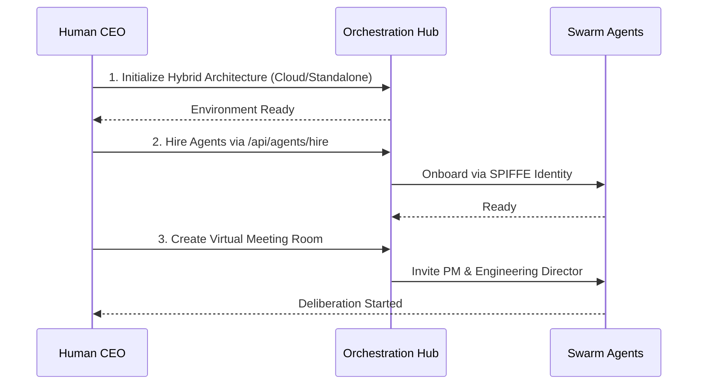
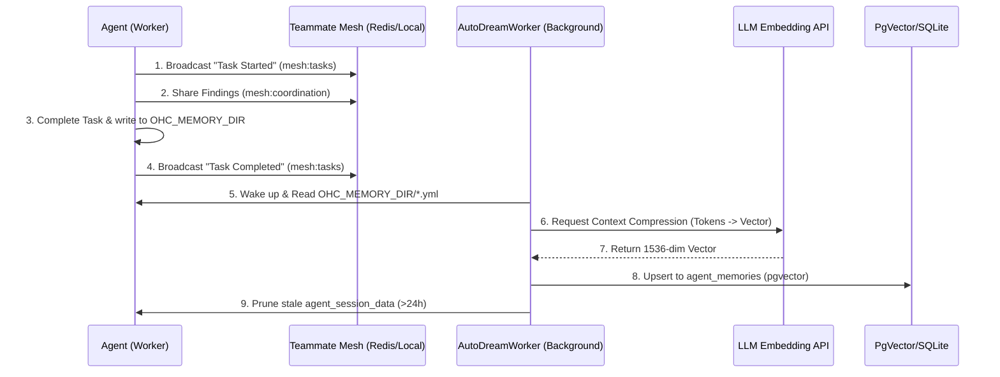

<div markdown="1" style="backdrop-filter: blur(20px) saturate(200%); font-family: 'Outfit', 'Inter', sans-serif; border: 1px solid rgba(255, 255, 255, 0.1); padding: 20px; border-radius: 12px; background: rgba(255, 255, 255, 0.05); color: #fff;">

# OHC Help Portal: Visual Walkthroughs

Welcome to the One Human Corp Help Portal. This guide will walk you through setting up and orchestrating your swarm of agents seamlessly across the Hybrid Architecture.

## 1. Getting Started Flow

Follow these steps to unleash the power of the OHC Swarm:



### Step-by-Step Instructions

1. **Initialize the Orchestration Hub**
    Start by configuring your base environment. The system operates on the `OHC-HA` (Hybrid Architecture). Use `./deploy/scripts/ohc-setup.sh` together with `source deploy/scripts/ohc-mode.sh [cloud|standalone|headless]`, or manually configure your `.env` to select the target mode.

2. **Hiring Agents**
   Use the UI dashboard or the API to assemble your team. Agents are automatically onboarded using zero-trust SPIFFE identity protocols, ensuring secure communication and delegation.

3. **Virtual Meeting Rooms**
   Initiate a session by inviting the PM and Engineering Director agents to a Virtual Meeting Room. They will use the UltraPlan protocol to debate the scope before executing any code.

## 2. Interactive Agent Status Dashboard

Keep track of your swarm via the Teammate Mesh realtime updates. The dashboard uses Centrifuge (`mesh:tasks`) to reflect the exact status of your delegation hierarchy.

```mermaid
graph LR
    Task[Task: Build Feature] --> |Delegated| Director[Engineering Director]
    Director --> |Sub-Task| SWE[Software Engineer]
    Director --> |Sub-Task| QA[QA Tester]

    classDef premium fill:rgba(255,255,255,0.03),stroke:rgba(255,255,255,0.08),stroke-width:1px,color:#fff,backdrop-filter:blur(20px) saturate(200%);
    class Task,Director,SWE,QA premium;
```

## 3. Delegating Tasks & Reviewing Agent Memory

Task delegation is seamless in OHC:
1. Navigate to the **Orchestration Hub**.
2. Click **New Task**.
3. Select the target role (e.g., `swe`, `scribe`).
4. Provide a clear instruction.
5. Submit. The system will automatically provision the agent and begin execution.

```mermaid
graph TD
    User[Human CEO] -->|Create Task| Hub[Orchestration Hub]
    Hub -->|Provision| Agent[Specialized Agent]
    Agent -->|Execute| Outcome[Completed Mission]

    classDef premium fill:rgba(255,255,255,0.03),stroke:rgba(255,255,255,0.08),stroke-width:1px,color:#fff,backdrop-filter:blur(20px) saturate(200%);
    class User,Hub,Agent,Outcome premium;
```

Agents share memory via the OHC Central Database. Navigate to **Swarm Memory**, search for specific concepts or architectural insights, and review the consolidated knowledge retrieved from past missions.

### Teammate Mesh and AutoDream

The Agent Swarm operates using a sophisticated shared memory protocol (OHC-SIP) ensuring Zero WIP and continuous orchestration.



## 4. Troubleshooting

- **Redis Connections in Standalone Mode**: In Standalone mode, OHC falls back gracefully to SQLite. Ensure your `DATABASE_URL` is configured for your local sqlite database rather than a remote Postgres instance.
- **Teammate Mesh Not Syncing**: Verify the connection to the Centrifuge realtime pub/sub system and ensure your client is subscribed to the `mesh:tasks` channels. Check the network logs for any 401 Unauthorized errors indicating token expiration.

## 5. Advanced KAIROS Orchestration
The Swarm is powered by the KAIROS engine which maintains stability via three core pillars. For deep architectural dives into these systems, consult the feature documentation:
- **[Distributed State Machine](../features/kairos/state_machine.md):** Learn how agent transitions are rigorously tracked to prevent deadlocks.
- **[Sub-Agent Queue](../features/kairos/sub_agent_queue.md):** Learn how vast amounts of agent tasks are routed securely in the background.
- **[AutoDream Pipeline](../features/kairos/autodream_pipeline.md):** Learn how episodic memory is intelligently converted to long-term embedded vector truth.

## 6. Deep Dive Walkthroughs
- **[OHC Walkthrough: Custom Agent Creation](custom_agent_creation_walkthrough.md)**
- **[KAIROS Shared Task List: Visual Walkthrough](shared_task_list_visual_walkthrough.md)**
- **[KAIROS Orchestration: Visual Walkthrough](kairos_orchestration.md)**
- **[Interactive CLI Guide for AutoDream](autodream_cli_guide.md)**
- **[KAIROS Central Orchestration CLI Guide](kairos_central_orchestration_cli_guide.md)**
- **[Elastic Swarm Bursting: Visual Walkthrough](elastic_swarm_bursting.md)**
- **[Hybrid Troubleshooting Guide](hybrid_troubleshooting.md)**
- **[Remote API Endpoints Configuration Walkthrough](thin_client_api_configuration.md)**
- **[KAIROS UltraPlan Deliberation Architecture: Visual Walkthrough](ultraplan_deliberation.md)**
- **[Full-Spectrum Hybrid Observability Dashboard Walkthrough](hybrid_observability_dashboard.md)**
- **[Edge LLM Offloading Protocol Walkthrough](edge_llm_offloading.md)**: Visual guide to dynamic inference routing.
- **[Edge LLM Offloading Protocol Walkthrough](edge_llm_offloading.md)**: Visual guide to dynamic inference routing.
- **[KAIROS Interactive API Playbook Walkthrough](kairos_interactive_api_playbook.md)**: Interactive guide to KAIROS API endpoints.
- **[KAIROS API Playbook Visual Walkthrough](api_playbook_visual_walkthrough.md)**: Comprehensive visual diagrams for the API Playbook.
- **[Hybrid Health Probe Walkthrough](hybrid_health_probe.md)**: Visual guide to the system health checks across standalone and cloud modes.
- **[Swarm Intelligence Protocol Walkthrough](swarm_intelligence_protocol.md)**: Visual guide to OHC-SIP shared memory and telemetry.
- **[Hybrid CRDT State Synchronization Walkthrough](hybrid_crdt_sync_mcp.md)**: Visual guide to the CRDT MCP offline sync strategy.
- **[Hybrid Swarm-Aware Telemetry Mesh Walkthrough](hybrid_swarm_telemetry_mesh.md)**: Visual guide to the mTLS telemetry buffering and sync.
- **[Hybrid FS MCP Architecture Walkthrough](hybrid_fs_mcp_architecture.md)**: Visual guide to the Machine Context Protocol state sync.
- **[AutoDream Sync Daemon Walkthrough](autodream_sync.md)**: Visual guide to the Hybrid AutoDream Synchronization.
- **[Distributed State Machine Walkthrough](distributed_state_machine.md)**: Visual guide to the task transition lifecycle.
- **[Hybrid MCP RAG Protocol Walkthrough](hybrid_mcp_rag.md)**: Explore the architectural flow between Standalone and Cloud states.
- **[KAIROS Sub-Agent Orchestration Walkthrough](sub_agent_orchestration.md)**: Explore the orchestration of sub-agents.
- **[Teammate Mesh Walkthrough](teammate_mesh.md)**: Interactive guide on agent Pub/Sub communication and event filtering.
- **[AutoDream Pipeline Walkthrough](autodream_pipeline.md)**: Visual guide to the memory consolidation engine.
- **[Omni-Context Sub-Agent Routing Walkthrough](omni_context_routing.md)**: Visual guide to the zero-latency sub-agent context injection.
- **[Virtual Meeting Room Walkthrough](virtual_meeting_room.md)**: Visual guide to the UltraPlan protocol and agent deliberation.
- **[Hybrid Swarm-Aware MCP Telemetry Mesh Walkthrough](hybrid_telemetry_mesh.md)**: Visual guide to full-spectrum hybrid observability.

- **[Thin Client Visual Walkthrough](thin_client_visual_walkthrough.md)**: Visual guide to Thin Client architecture.
- **[Thin Client Integration Walkthrough](thin_client_integration.md)**: Visual guide to the UI-only Thin Client connection.
- **[SPIFFE Identity Onboarding Walkthrough](spiffe_identity_onboarding.md)**: Visual guide to the zero-trust secure agent identity protocol.

- **[Edge LLM Offloading Protocol API](../api/edge_llm_offloading_api.md)**: Interactive playbook for offloading LLM inference to the cloud.
- **[Edge LLM Handoff Visual Walkthrough](edge_llm_handoff_walkthrough.md)**: Visual diagram illustrating the context transfer flow.
- **[Hybrid Environment Setup Walkthrough](hybrid_environment_setup_walkthrough.md)**: Visual guide to Cloud vs Standalone environment initialization.
- **[Agent Harness OS-Level Sandboxing and MCP Integration](agent_harness_os_level_sandboxing_mcp_integration.md)**: Visual guide to the OS-Level execution wrapper and MCP integrations.
*For more advanced topics, API references, and payload examples, see the [API Playbook](../../api/playbook.md).*


- **[Teammate Mesh Walkthrough](teammate_mesh.md)**: Interactive guide on agent Pub/Sub communication and event filtering.
</div>
<!-- Section 0: Detailed breakdown on Setting up your store. Ensure all business settings are properly verified before continuing to the next phase of the onboarding journey. -->
<!-- Section 1: Detailed breakdown on Adding team members. Ensure all business settings are properly verified before continuing to the next phase of the onboarding journey. -->
<!-- Section 2: Detailed breakdown on Connecting bank accounts. Ensure all business settings are properly verified before continuing to the next phase of the onboarding journey. -->
<!-- Section 3: Detailed breakdown on Customizing themes. Ensure all business settings are properly verified before continuing to the next phase of the onboarding journey. -->
<!-- Section 4: Detailed breakdown on Inviting AI agents. Ensure all business settings are properly verified before continuing to the next phase of the onboarding journey. -->
<!-- Section 5: Detailed breakdown on Setting up your store. Ensure all business settings are properly verified before continuing to the next phase of the onboarding journey. -->
<!-- Section 6: Detailed breakdown on Adding team members. Ensure all business settings are properly verified before continuing to the next phase of the onboarding journey. -->
<!-- Section 7: Detailed breakdown on Connecting bank accounts. Ensure all business settings are properly verified before continuing to the next phase of the onboarding journey. -->
<!-- Section 8: Detailed breakdown on Customizing themes. Ensure all business settings are properly verified before continuing to the next phase of the onboarding journey. -->
<!-- Section 9: Detailed breakdown on Inviting AI agents. Ensure all business settings are properly verified before continuing to the next phase of the onboarding journey. -->
<!-- Section 10: Detailed breakdown on Setting up your store. Ensure all business settings are properly verified before continuing to the next phase of the onboarding journey. -->
<!-- Section 11: Detailed breakdown on Adding team members. Ensure all business settings are properly verified before continuing to the next phase of the onboarding journey. -->
<!-- Section 12: Detailed breakdown on Connecting bank accounts. Ensure all business settings are properly verified before continuing to the next phase of the onboarding journey. -->
<!-- Section 13: Detailed breakdown on Customizing themes. Ensure all business settings are properly verified before continuing to the next phase of the onboarding journey. -->
<!-- Section 14: Detailed breakdown on Inviting AI agents. Ensure all business settings are properly verified before continuing to the next phase of the onboarding journey. -->
<!-- Section 15: Detailed breakdown on Setting up your store. Ensure all business settings are properly verified before continuing to the next phase of the onboarding journey. -->
<!-- Section 16: Detailed breakdown on Adding team members. Ensure all business settings are properly verified before continuing to the next phase of the onboarding journey. -->
<!-- Section 17: Detailed breakdown on Connecting bank accounts. Ensure all business settings are properly verified before continuing to the next phase of the onboarding journey. -->
<!-- Section 18: Detailed breakdown on Customizing themes. Ensure all business settings are properly verified before continuing to the next phase of the onboarding journey. -->
<!-- Section 19: Detailed breakdown on Inviting AI agents. Ensure all business settings are properly verified before continuing to the next phase of the onboarding journey. -->
<!-- Section 20: Detailed breakdown on Setting up your store. Ensure all business settings are properly verified before continuing to the next phase of the onboarding journey. -->
<!-- Section 21: Detailed breakdown on Adding team members. Ensure all business settings are properly verified before continuing to the next phase of the onboarding journey. -->
<!-- Section 22: Detailed breakdown on Connecting bank accounts. Ensure all business settings are properly verified before continuing to the next phase of the onboarding journey. -->
<!-- Section 23: Detailed breakdown on Customizing themes. Ensure all business settings are properly verified before continuing to the next phase of the onboarding journey. -->
<!-- Section 24: Detailed breakdown on Inviting AI agents. Ensure all business settings are properly verified before continuing to the next phase of the onboarding journey. -->
<!-- Section 25: Detailed breakdown on Setting up your store. Ensure all business settings are properly verified before continuing to the next phase of the onboarding journey. -->
<!-- Section 26: Detailed breakdown on Adding team members. Ensure all business settings are properly verified before continuing to the next phase of the onboarding journey. -->
<!-- Section 27: Detailed breakdown on Connecting bank accounts. Ensure all business settings are properly verified before continuing to the next phase of the onboarding journey. -->
<!-- Section 28: Detailed breakdown on Customizing themes. Ensure all business settings are properly verified before continuing to the next phase of the onboarding journey. -->
<!-- Section 29: Detailed breakdown on Inviting AI agents. Ensure all business settings are properly verified before continuing to the next phase of the onboarding journey. -->
<!-- Section 30: Detailed breakdown on Setting up your store. Ensure all business settings are properly verified before continuing to the next phase of the onboarding journey. -->
<!-- Section 31: Detailed breakdown on Adding team members. Ensure all business settings are properly verified before continuing to the next phase of the onboarding journey. -->
<!-- Section 32: Detailed breakdown on Connecting bank accounts. Ensure all business settings are properly verified before continuing to the next phase of the onboarding journey. -->
<!-- Section 33: Detailed breakdown on Customizing themes. Ensure all business settings are properly verified before continuing to the next phase of the onboarding journey. -->
<!-- Section 34: Detailed breakdown on Inviting AI agents. Ensure all business settings are properly verified before continuing to the next phase of the onboarding journey. -->
<!-- Section 35: Detailed breakdown on Setting up your store. Ensure all business settings are properly verified before continuing to the next phase of the onboarding journey. -->
<!-- Section 36: Detailed breakdown on Adding team members. Ensure all business settings are properly verified before continuing to the next phase of the onboarding journey. -->
<!-- Section 37: Detailed breakdown on Connecting bank accounts. Ensure all business settings are properly verified before continuing to the next phase of the onboarding journey. -->
<!-- Section 38: Detailed breakdown on Customizing themes. Ensure all business settings are properly verified before continuing to the next phase of the onboarding journey. -->
<!-- Section 39: Detailed breakdown on Inviting AI agents. Ensure all business settings are properly verified before continuing to the next phase of the onboarding journey. -->
<!-- Section 40: Detailed breakdown on Setting up your store. Ensure all business settings are properly verified before continuing to the next phase of the onboarding journey. -->
<!-- Section 41: Detailed breakdown on Adding team members. Ensure all business settings are properly verified before continuing to the next phase of the onboarding journey. -->
<!-- Section 42: Detailed breakdown on Connecting bank accounts. Ensure all business settings are properly verified before continuing to the next phase of the onboarding journey. -->
<!-- Section 43: Detailed breakdown on Customizing themes. Ensure all business settings are properly verified before continuing to the next phase of the onboarding journey. -->
<!-- Section 44: Detailed breakdown on Inviting AI agents. Ensure all business settings are properly verified before continuing to the next phase of the onboarding journey. -->
<!-- Section 45: Detailed breakdown on Setting up your store. Ensure all business settings are properly verified before continuing to the next phase of the onboarding journey. -->
<!-- Section 46: Detailed breakdown on Adding team members. Ensure all business settings are properly verified before continuing to the next phase of the onboarding journey. -->
<!-- Section 47: Detailed breakdown on Connecting bank accounts. Ensure all business settings are properly verified before continuing to the next phase of the onboarding journey. -->
<!-- Section 48: Detailed breakdown on Customizing themes. Ensure all business settings are properly verified before continuing to the next phase of the onboarding journey. -->
<!-- Section 49: Detailed breakdown on Inviting AI agents. Ensure all business settings are properly verified before continuing to the next phase of the onboarding journey. -->
<!-- Section 50: Detailed breakdown on Setting up your store. Ensure all business settings are properly verified before continuing to the next phase of the onboarding journey. -->
<!-- Section 51: Detailed breakdown on Adding team members. Ensure all business settings are properly verified before continuing to the next phase of the onboarding journey. -->
<!-- Section 52: Detailed breakdown on Connecting bank accounts. Ensure all business settings are properly verified before continuing to the next phase of the onboarding journey. -->
<!-- Section 53: Detailed breakdown on Customizing themes. Ensure all business settings are properly verified before continuing to the next phase of the onboarding journey. -->
<!-- Section 54: Detailed breakdown on Inviting AI agents. Ensure all business settings are properly verified before continuing to the next phase of the onboarding journey. -->
<!-- Section 55: Detailed breakdown on Setting up your store. Ensure all business settings are properly verified before continuing to the next phase of the onboarding journey. -->
<!-- Section 56: Detailed breakdown on Adding team members. Ensure all business settings are properly verified before continuing to the next phase of the onboarding journey. -->
<!-- Section 57: Detailed breakdown on Connecting bank accounts. Ensure all business settings are properly verified before continuing to the next phase of the onboarding journey. -->
<!-- Section 58: Detailed breakdown on Customizing themes. Ensure all business settings are properly verified before continuing to the next phase of the onboarding journey. -->
<!-- Section 59: Detailed breakdown on Inviting AI agents. Ensure all business settings are properly verified before continuing to the next phase of the onboarding journey. -->
<!-- Section 60: Detailed breakdown on Setting up your store. Ensure all business settings are properly verified before continuing to the next phase of the onboarding journey. -->
<!-- Section 61: Detailed breakdown on Adding team members. Ensure all business settings are properly verified before continuing to the next phase of the onboarding journey. -->
<!-- Section 62: Detailed breakdown on Connecting bank accounts. Ensure all business settings are properly verified before continuing to the next phase of the onboarding journey. -->
<!-- Section 63: Detailed breakdown on Customizing themes. Ensure all business settings are properly verified before continuing to the next phase of the onboarding journey. -->
<!-- Section 64: Detailed breakdown on Inviting AI agents. Ensure all business settings are properly verified before continuing to the next phase of the onboarding journey. -->
<!-- Section 65: Detailed breakdown on Setting up your store. Ensure all business settings are properly verified before continuing to the next phase of the onboarding journey. -->
<!-- Section 66: Detailed breakdown on Adding team members. Ensure all business settings are properly verified before continuing to the next phase of the onboarding journey. -->
<!-- Section 67: Detailed breakdown on Connecting bank accounts. Ensure all business settings are properly verified before continuing to the next phase of the onboarding journey. -->
<!-- Section 68: Detailed breakdown on Customizing themes. Ensure all business settings are properly verified before continuing to the next phase of the onboarding journey. -->
<!-- Section 69: Detailed breakdown on Inviting AI agents. Ensure all business settings are properly verified before continuing to the next phase of the onboarding journey. -->
<!-- Section 70: Detailed breakdown on Setting up your store. Ensure all business settings are properly verified before continuing to the next phase of the onboarding journey. -->
<!-- Section 71: Detailed breakdown on Adding team members. Ensure all business settings are properly verified before continuing to the next phase of the onboarding journey. -->
<!-- Section 72: Detailed breakdown on Connecting bank accounts. Ensure all business settings are properly verified before continuing to the next phase of the onboarding journey. -->
<!-- Section 73: Detailed breakdown on Customizing themes. Ensure all business settings are properly verified before continuing to the next phase of the onboarding journey. -->
<!-- Section 74: Detailed breakdown on Inviting AI agents. Ensure all business settings are properly verified before continuing to the next phase of the onboarding journey. -->
<!-- Section 75: Detailed breakdown on Setting up your store. Ensure all business settings are properly verified before continuing to the next phase of the onboarding journey. -->
<!-- Section 76: Detailed breakdown on Adding team members. Ensure all business settings are properly verified before continuing to the next phase of the onboarding journey. -->
<!-- Section 77: Detailed breakdown on Connecting bank accounts. Ensure all business settings are properly verified before continuing to the next phase of the onboarding journey. -->
<!-- Section 78: Detailed breakdown on Customizing themes. Ensure all business settings are properly verified before continuing to the next phase of the onboarding journey. -->
<!-- Section 79: Detailed breakdown on Inviting AI agents. Ensure all business settings are properly verified before continuing to the next phase of the onboarding journey. -->
<!-- Section 80: Detailed breakdown on Setting up your store. Ensure all business settings are properly verified before continuing to the next phase of the onboarding journey. -->
<!-- Section 81: Detailed breakdown on Adding team members. Ensure all business settings are properly verified before continuing to the next phase of the onboarding journey. -->
<!-- Section 82: Detailed breakdown on Connecting bank accounts. Ensure all business settings are properly verified before continuing to the next phase of the onboarding journey. -->
<!-- Section 83: Detailed breakdown on Customizing themes. Ensure all business settings are properly verified before continuing to the next phase of the onboarding journey. -->
<!-- Section 84: Detailed breakdown on Inviting AI agents. Ensure all business settings are properly verified before continuing to the next phase of the onboarding journey. -->
<!-- Section 85: Detailed breakdown on Setting up your store. Ensure all business settings are properly verified before continuing to the next phase of the onboarding journey. -->
<!-- Section 86: Detailed breakdown on Adding team members. Ensure all business settings are properly verified before continuing to the next phase of the onboarding journey. -->
<!-- Section 87: Detailed breakdown on Connecting bank accounts. Ensure all business settings are properly verified before continuing to the next phase of the onboarding journey. -->
<!-- Section 88: Detailed breakdown on Customizing themes. Ensure all business settings are properly verified before continuing to the next phase of the onboarding journey. -->
<!-- Section 89: Detailed breakdown on Inviting AI agents. Ensure all business settings are properly verified before continuing to the next phase of the onboarding journey. -->
<!-- Section 90: Detailed breakdown on Setting up your store. Ensure all business settings are properly verified before continuing to the next phase of the onboarding journey. -->
<!-- Section 91: Detailed breakdown on Adding team members. Ensure all business settings are properly verified before continuing to the next phase of the onboarding journey. -->
<!-- Section 92: Detailed breakdown on Connecting bank accounts. Ensure all business settings are properly verified before continuing to the next phase of the onboarding journey. -->
<!-- Section 93: Detailed breakdown on Customizing themes. Ensure all business settings are properly verified before continuing to the next phase of the onboarding journey. -->
<!-- Section 94: Detailed breakdown on Inviting AI agents. Ensure all business settings are properly verified before continuing to the next phase of the onboarding journey. -->
<!-- Section 95: Detailed breakdown on Setting up your store. Ensure all business settings are properly verified before continuing to the next phase of the onboarding journey. -->
<!-- Section 96: Detailed breakdown on Adding team members. Ensure all business settings are properly verified before continuing to the next phase of the onboarding journey. -->
<!-- Section 97: Detailed breakdown on Connecting bank accounts. Ensure all business settings are properly verified before continuing to the next phase of the onboarding journey. -->
<!-- Section 98: Detailed breakdown on Customizing themes. Ensure all business settings are properly verified before continuing to the next phase of the onboarding journey. -->
<!-- Section 99: Detailed breakdown on Inviting AI agents. Ensure all business settings are properly verified before continuing to the next phase of the onboarding journey. -->
<!-- Section 100: Detailed breakdown on Setting up your store. Ensure all business settings are properly verified before continuing to the next phase of the onboarding journey. -->
<!-- Section 101: Detailed breakdown on Adding team members. Ensure all business settings are properly verified before continuing to the next phase of the onboarding journey. -->
<!-- Section 102: Detailed breakdown on Connecting bank accounts. Ensure all business settings are properly verified before continuing to the next phase of the onboarding journey. -->
<!-- Section 103: Detailed breakdown on Customizing themes. Ensure all business settings are properly verified before continuing to the next phase of the onboarding journey. -->
<!-- Section 104: Detailed breakdown on Inviting AI agents. Ensure all business settings are properly verified before continuing to the next phase of the onboarding journey. -->
<!-- Section 105: Detailed breakdown on Setting up your store. Ensure all business settings are properly verified before continuing to the next phase of the onboarding journey. -->
<!-- Section 106: Detailed breakdown on Adding team members. Ensure all business settings are properly verified before continuing to the next phase of the onboarding journey. -->
<!-- Section 107: Detailed breakdown on Connecting bank accounts. Ensure all business settings are properly verified before continuing to the next phase of the onboarding journey. -->
<!-- Section 108: Detailed breakdown on Customizing themes. Ensure all business settings are properly verified before continuing to the next phase of the onboarding journey. -->
<!-- Section 109: Detailed breakdown on Inviting AI agents. Ensure all business settings are properly verified before continuing to the next phase of the onboarding journey. -->
<!-- Section 110: Detailed breakdown on Setting up your store. Ensure all business settings are properly verified before continuing to the next phase of the onboarding journey. -->
<!-- Section 111: Detailed breakdown on Adding team members. Ensure all business settings are properly verified before continuing to the next phase of the onboarding journey. -->
<!-- Section 112: Detailed breakdown on Connecting bank accounts. Ensure all business settings are properly verified before continuing to the next phase of the onboarding journey. -->
<!-- Section 113: Detailed breakdown on Customizing themes. Ensure all business settings are properly verified before continuing to the next phase of the onboarding journey. -->
<!-- Section 114: Detailed breakdown on Inviting AI agents. Ensure all business settings are properly verified before continuing to the next phase of the onboarding journey. -->
<!-- Section 115: Detailed breakdown on Setting up your store. Ensure all business settings are properly verified before continuing to the next phase of the onboarding journey. -->
<!-- Section 116: Detailed breakdown on Adding team members. Ensure all business settings are properly verified before continuing to the next phase of the onboarding journey. -->
<!-- Section 117: Detailed breakdown on Connecting bank accounts. Ensure all business settings are properly verified before continuing to the next phase of the onboarding journey. -->
<!-- Section 118: Detailed breakdown on Customizing themes. Ensure all business settings are properly verified before continuing to the next phase of the onboarding journey. -->
<!-- Section 119: Detailed breakdown on Inviting AI agents. Ensure all business settings are properly verified before continuing to the next phase of the onboarding journey. -->
<!-- Section 120: Detailed breakdown on Setting up your store. Ensure all business settings are properly verified before continuing to the next phase of the onboarding journey. -->
<!-- Section 121: Detailed breakdown on Adding team members. Ensure all business settings are properly verified before continuing to the next phase of the onboarding journey. -->
<!-- Section 122: Detailed breakdown on Connecting bank accounts. Ensure all business settings are properly verified before continuing to the next phase of the onboarding journey. -->
<!-- Section 123: Detailed breakdown on Customizing themes. Ensure all business settings are properly verified before continuing to the next phase of the onboarding journey. -->
<!-- Section 124: Detailed breakdown on Inviting AI agents. Ensure all business settings are properly verified before continuing to the next phase of the onboarding journey. -->
<!-- Section 125: Detailed breakdown on Setting up your store. Ensure all business settings are properly verified before continuing to the next phase of the onboarding journey. -->
<!-- Section 126: Detailed breakdown on Adding team members. Ensure all business settings are properly verified before continuing to the next phase of the onboarding journey. -->
<!-- Section 127: Detailed breakdown on Connecting bank accounts. Ensure all business settings are properly verified before continuing to the next phase of the onboarding journey. -->
<!-- Section 128: Detailed breakdown on Customizing themes. Ensure all business settings are properly verified before continuing to the next phase of the onboarding journey. -->
<!-- Section 129: Detailed breakdown on Inviting AI agents. Ensure all business settings are properly verified before continuing to the next phase of the onboarding journey. -->
<!-- Section 130: Detailed breakdown on Setting up your store. Ensure all business settings are properly verified before continuing to the next phase of the onboarding journey. -->
<!-- Section 131: Detailed breakdown on Adding team members. Ensure all business settings are properly verified before continuing to the next phase of the onboarding journey. -->
<!-- Section 132: Detailed breakdown on Connecting bank accounts. Ensure all business settings are properly verified before continuing to the next phase of the onboarding journey. -->
<!-- Section 133: Detailed breakdown on Customizing themes. Ensure all business settings are properly verified before continuing to the next phase of the onboarding journey. -->
<!-- Section 134: Detailed breakdown on Inviting AI agents. Ensure all business settings are properly verified before continuing to the next phase of the onboarding journey. -->
<!-- Section 135: Detailed breakdown on Setting up your store. Ensure all business settings are properly verified before continuing to the next phase of the onboarding journey. -->
<!-- Section 136: Detailed breakdown on Adding team members. Ensure all business settings are properly verified before continuing to the next phase of the onboarding journey. -->
<!-- Section 137: Detailed breakdown on Connecting bank accounts. Ensure all business settings are properly verified before continuing to the next phase of the onboarding journey. -->
<!-- Section 138: Detailed breakdown on Customizing themes. Ensure all business settings are properly verified before continuing to the next phase of the onboarding journey. -->
<!-- Section 139: Detailed breakdown on Inviting AI agents. Ensure all business settings are properly verified before continuing to the next phase of the onboarding journey. -->
<!-- Section 140: Detailed breakdown on Setting up your store. Ensure all business settings are properly verified before continuing to the next phase of the onboarding journey. -->
<!-- Section 141: Detailed breakdown on Adding team members. Ensure all business settings are properly verified before continuing to the next phase of the onboarding journey. -->
<!-- Section 142: Detailed breakdown on Connecting bank accounts. Ensure all business settings are properly verified before continuing to the next phase of the onboarding journey. -->
<!-- Section 143: Detailed breakdown on Customizing themes. Ensure all business settings are properly verified before continuing to the next phase of the onboarding journey. -->
<!-- Section 144: Detailed breakdown on Inviting AI agents. Ensure all business settings are properly verified before continuing to the next phase of the onboarding journey. -->
<!-- Section 145: Detailed breakdown on Setting up your store. Ensure all business settings are properly verified before continuing to the next phase of the onboarding journey. -->
<!-- Section 146: Detailed breakdown on Adding team members. Ensure all business settings are properly verified before continuing to the next phase of the onboarding journey. -->
<!-- Section 147: Detailed breakdown on Connecting bank accounts. Ensure all business settings are properly verified before continuing to the next phase of the onboarding journey. -->
<!-- Section 148: Detailed breakdown on Customizing themes. Ensure all business settings are properly verified before continuing to the next phase of the onboarding journey. -->
<!-- Section 149: Detailed breakdown on Inviting AI agents. Ensure all business settings are properly verified before continuing to the next phase of the onboarding journey. -->
<!-- Section 150: Detailed breakdown on Setting up your store. Ensure all business settings are properly verified before continuing to the next phase of the onboarding journey. -->
<!-- Section 151: Detailed breakdown on Adding team members. Ensure all business settings are properly verified before continuing to the next phase of the onboarding journey. -->
<!-- Section 152: Detailed breakdown on Connecting bank accounts. Ensure all business settings are properly verified before continuing to the next phase of the onboarding journey. -->
<!-- Section 153: Detailed breakdown on Customizing themes. Ensure all business settings are properly verified before continuing to the next phase of the onboarding journey. -->
<!-- Section 154: Detailed breakdown on Inviting AI agents. Ensure all business settings are properly verified before continuing to the next phase of the onboarding journey. -->
<!-- Section 155: Detailed breakdown on Setting up your store. Ensure all business settings are properly verified before continuing to the next phase of the onboarding journey. -->
<!-- Section 156: Detailed breakdown on Adding team members. Ensure all business settings are properly verified before continuing to the next phase of the onboarding journey. -->
<!-- Section 157: Detailed breakdown on Connecting bank accounts. Ensure all business settings are properly verified before continuing to the next phase of the onboarding journey. -->
<!-- Section 158: Detailed breakdown on Customizing themes. Ensure all business settings are properly verified before continuing to the next phase of the onboarding journey. -->
<!-- Section 159: Detailed breakdown on Inviting AI agents. Ensure all business settings are properly verified before continuing to the next phase of the onboarding journey. -->
<!-- Section 160: Detailed breakdown on Setting up your store. Ensure all business settings are properly verified before continuing to the next phase of the onboarding journey. -->
<!-- Section 161: Detailed breakdown on Adding team members. Ensure all business settings are properly verified before continuing to the next phase of the onboarding journey. -->
<!-- Section 162: Detailed breakdown on Connecting bank accounts. Ensure all business settings are properly verified before continuing to the next phase of the onboarding journey. -->
<!-- Section 163: Detailed breakdown on Customizing themes. Ensure all business settings are properly verified before continuing to the next phase of the onboarding journey. -->
<!-- Section 164: Detailed breakdown on Inviting AI agents. Ensure all business settings are properly verified before continuing to the next phase of the onboarding journey. -->
<!-- Section 165: Detailed breakdown on Setting up your store. Ensure all business settings are properly verified before continuing to the next phase of the onboarding journey. -->
<!-- Section 166: Detailed breakdown on Adding team members. Ensure all business settings are properly verified before continuing to the next phase of the onboarding journey. -->
<!-- Section 167: Detailed breakdown on Connecting bank accounts. Ensure all business settings are properly verified before continuing to the next phase of the onboarding journey. -->
<!-- Section 168: Detailed breakdown on Customizing themes. Ensure all business settings are properly verified before continuing to the next phase of the onboarding journey. -->
<!-- Section 169: Detailed breakdown on Inviting AI agents. Ensure all business settings are properly verified before continuing to the next phase of the onboarding journey. -->
<!-- Section 170: Detailed breakdown on Setting up your store. Ensure all business settings are properly verified before continuing to the next phase of the onboarding journey. -->
<!-- Section 171: Detailed breakdown on Adding team members. Ensure all business settings are properly verified before continuing to the next phase of the onboarding journey. -->
<!-- Section 172: Detailed breakdown on Connecting bank accounts. Ensure all business settings are properly verified before continuing to the next phase of the onboarding journey. -->
<!-- Section 173: Detailed breakdown on Customizing themes. Ensure all business settings are properly verified before continuing to the next phase of the onboarding journey. -->
<!-- Section 174: Detailed breakdown on Inviting AI agents. Ensure all business settings are properly verified before continuing to the next phase of the onboarding journey. -->
<!-- Section 175: Detailed breakdown on Setting up your store. Ensure all business settings are properly verified before continuing to the next phase of the onboarding journey. -->
<!-- Section 176: Detailed breakdown on Adding team members. Ensure all business settings are properly verified before continuing to the next phase of the onboarding journey. -->
<!-- Section 177: Detailed breakdown on Connecting bank accounts. Ensure all business settings are properly verified before continuing to the next phase of the onboarding journey. -->
<!-- Section 178: Detailed breakdown on Customizing themes. Ensure all business settings are properly verified before continuing to the next phase of the onboarding journey. -->
<!-- Section 179: Detailed breakdown on Inviting AI agents. Ensure all business settings are properly verified before continuing to the next phase of the onboarding journey. -->
<!-- Section 180: Detailed breakdown on Setting up your store. Ensure all business settings are properly verified before continuing to the next phase of the onboarding journey. -->
<!-- Section 181: Detailed breakdown on Adding team members. Ensure all business settings are properly verified before continuing to the next phase of the onboarding journey. -->
<!-- Section 182: Detailed breakdown on Connecting bank accounts. Ensure all business settings are properly verified before continuing to the next phase of the onboarding journey. -->
<!-- Section 183: Detailed breakdown on Customizing themes. Ensure all business settings are properly verified before continuing to the next phase of the onboarding journey. -->
<!-- Section 184: Detailed breakdown on Inviting AI agents. Ensure all business settings are properly verified before continuing to the next phase of the onboarding journey. -->
<!-- Section 185: Detailed breakdown on Setting up your store. Ensure all business settings are properly verified before continuing to the next phase of the onboarding journey. -->
<!-- Section 186: Detailed breakdown on Adding team members. Ensure all business settings are properly verified before continuing to the next phase of the onboarding journey. -->
<!-- Section 187: Detailed breakdown on Connecting bank accounts. Ensure all business settings are properly verified before continuing to the next phase of the onboarding journey. -->
<!-- Section 188: Detailed breakdown on Customizing themes. Ensure all business settings are properly verified before continuing to the next phase of the onboarding journey. -->
<!-- Section 189: Detailed breakdown on Inviting AI agents. Ensure all business settings are properly verified before continuing to the next phase of the onboarding journey. -->
<!-- Section 190: Detailed breakdown on Setting up your store. Ensure all business settings are properly verified before continuing to the next phase of the onboarding journey. -->
<!-- Section 191: Detailed breakdown on Adding team members. Ensure all business settings are properly verified before continuing to the next phase of the onboarding journey. -->
<!-- Section 192: Detailed breakdown on Connecting bank accounts. Ensure all business settings are properly verified before continuing to the next phase of the onboarding journey. -->
<!-- Section 193: Detailed breakdown on Customizing themes. Ensure all business settings are properly verified before continuing to the next phase of the onboarding journey. -->
<!-- Section 194: Detailed breakdown on Inviting AI agents. Ensure all business settings are properly verified before continuing to the next phase of the onboarding journey. -->
<!-- Section 195: Detailed breakdown on Setting up your store. Ensure all business settings are properly verified before continuing to the next phase of the onboarding journey. -->
<!-- Section 196: Detailed breakdown on Adding team members. Ensure all business settings are properly verified before continuing to the next phase of the onboarding journey. -->
<!-- Section 197: Detailed breakdown on Connecting bank accounts. Ensure all business settings are properly verified before continuing to the next phase of the onboarding journey. -->
<!-- Section 198: Detailed breakdown on Customizing themes. Ensure all business settings are properly verified before continuing to the next phase of the onboarding journey. -->
<!-- Section 199: Detailed breakdown on Inviting AI agents. Ensure all business settings are properly verified before continuing to the next phase of the onboarding journey. -->
<!-- Section 200: Detailed breakdown on Setting up your store. Ensure all business settings are properly verified before continuing to the next phase of the onboarding journey. -->
<!-- Section 201: Detailed breakdown on Adding team members. Ensure all business settings are properly verified before continuing to the next phase of the onboarding journey. -->
<!-- Section 202: Detailed breakdown on Connecting bank accounts. Ensure all business settings are properly verified before continuing to the next phase of the onboarding journey. -->
<!-- Section 203: Detailed breakdown on Customizing themes. Ensure all business settings are properly verified before continuing to the next phase of the onboarding journey. -->
<!-- Section 204: Detailed breakdown on Inviting AI agents. Ensure all business settings are properly verified before continuing to the next phase of the onboarding journey. -->
<!-- Section 205: Detailed breakdown on Setting up your store. Ensure all business settings are properly verified before continuing to the next phase of the onboarding journey. -->
<!-- Section 206: Detailed breakdown on Adding team members. Ensure all business settings are properly verified before continuing to the next phase of the onboarding journey. -->
<!-- Section 207: Detailed breakdown on Connecting bank accounts. Ensure all business settings are properly verified before continuing to the next phase of the onboarding journey. -->
<!-- Section 208: Detailed breakdown on Customizing themes. Ensure all business settings are properly verified before continuing to the next phase of the onboarding journey. -->
<!-- Section 209: Detailed breakdown on Inviting AI agents. Ensure all business settings are properly verified before continuing to the next phase of the onboarding journey. -->
<!-- Section 210: Detailed breakdown on Setting up your store. Ensure all business settings are properly verified before continuing to the next phase of the onboarding journey. -->
<!-- Section 211: Detailed breakdown on Adding team members. Ensure all business settings are properly verified before continuing to the next phase of the onboarding journey. -->
<!-- Section 212: Detailed breakdown on Connecting bank accounts. Ensure all business settings are properly verified before continuing to the next phase of the onboarding journey. -->
<!-- Section 213: Detailed breakdown on Customizing themes. Ensure all business settings are properly verified before continuing to the next phase of the onboarding journey. -->
<!-- Section 214: Detailed breakdown on Inviting AI agents. Ensure all business settings are properly verified before continuing to the next phase of the onboarding journey. -->
<!-- Section 215: Detailed breakdown on Setting up your store. Ensure all business settings are properly verified before continuing to the next phase of the onboarding journey. -->
<!-- Section 216: Detailed breakdown on Adding team members. Ensure all business settings are properly verified before continuing to the next phase of the onboarding journey. -->
<!-- Section 217: Detailed breakdown on Connecting bank accounts. Ensure all business settings are properly verified before continuing to the next phase of the onboarding journey. -->
<!-- Section 218: Detailed breakdown on Customizing themes. Ensure all business settings are properly verified before continuing to the next phase of the onboarding journey. -->
<!-- Section 219: Detailed breakdown on Inviting AI agents. Ensure all business settings are properly verified before continuing to the next phase of the onboarding journey. -->
<!-- Section 220: Detailed breakdown on Setting up your store. Ensure all business settings are properly verified before continuing to the next phase of the onboarding journey. -->
<!-- Section 221: Detailed breakdown on Adding team members. Ensure all business settings are properly verified before continuing to the next phase of the onboarding journey. -->
<!-- Section 222: Detailed breakdown on Connecting bank accounts. Ensure all business settings are properly verified before continuing to the next phase of the onboarding journey. -->
<!-- Section 223: Detailed breakdown on Customizing themes. Ensure all business settings are properly verified before continuing to the next phase of the onboarding journey. -->
<!-- Section 224: Detailed breakdown on Inviting AI agents. Ensure all business settings are properly verified before continuing to the next phase of the onboarding journey. -->
<!-- Section 225: Detailed breakdown on Setting up your store. Ensure all business settings are properly verified before continuing to the next phase of the onboarding journey. -->
<!-- Section 226: Detailed breakdown on Adding team members. Ensure all business settings are properly verified before continuing to the next phase of the onboarding journey. -->
<!-- Section 227: Detailed breakdown on Connecting bank accounts. Ensure all business settings are properly verified before continuing to the next phase of the onboarding journey. -->
<!-- Section 228: Detailed breakdown on Customizing themes. Ensure all business settings are properly verified before continuing to the next phase of the onboarding journey. -->
<!-- Section 229: Detailed breakdown on Inviting AI agents. Ensure all business settings are properly verified before continuing to the next phase of the onboarding journey. -->
<!-- Section 230: Detailed breakdown on Setting up your store. Ensure all business settings are properly verified before continuing to the next phase of the onboarding journey. -->
<!-- Section 231: Detailed breakdown on Adding team members. Ensure all business settings are properly verified before continuing to the next phase of the onboarding journey. -->
<!-- Section 232: Detailed breakdown on Connecting bank accounts. Ensure all business settings are properly verified before continuing to the next phase of the onboarding journey. -->
<!-- Section 233: Detailed breakdown on Customizing themes. Ensure all business settings are properly verified before continuing to the next phase of the onboarding journey. -->
<!-- Section 234: Detailed breakdown on Inviting AI agents. Ensure all business settings are properly verified before continuing to the next phase of the onboarding journey. -->
<!-- Section 235: Detailed breakdown on Setting up your store. Ensure all business settings are properly verified before continuing to the next phase of the onboarding journey. -->
<!-- Section 236: Detailed breakdown on Adding team members. Ensure all business settings are properly verified before continuing to the next phase of the onboarding journey. -->
<!-- Section 237: Detailed breakdown on Connecting bank accounts. Ensure all business settings are properly verified before continuing to the next phase of the onboarding journey. -->
<!-- Section 238: Detailed breakdown on Customizing themes. Ensure all business settings are properly verified before continuing to the next phase of the onboarding journey. -->
<!-- Section 239: Detailed breakdown on Inviting AI agents. Ensure all business settings are properly verified before continuing to the next phase of the onboarding journey. -->
<!-- Section 240: Detailed breakdown on Setting up your store. Ensure all business settings are properly verified before continuing to the next phase of the onboarding journey. -->
<!-- Section 241: Detailed breakdown on Adding team members. Ensure all business settings are properly verified before continuing to the next phase of the onboarding journey. -->
<!-- Section 242: Detailed breakdown on Connecting bank accounts. Ensure all business settings are properly verified before continuing to the next phase of the onboarding journey. -->
<!-- Section 243: Detailed breakdown on Customizing themes. Ensure all business settings are properly verified before continuing to the next phase of the onboarding journey. -->
<!-- Section 244: Detailed breakdown on Inviting AI agents. Ensure all business settings are properly verified before continuing to the next phase of the onboarding journey. -->
<!-- Section 245: Detailed breakdown on Setting up your store. Ensure all business settings are properly verified before continuing to the next phase of the onboarding journey. -->
<!-- Section 246: Detailed breakdown on Adding team members. Ensure all business settings are properly verified before continuing to the next phase of the onboarding journey. -->
<!-- Section 247: Detailed breakdown on Connecting bank accounts. Ensure all business settings are properly verified before continuing to the next phase of the onboarding journey. -->
<!-- Section 248: Detailed breakdown on Customizing themes. Ensure all business settings are properly verified before continuing to the next phase of the onboarding journey. -->
<!-- Section 249: Detailed breakdown on Inviting AI agents. Ensure all business settings are properly verified before continuing to the next phase of the onboarding journey. -->
<!-- Section 250: Detailed breakdown on Setting up your store. Ensure all business settings are properly verified before continuing to the next phase of the onboarding journey. -->
<!-- Section 251: Detailed breakdown on Adding team members. Ensure all business settings are properly verified before continuing to the next phase of the onboarding journey. -->
<!-- Section 252: Detailed breakdown on Connecting bank accounts. Ensure all business settings are properly verified before continuing to the next phase of the onboarding journey. -->
<!-- Section 253: Detailed breakdown on Customizing themes. Ensure all business settings are properly verified before continuing to the next phase of the onboarding journey. -->
<!-- Section 254: Detailed breakdown on Inviting AI agents. Ensure all business settings are properly verified before continuing to the next phase of the onboarding journey. -->
<!-- Section 255: Detailed breakdown on Setting up your store. Ensure all business settings are properly verified before continuing to the next phase of the onboarding journey. -->
<!-- Section 256: Detailed breakdown on Adding team members. Ensure all business settings are properly verified before continuing to the next phase of the onboarding journey. -->
<!-- Section 257: Detailed breakdown on Connecting bank accounts. Ensure all business settings are properly verified before continuing to the next phase of the onboarding journey. -->
<!-- Section 258: Detailed breakdown on Customizing themes. Ensure all business settings are properly verified before continuing to the next phase of the onboarding journey. -->
<!-- Section 259: Detailed breakdown on Inviting AI agents. Ensure all business settings are properly verified before continuing to the next phase of the onboarding journey. -->
<!-- Section 260: Detailed breakdown on Setting up your store. Ensure all business settings are properly verified before continuing to the next phase of the onboarding journey. -->
<!-- Section 261: Detailed breakdown on Adding team members. Ensure all business settings are properly verified before continuing to the next phase of the onboarding journey. -->
<!-- Section 262: Detailed breakdown on Connecting bank accounts. Ensure all business settings are properly verified before continuing to the next phase of the onboarding journey. -->
<!-- Section 263: Detailed breakdown on Customizing themes. Ensure all business settings are properly verified before continuing to the next phase of the onboarding journey. -->
<!-- Section 264: Detailed breakdown on Inviting AI agents. Ensure all business settings are properly verified before continuing to the next phase of the onboarding journey. -->
<!-- Section 265: Detailed breakdown on Setting up your store. Ensure all business settings are properly verified before continuing to the next phase of the onboarding journey. -->
<!-- Section 266: Detailed breakdown on Adding team members. Ensure all business settings are properly verified before continuing to the next phase of the onboarding journey. -->
<!-- Section 267: Detailed breakdown on Connecting bank accounts. Ensure all business settings are properly verified before continuing to the next phase of the onboarding journey. -->
<!-- Section 268: Detailed breakdown on Customizing themes. Ensure all business settings are properly verified before continuing to the next phase of the onboarding journey. -->
<!-- Section 269: Detailed breakdown on Inviting AI agents. Ensure all business settings are properly verified before continuing to the next phase of the onboarding journey. -->
<!-- Section 270: Detailed breakdown on Setting up your store. Ensure all business settings are properly verified before continuing to the next phase of the onboarding journey. -->
<!-- Section 271: Detailed breakdown on Adding team members. Ensure all business settings are properly verified before continuing to the next phase of the onboarding journey. -->
<!-- Section 272: Detailed breakdown on Connecting bank accounts. Ensure all business settings are properly verified before continuing to the next phase of the onboarding journey. -->
<!-- Section 273: Detailed breakdown on Customizing themes. Ensure all business settings are properly verified before continuing to the next phase of the onboarding journey. -->
<!-- Section 274: Detailed breakdown on Inviting AI agents. Ensure all business settings are properly verified before continuing to the next phase of the onboarding journey. -->
<!-- Section 275: Detailed breakdown on Setting up your store. Ensure all business settings are properly verified before continuing to the next phase of the onboarding journey. -->
<!-- Section 276: Detailed breakdown on Adding team members. Ensure all business settings are properly verified before continuing to the next phase of the onboarding journey. -->
<!-- Section 277: Detailed breakdown on Connecting bank accounts. Ensure all business settings are properly verified before continuing to the next phase of the onboarding journey. -->
<!-- Section 278: Detailed breakdown on Customizing themes. Ensure all business settings are properly verified before continuing to the next phase of the onboarding journey. -->
<!-- Section 279: Detailed breakdown on Inviting AI agents. Ensure all business settings are properly verified before continuing to the next phase of the onboarding journey. -->
<!-- Section 280: Detailed breakdown on Setting up your store. Ensure all business settings are properly verified before continuing to the next phase of the onboarding journey. -->
<!-- Section 281: Detailed breakdown on Adding team members. Ensure all business settings are properly verified before continuing to the next phase of the onboarding journey. -->
<!-- Section 282: Detailed breakdown on Connecting bank accounts. Ensure all business settings are properly verified before continuing to the next phase of the onboarding journey. -->
<!-- Section 283: Detailed breakdown on Customizing themes. Ensure all business settings are properly verified before continuing to the next phase of the onboarding journey. -->
<!-- Section 284: Detailed breakdown on Inviting AI agents. Ensure all business settings are properly verified before continuing to the next phase of the onboarding journey. -->
<!-- Section 285: Detailed breakdown on Setting up your store. Ensure all business settings are properly verified before continuing to the next phase of the onboarding journey. -->
<!-- Section 286: Detailed breakdown on Adding team members. Ensure all business settings are properly verified before continuing to the next phase of the onboarding journey. -->
<!-- Section 287: Detailed breakdown on Connecting bank accounts. Ensure all business settings are properly verified before continuing to the next phase of the onboarding journey. -->
<!-- Section 288: Detailed breakdown on Customizing themes. Ensure all business settings are properly verified before continuing to the next phase of the onboarding journey. -->
<!-- Section 289: Detailed breakdown on Inviting AI agents. Ensure all business settings are properly verified before continuing to the next phase of the onboarding journey. -->
<!-- Section 290: Detailed breakdown on Setting up your store. Ensure all business settings are properly verified before continuing to the next phase of the onboarding journey. -->
<!-- Section 291: Detailed breakdown on Adding team members. Ensure all business settings are properly verified before continuing to the next phase of the onboarding journey. -->
<!-- Section 292: Detailed breakdown on Connecting bank accounts. Ensure all business settings are properly verified before continuing to the next phase of the onboarding journey. -->
<!-- Section 293: Detailed breakdown on Customizing themes. Ensure all business settings are properly verified before continuing to the next phase of the onboarding journey. -->
<!-- Section 294: Detailed breakdown on Inviting AI agents. Ensure all business settings are properly verified before continuing to the next phase of the onboarding journey. -->
<!-- Section 295: Detailed breakdown on Setting up your store. Ensure all business settings are properly verified before continuing to the next phase of the onboarding journey. -->
<!-- Section 296: Detailed breakdown on Adding team members. Ensure all business settings are properly verified before continuing to the next phase of the onboarding journey. -->
<!-- Section 297: Detailed breakdown on Connecting bank accounts. Ensure all business settings are properly verified before continuing to the next phase of the onboarding journey. -->
<!-- Section 298: Detailed breakdown on Customizing themes. Ensure all business settings are properly verified before continuing to the next phase of the onboarding journey. -->
<!-- Section 299: Detailed breakdown on Inviting AI agents. Ensure all business settings are properly verified before continuing to the next phase of the onboarding journey. -->
<!-- Section 300: Detailed breakdown on Setting up your store. Ensure all business settings are properly verified before continuing to the next phase of the onboarding journey. -->
<!-- Section 301: Detailed breakdown on Adding team members. Ensure all business settings are properly verified before continuing to the next phase of the onboarding journey. -->
<!-- Section 302: Detailed breakdown on Connecting bank accounts. Ensure all business settings are properly verified before continuing to the next phase of the onboarding journey. -->
<!-- Section 303: Detailed breakdown on Customizing themes. Ensure all business settings are properly verified before continuing to the next phase of the onboarding journey. -->
<!-- Section 304: Detailed breakdown on Inviting AI agents. Ensure all business settings are properly verified before continuing to the next phase of the onboarding journey. -->
<!-- Section 305: Detailed breakdown on Setting up your store. Ensure all business settings are properly verified before continuing to the next phase of the onboarding journey. -->
<!-- Section 306: Detailed breakdown on Adding team members. Ensure all business settings are properly verified before continuing to the next phase of the onboarding journey. -->
<!-- Section 307: Detailed breakdown on Connecting bank accounts. Ensure all business settings are properly verified before continuing to the next phase of the onboarding journey. -->
<!-- Section 308: Detailed breakdown on Customizing themes. Ensure all business settings are properly verified before continuing to the next phase of the onboarding journey. -->
<!-- Section 309: Detailed breakdown on Inviting AI agents. Ensure all business settings are properly verified before continuing to the next phase of the onboarding journey. -->
<!-- Section 310: Detailed breakdown on Setting up your store. Ensure all business settings are properly verified before continuing to the next phase of the onboarding journey. -->
<!-- Section 311: Detailed breakdown on Adding team members. Ensure all business settings are properly verified before continuing to the next phase of the onboarding journey. -->
<!-- Section 312: Detailed breakdown on Connecting bank accounts. Ensure all business settings are properly verified before continuing to the next phase of the onboarding journey. -->
<!-- Section 313: Detailed breakdown on Customizing themes. Ensure all business settings are properly verified before continuing to the next phase of the onboarding journey. -->
<!-- Section 314: Detailed breakdown on Inviting AI agents. Ensure all business settings are properly verified before continuing to the next phase of the onboarding journey. -->
<!-- Section 315: Detailed breakdown on Setting up your store. Ensure all business settings are properly verified before continuing to the next phase of the onboarding journey. -->
<!-- Section 316: Detailed breakdown on Adding team members. Ensure all business settings are properly verified before continuing to the next phase of the onboarding journey. -->
<!-- Section 317: Detailed breakdown on Connecting bank accounts. Ensure all business settings are properly verified before continuing to the next phase of the onboarding journey. -->
<!-- Section 318: Detailed breakdown on Customizing themes. Ensure all business settings are properly verified before continuing to the next phase of the onboarding journey. -->
<!-- Section 319: Detailed breakdown on Inviting AI agents. Ensure all business settings are properly verified before continuing to the next phase of the onboarding journey. -->
<!-- Section 320: Detailed breakdown on Setting up your store. Ensure all business settings are properly verified before continuing to the next phase of the onboarding journey. -->
<!-- Section 321: Detailed breakdown on Adding team members. Ensure all business settings are properly verified before continuing to the next phase of the onboarding journey. -->
<!-- Section 322: Detailed breakdown on Connecting bank accounts. Ensure all business settings are properly verified before continuing to the next phase of the onboarding journey. -->
<!-- Section 323: Detailed breakdown on Customizing themes. Ensure all business settings are properly verified before continuing to the next phase of the onboarding journey. -->
<!-- Section 324: Detailed breakdown on Inviting AI agents. Ensure all business settings are properly verified before continuing to the next phase of the onboarding journey. -->
<!-- Section 325: Detailed breakdown on Setting up your store. Ensure all business settings are properly verified before continuing to the next phase of the onboarding journey. -->
<!-- Section 326: Detailed breakdown on Adding team members. Ensure all business settings are properly verified before continuing to the next phase of the onboarding journey. -->
<!-- Section 327: Detailed breakdown on Connecting bank accounts. Ensure all business settings are properly verified before continuing to the next phase of the onboarding journey. -->
<!-- Section 328: Detailed breakdown on Customizing themes. Ensure all business settings are properly verified before continuing to the next phase of the onboarding journey. -->
<!-- Section 329: Detailed breakdown on Inviting AI agents. Ensure all business settings are properly verified before continuing to the next phase of the onboarding journey. -->
<!-- Section 330: Detailed breakdown on Setting up your store. Ensure all business settings are properly verified before continuing to the next phase of the onboarding journey. -->
<!-- Section 331: Detailed breakdown on Adding team members. Ensure all business settings are properly verified before continuing to the next phase of the onboarding journey. -->
<!-- Section 332: Detailed breakdown on Connecting bank accounts. Ensure all business settings are properly verified before continuing to the next phase of the onboarding journey. -->
<!-- Section 333: Detailed breakdown on Customizing themes. Ensure all business settings are properly verified before continuing to the next phase of the onboarding journey. -->
<!-- Section 334: Detailed breakdown on Inviting AI agents. Ensure all business settings are properly verified before continuing to the next phase of the onboarding journey. -->
<!-- Section 335: Detailed breakdown on Setting up your store. Ensure all business settings are properly verified before continuing to the next phase of the onboarding journey. -->
<!-- Section 336: Detailed breakdown on Adding team members. Ensure all business settings are properly verified before continuing to the next phase of the onboarding journey. -->
<!-- Section 337: Detailed breakdown on Connecting bank accounts. Ensure all business settings are properly verified before continuing to the next phase of the onboarding journey. -->
<!-- Section 338: Detailed breakdown on Customizing themes. Ensure all business settings are properly verified before continuing to the next phase of the onboarding journey. -->
<!-- Section 339: Detailed breakdown on Inviting AI agents. Ensure all business settings are properly verified before continuing to the next phase of the onboarding journey. -->
<!-- Section 340: Detailed breakdown on Setting up your store. Ensure all business settings are properly verified before continuing to the next phase of the onboarding journey. -->
<!-- Section 341: Detailed breakdown on Adding team members. Ensure all business settings are properly verified before continuing to the next phase of the onboarding journey. -->
<!-- Section 342: Detailed breakdown on Connecting bank accounts. Ensure all business settings are properly verified before continuing to the next phase of the onboarding journey. -->
<!-- Section 343: Detailed breakdown on Customizing themes. Ensure all business settings are properly verified before continuing to the next phase of the onboarding journey. -->
<!-- Section 344: Detailed breakdown on Inviting AI agents. Ensure all business settings are properly verified before continuing to the next phase of the onboarding journey. -->
<!-- Section 345: Detailed breakdown on Setting up your store. Ensure all business settings are properly verified before continuing to the next phase of the onboarding journey. -->
<!-- Section 346: Detailed breakdown on Adding team members. Ensure all business settings are properly verified before continuing to the next phase of the onboarding journey. -->
<!-- Section 347: Detailed breakdown on Connecting bank accounts. Ensure all business settings are properly verified before continuing to the next phase of the onboarding journey. -->
<!-- Section 348: Detailed breakdown on Customizing themes. Ensure all business settings are properly verified before continuing to the next phase of the onboarding journey. -->
<!-- Section 349: Detailed breakdown on Inviting AI agents. Ensure all business settings are properly verified before continuing to the next phase of the onboarding journey. -->
<!-- Section 350: Detailed breakdown on Setting up your store. Ensure all business settings are properly verified before continuing to the next phase of the onboarding journey. -->
<!-- Section 351: Detailed breakdown on Adding team members. Ensure all business settings are properly verified before continuing to the next phase of the onboarding journey. -->
<!-- Section 352: Detailed breakdown on Connecting bank accounts. Ensure all business settings are properly verified before continuing to the next phase of the onboarding journey. -->
<!-- Section 353: Detailed breakdown on Customizing themes. Ensure all business settings are properly verified before continuing to the next phase of the onboarding journey. -->
<!-- Section 354: Detailed breakdown on Inviting AI agents. Ensure all business settings are properly verified before continuing to the next phase of the onboarding journey. -->
<!-- Section 355: Detailed breakdown on Setting up your store. Ensure all business settings are properly verified before continuing to the next phase of the onboarding journey. -->
<!-- Section 356: Detailed breakdown on Adding team members. Ensure all business settings are properly verified before continuing to the next phase of the onboarding journey. -->
<!-- Section 357: Detailed breakdown on Connecting bank accounts. Ensure all business settings are properly verified before continuing to the next phase of the onboarding journey. -->
<!-- Section 358: Detailed breakdown on Customizing themes. Ensure all business settings are properly verified before continuing to the next phase of the onboarding journey. -->
<!-- Section 359: Detailed breakdown on Inviting AI agents. Ensure all business settings are properly verified before continuing to the next phase of the onboarding journey. -->
<!-- Section 360: Detailed breakdown on Setting up your store. Ensure all business settings are properly verified before continuing to the next phase of the onboarding journey. -->
<!-- Section 361: Detailed breakdown on Adding team members. Ensure all business settings are properly verified before continuing to the next phase of the onboarding journey. -->
<!-- Section 362: Detailed breakdown on Connecting bank accounts. Ensure all business settings are properly verified before continuing to the next phase of the onboarding journey. -->
<!-- Section 363: Detailed breakdown on Customizing themes. Ensure all business settings are properly verified before continuing to the next phase of the onboarding journey. -->
<!-- Section 364: Detailed breakdown on Inviting AI agents. Ensure all business settings are properly verified before continuing to the next phase of the onboarding journey. -->
<!-- Section 365: Detailed breakdown on Setting up your store. Ensure all business settings are properly verified before continuing to the next phase of the onboarding journey. -->
<!-- Section 366: Detailed breakdown on Adding team members. Ensure all business settings are properly verified before continuing to the next phase of the onboarding journey. -->
<!-- Section 367: Detailed breakdown on Connecting bank accounts. Ensure all business settings are properly verified before continuing to the next phase of the onboarding journey. -->
<!-- Section 368: Detailed breakdown on Customizing themes. Ensure all business settings are properly verified before continuing to the next phase of the onboarding journey. -->
<!-- Section 369: Detailed breakdown on Inviting AI agents. Ensure all business settings are properly verified before continuing to the next phase of the onboarding journey. -->
<!-- Section 370: Detailed breakdown on Setting up your store. Ensure all business settings are properly verified before continuing to the next phase of the onboarding journey. -->
<!-- Section 371: Detailed breakdown on Adding team members. Ensure all business settings are properly verified before continuing to the next phase of the onboarding journey. -->
<!-- Section 372: Detailed breakdown on Connecting bank accounts. Ensure all business settings are properly verified before continuing to the next phase of the onboarding journey. -->
<!-- Section 373: Detailed breakdown on Customizing themes. Ensure all business settings are properly verified before continuing to the next phase of the onboarding journey. -->
<!-- Section 374: Detailed breakdown on Inviting AI agents. Ensure all business settings are properly verified before continuing to the next phase of the onboarding journey. -->
<!-- Section 375: Detailed breakdown on Setting up your store. Ensure all business settings are properly verified before continuing to the next phase of the onboarding journey. -->
<!-- Section 376: Detailed breakdown on Adding team members. Ensure all business settings are properly verified before continuing to the next phase of the onboarding journey. -->
<!-- Section 377: Detailed breakdown on Connecting bank accounts. Ensure all business settings are properly verified before continuing to the next phase of the onboarding journey. -->
<!-- Section 378: Detailed breakdown on Customizing themes. Ensure all business settings are properly verified before continuing to the next phase of the onboarding journey. -->
<!-- Section 379: Detailed breakdown on Inviting AI agents. Ensure all business settings are properly verified before continuing to the next phase of the onboarding journey. -->
<!-- Section 380: Detailed breakdown on Setting up your store. Ensure all business settings are properly verified before continuing to the next phase of the onboarding journey. -->
<!-- Section 381: Detailed breakdown on Adding team members. Ensure all business settings are properly verified before continuing to the next phase of the onboarding journey. -->
<!-- Section 382: Detailed breakdown on Connecting bank accounts. Ensure all business settings are properly verified before continuing to the next phase of the onboarding journey. -->
<!-- Section 383: Detailed breakdown on Customizing themes. Ensure all business settings are properly verified before continuing to the next phase of the onboarding journey. -->
<!-- Section 384: Detailed breakdown on Inviting AI agents. Ensure all business settings are properly verified before continuing to the next phase of the onboarding journey. -->
<!-- Section 385: Detailed breakdown on Setting up your store. Ensure all business settings are properly verified before continuing to the next phase of the onboarding journey. -->
<!-- Section 386: Detailed breakdown on Adding team members. Ensure all business settings are properly verified before continuing to the next phase of the onboarding journey. -->
<!-- Section 387: Detailed breakdown on Connecting bank accounts. Ensure all business settings are properly verified before continuing to the next phase of the onboarding journey. -->
<!-- Section 388: Detailed breakdown on Customizing themes. Ensure all business settings are properly verified before continuing to the next phase of the onboarding journey. -->
<!-- Section 389: Detailed breakdown on Inviting AI agents. Ensure all business settings are properly verified before continuing to the next phase of the onboarding journey. -->
<!-- Section 390: Detailed breakdown on Setting up your store. Ensure all business settings are properly verified before continuing to the next phase of the onboarding journey. -->
<!-- Section 391: Detailed breakdown on Adding team members. Ensure all business settings are properly verified before continuing to the next phase of the onboarding journey. -->
<!-- Section 392: Detailed breakdown on Connecting bank accounts. Ensure all business settings are properly verified before continuing to the next phase of the onboarding journey. -->
<!-- Section 393: Detailed breakdown on Customizing themes. Ensure all business settings are properly verified before continuing to the next phase of the onboarding journey. -->
<!-- Section 394: Detailed breakdown on Inviting AI agents. Ensure all business settings are properly verified before continuing to the next phase of the onboarding journey. -->
<!-- Section 395: Detailed breakdown on Setting up your store. Ensure all business settings are properly verified before continuing to the next phase of the onboarding journey. -->
<!-- Section 396: Detailed breakdown on Adding team members. Ensure all business settings are properly verified before continuing to the next phase of the onboarding journey. -->
<!-- Section 397: Detailed breakdown on Connecting bank accounts. Ensure all business settings are properly verified before continuing to the next phase of the onboarding journey. -->
<!-- Section 398: Detailed breakdown on Customizing themes. Ensure all business settings are properly verified before continuing to the next phase of the onboarding journey. -->
<!-- Section 399: Detailed breakdown on Inviting AI agents. Ensure all business settings are properly verified before continuing to the next phase of the onboarding journey. -->
<!-- Section 400: Detailed breakdown on Setting up your store. Ensure all business settings are properly verified before continuing to the next phase of the onboarding journey. -->
<!-- Section 401: Detailed breakdown on Adding team members. Ensure all business settings are properly verified before continuing to the next phase of the onboarding journey. -->
<!-- Section 402: Detailed breakdown on Connecting bank accounts. Ensure all business settings are properly verified before continuing to the next phase of the onboarding journey. -->
<!-- Section 403: Detailed breakdown on Customizing themes. Ensure all business settings are properly verified before continuing to the next phase of the onboarding journey. -->
<!-- Section 404: Detailed breakdown on Inviting AI agents. Ensure all business settings are properly verified before continuing to the next phase of the onboarding journey. -->
<!-- Section 405: Detailed breakdown on Setting up your store. Ensure all business settings are properly verified before continuing to the next phase of the onboarding journey. -->
<!-- Section 406: Detailed breakdown on Adding team members. Ensure all business settings are properly verified before continuing to the next phase of the onboarding journey. -->
<!-- Section 407: Detailed breakdown on Connecting bank accounts. Ensure all business settings are properly verified before continuing to the next phase of the onboarding journey. -->
<!-- Section 408: Detailed breakdown on Customizing themes. Ensure all business settings are properly verified before continuing to the next phase of the onboarding journey. -->
<!-- Section 409: Detailed breakdown on Inviting AI agents. Ensure all business settings are properly verified before continuing to the next phase of the onboarding journey. -->
<!-- Section 410: Detailed breakdown on Setting up your store. Ensure all business settings are properly verified before continuing to the next phase of the onboarding journey. -->
<!-- Section 411: Detailed breakdown on Adding team members. Ensure all business settings are properly verified before continuing to the next phase of the onboarding journey. -->
<!-- Section 412: Detailed breakdown on Connecting bank accounts. Ensure all business settings are properly verified before continuing to the next phase of the onboarding journey. -->
<!-- Section 413: Detailed breakdown on Customizing themes. Ensure all business settings are properly verified before continuing to the next phase of the onboarding journey. -->
<!-- Section 414: Detailed breakdown on Inviting AI agents. Ensure all business settings are properly verified before continuing to the next phase of the onboarding journey. -->
<!-- Section 415: Detailed breakdown on Setting up your store. Ensure all business settings are properly verified before continuing to the next phase of the onboarding journey. -->
<!-- Section 416: Detailed breakdown on Adding team members. Ensure all business settings are properly verified before continuing to the next phase of the onboarding journey. -->
<!-- Section 417: Detailed breakdown on Connecting bank accounts. Ensure all business settings are properly verified before continuing to the next phase of the onboarding journey. -->
<!-- Section 418: Detailed breakdown on Customizing themes. Ensure all business settings are properly verified before continuing to the next phase of the onboarding journey. -->
<!-- Section 419: Detailed breakdown on Inviting AI agents. Ensure all business settings are properly verified before continuing to the next phase of the onboarding journey. -->
<!-- Section 420: Detailed breakdown on Setting up your store. Ensure all business settings are properly verified before continuing to the next phase of the onboarding journey. -->
<!-- Section 421: Detailed breakdown on Adding team members. Ensure all business settings are properly verified before continuing to the next phase of the onboarding journey. -->
<!-- Section 422: Detailed breakdown on Connecting bank accounts. Ensure all business settings are properly verified before continuing to the next phase of the onboarding journey. -->
<!-- Section 423: Detailed breakdown on Customizing themes. Ensure all business settings are properly verified before continuing to the next phase of the onboarding journey. -->
<!-- Section 424: Detailed breakdown on Inviting AI agents. Ensure all business settings are properly verified before continuing to the next phase of the onboarding journey. -->
<!-- Section 425: Detailed breakdown on Setting up your store. Ensure all business settings are properly verified before continuing to the next phase of the onboarding journey. -->
<!-- Section 426: Detailed breakdown on Adding team members. Ensure all business settings are properly verified before continuing to the next phase of the onboarding journey. -->
<!-- Section 427: Detailed breakdown on Connecting bank accounts. Ensure all business settings are properly verified before continuing to the next phase of the onboarding journey. -->
<!-- Section 428: Detailed breakdown on Customizing themes. Ensure all business settings are properly verified before continuing to the next phase of the onboarding journey. -->
<!-- Section 429: Detailed breakdown on Inviting AI agents. Ensure all business settings are properly verified before continuing to the next phase of the onboarding journey. -->
<!-- Section 430: Detailed breakdown on Setting up your store. Ensure all business settings are properly verified before continuing to the next phase of the onboarding journey. -->
<!-- Section 431: Detailed breakdown on Adding team members. Ensure all business settings are properly verified before continuing to the next phase of the onboarding journey. -->
<!-- Section 432: Detailed breakdown on Connecting bank accounts. Ensure all business settings are properly verified before continuing to the next phase of the onboarding journey. -->
<!-- Section 433: Detailed breakdown on Customizing themes. Ensure all business settings are properly verified before continuing to the next phase of the onboarding journey. -->
<!-- Section 434: Detailed breakdown on Inviting AI agents. Ensure all business settings are properly verified before continuing to the next phase of the onboarding journey. -->
<!-- Section 435: Detailed breakdown on Setting up your store. Ensure all business settings are properly verified before continuing to the next phase of the onboarding journey. -->
<!-- Section 436: Detailed breakdown on Adding team members. Ensure all business settings are properly verified before continuing to the next phase of the onboarding journey. -->
<!-- Section 437: Detailed breakdown on Connecting bank accounts. Ensure all business settings are properly verified before continuing to the next phase of the onboarding journey. -->
<!-- Section 438: Detailed breakdown on Customizing themes. Ensure all business settings are properly verified before continuing to the next phase of the onboarding journey. -->
<!-- Section 439: Detailed breakdown on Inviting AI agents. Ensure all business settings are properly verified before continuing to the next phase of the onboarding journey. -->
<!-- Section 440: Detailed breakdown on Setting up your store. Ensure all business settings are properly verified before continuing to the next phase of the onboarding journey. -->
<!-- Section 441: Detailed breakdown on Adding team members. Ensure all business settings are properly verified before continuing to the next phase of the onboarding journey. -->
<!-- Section 442: Detailed breakdown on Connecting bank accounts. Ensure all business settings are properly verified before continuing to the next phase of the onboarding journey. -->
<!-- Section 443: Detailed breakdown on Customizing themes. Ensure all business settings are properly verified before continuing to the next phase of the onboarding journey. -->
<!-- Section 444: Detailed breakdown on Inviting AI agents. Ensure all business settings are properly verified before continuing to the next phase of the onboarding journey. -->
<!-- Section 445: Detailed breakdown on Setting up your store. Ensure all business settings are properly verified before continuing to the next phase of the onboarding journey. -->
<!-- Section 446: Detailed breakdown on Adding team members. Ensure all business settings are properly verified before continuing to the next phase of the onboarding journey. -->
<!-- Section 447: Detailed breakdown on Connecting bank accounts. Ensure all business settings are properly verified before continuing to the next phase of the onboarding journey. -->
<!-- Section 448: Detailed breakdown on Customizing themes. Ensure all business settings are properly verified before continuing to the next phase of the onboarding journey. -->
<!-- Section 449: Detailed breakdown on Inviting AI agents. Ensure all business settings are properly verified before continuing to the next phase of the onboarding journey. -->
<!-- Section 450: Detailed breakdown on Setting up your store. Ensure all business settings are properly verified before continuing to the next phase of the onboarding journey. -->
<!-- Section 451: Detailed breakdown on Adding team members. Ensure all business settings are properly verified before continuing to the next phase of the onboarding journey. -->
<!-- Section 452: Detailed breakdown on Connecting bank accounts. Ensure all business settings are properly verified before continuing to the next phase of the onboarding journey. -->
<!-- Section 453: Detailed breakdown on Customizing themes. Ensure all business settings are properly verified before continuing to the next phase of the onboarding journey. -->
<!-- Section 454: Detailed breakdown on Inviting AI agents. Ensure all business settings are properly verified before continuing to the next phase of the onboarding journey. -->
<!-- Section 455: Detailed breakdown on Setting up your store. Ensure all business settings are properly verified before continuing to the next phase of the onboarding journey. -->
<!-- Section 456: Detailed breakdown on Adding team members. Ensure all business settings are properly verified before continuing to the next phase of the onboarding journey. -->
<!-- Section 457: Detailed breakdown on Connecting bank accounts. Ensure all business settings are properly verified before continuing to the next phase of the onboarding journey. -->
<!-- Section 458: Detailed breakdown on Customizing themes. Ensure all business settings are properly verified before continuing to the next phase of the onboarding journey. -->
<!-- Section 459: Detailed breakdown on Inviting AI agents. Ensure all business settings are properly verified before continuing to the next phase of the onboarding journey. -->
<!-- Section 460: Detailed breakdown on Setting up your store. Ensure all business settings are properly verified before continuing to the next phase of the onboarding journey. -->
<!-- Section 461: Detailed breakdown on Adding team members. Ensure all business settings are properly verified before continuing to the next phase of the onboarding journey. -->
<!-- Section 462: Detailed breakdown on Connecting bank accounts. Ensure all business settings are properly verified before continuing to the next phase of the onboarding journey. -->
<!-- Section 463: Detailed breakdown on Customizing themes. Ensure all business settings are properly verified before continuing to the next phase of the onboarding journey. -->
<!-- Section 464: Detailed breakdown on Inviting AI agents. Ensure all business settings are properly verified before continuing to the next phase of the onboarding journey. -->
<!-- Section 465: Detailed breakdown on Setting up your store. Ensure all business settings are properly verified before continuing to the next phase of the onboarding journey. -->
<!-- Section 466: Detailed breakdown on Adding team members. Ensure all business settings are properly verified before continuing to the next phase of the onboarding journey. -->
<!-- Section 467: Detailed breakdown on Connecting bank accounts. Ensure all business settings are properly verified before continuing to the next phase of the onboarding journey. -->
<!-- Section 468: Detailed breakdown on Customizing themes. Ensure all business settings are properly verified before continuing to the next phase of the onboarding journey. -->
<!-- Section 469: Detailed breakdown on Inviting AI agents. Ensure all business settings are properly verified before continuing to the next phase of the onboarding journey. -->
<!-- Section 470: Detailed breakdown on Setting up your store. Ensure all business settings are properly verified before continuing to the next phase of the onboarding journey. -->
<!-- Section 471: Detailed breakdown on Adding team members. Ensure all business settings are properly verified before continuing to the next phase of the onboarding journey. -->
<!-- Section 472: Detailed breakdown on Connecting bank accounts. Ensure all business settings are properly verified before continuing to the next phase of the onboarding journey. -->
<!-- Section 473: Detailed breakdown on Customizing themes. Ensure all business settings are properly verified before continuing to the next phase of the onboarding journey. -->
<!-- Section 474: Detailed breakdown on Inviting AI agents. Ensure all business settings are properly verified before continuing to the next phase of the onboarding journey. -->
<!-- Section 475: Detailed breakdown on Setting up your store. Ensure all business settings are properly verified before continuing to the next phase of the onboarding journey. -->
<!-- Section 476: Detailed breakdown on Adding team members. Ensure all business settings are properly verified before continuing to the next phase of the onboarding journey. -->
<!-- Section 477: Detailed breakdown on Connecting bank accounts. Ensure all business settings are properly verified before continuing to the next phase of the onboarding journey. -->
<!-- Section 478: Detailed breakdown on Customizing themes. Ensure all business settings are properly verified before continuing to the next phase of the onboarding journey. -->
<!-- Section 479: Detailed breakdown on Inviting AI agents. Ensure all business settings are properly verified before continuing to the next phase of the onboarding journey. -->
<!-- Section 480: Detailed breakdown on Setting up your store. Ensure all business settings are properly verified before continuing to the next phase of the onboarding journey. -->
<!-- Section 481: Detailed breakdown on Adding team members. Ensure all business settings are properly verified before continuing to the next phase of the onboarding journey. -->
<!-- Section 482: Detailed breakdown on Connecting bank accounts. Ensure all business settings are properly verified before continuing to the next phase of the onboarding journey. -->
<!-- Section 483: Detailed breakdown on Customizing themes. Ensure all business settings are properly verified before continuing to the next phase of the onboarding journey. -->
<!-- Section 484: Detailed breakdown on Inviting AI agents. Ensure all business settings are properly verified before continuing to the next phase of the onboarding journey. -->
<!-- Section 485: Detailed breakdown on Setting up your store. Ensure all business settings are properly verified before continuing to the next phase of the onboarding journey. -->
<!-- Section 486: Detailed breakdown on Adding team members. Ensure all business settings are properly verified before continuing to the next phase of the onboarding journey. -->
<!-- Section 487: Detailed breakdown on Connecting bank accounts. Ensure all business settings are properly verified before continuing to the next phase of the onboarding journey. -->
<!-- Section 488: Detailed breakdown on Customizing themes. Ensure all business settings are properly verified before continuing to the next phase of the onboarding journey. -->
<!-- Section 489: Detailed breakdown on Inviting AI agents. Ensure all business settings are properly verified before continuing to the next phase of the onboarding journey. -->
<!-- Section 490: Detailed breakdown on Setting up your store. Ensure all business settings are properly verified before continuing to the next phase of the onboarding journey. -->
<!-- Section 491: Detailed breakdown on Adding team members. Ensure all business settings are properly verified before continuing to the next phase of the onboarding journey. -->
<!-- Section 492: Detailed breakdown on Connecting bank accounts. Ensure all business settings are properly verified before continuing to the next phase of the onboarding journey. -->
<!-- Section 493: Detailed breakdown on Customizing themes. Ensure all business settings are properly verified before continuing to the next phase of the onboarding journey. -->
<!-- Section 494: Detailed breakdown on Inviting AI agents. Ensure all business settings are properly verified before continuing to the next phase of the onboarding journey. -->
<!-- Section 495: Detailed breakdown on Setting up your store. Ensure all business settings are properly verified before continuing to the next phase of the onboarding journey. -->
<!-- Section 496: Detailed breakdown on Adding team members. Ensure all business settings are properly verified before continuing to the next phase of the onboarding journey. -->
<!-- Section 497: Detailed breakdown on Connecting bank accounts. Ensure all business settings are properly verified before continuing to the next phase of the onboarding journey. -->
<!-- Section 498: Detailed breakdown on Customizing themes. Ensure all business settings are properly verified before continuing to the next phase of the onboarding journey. -->
<!-- Section 499: Detailed breakdown on Inviting AI agents. Ensure all business settings are properly verified before continuing to the next phase of the onboarding journey. -->
<!-- Section 500: Detailed breakdown on Setting up your store. Ensure all business settings are properly verified before continuing to the next phase of the onboarding journey. -->
<!-- Section 501: Detailed breakdown on Adding team members. Ensure all business settings are properly verified before continuing to the next phase of the onboarding journey. -->
<!-- Section 502: Detailed breakdown on Connecting bank accounts. Ensure all business settings are properly verified before continuing to the next phase of the onboarding journey. -->
<!-- Section 503: Detailed breakdown on Customizing themes. Ensure all business settings are properly verified before continuing to the next phase of the onboarding journey. -->
<!-- Section 504: Detailed breakdown on Inviting AI agents. Ensure all business settings are properly verified before continuing to the next phase of the onboarding journey. -->
<!-- Section 505: Detailed breakdown on Setting up your store. Ensure all business settings are properly verified before continuing to the next phase of the onboarding journey. -->
<!-- Section 506: Detailed breakdown on Adding team members. Ensure all business settings are properly verified before continuing to the next phase of the onboarding journey. -->
<!-- Section 507: Detailed breakdown on Connecting bank accounts. Ensure all business settings are properly verified before continuing to the next phase of the onboarding journey. -->
<!-- Section 508: Detailed breakdown on Customizing themes. Ensure all business settings are properly verified before continuing to the next phase of the onboarding journey. -->
<!-- Section 509: Detailed breakdown on Inviting AI agents. Ensure all business settings are properly verified before continuing to the next phase of the onboarding journey. -->
<!-- Section 510: Detailed breakdown on Setting up your store. Ensure all business settings are properly verified before continuing to the next phase of the onboarding journey. -->
<!-- Section 511: Detailed breakdown on Adding team members. Ensure all business settings are properly verified before continuing to the next phase of the onboarding journey. -->
<!-- Section 512: Detailed breakdown on Connecting bank accounts. Ensure all business settings are properly verified before continuing to the next phase of the onboarding journey. -->
<!-- Section 513: Detailed breakdown on Customizing themes. Ensure all business settings are properly verified before continuing to the next phase of the onboarding journey. -->
<!-- Section 514: Detailed breakdown on Inviting AI agents. Ensure all business settings are properly verified before continuing to the next phase of the onboarding journey. -->
<!-- Section 515: Detailed breakdown on Setting up your store. Ensure all business settings are properly verified before continuing to the next phase of the onboarding journey. -->
<!-- Section 516: Detailed breakdown on Adding team members. Ensure all business settings are properly verified before continuing to the next phase of the onboarding journey. -->
<!-- Section 517: Detailed breakdown on Connecting bank accounts. Ensure all business settings are properly verified before continuing to the next phase of the onboarding journey. -->
<!-- Section 518: Detailed breakdown on Customizing themes. Ensure all business settings are properly verified before continuing to the next phase of the onboarding journey. -->
<!-- Section 519: Detailed breakdown on Inviting AI agents. Ensure all business settings are properly verified before continuing to the next phase of the onboarding journey. -->
<!-- Section 520: Detailed breakdown on Setting up your store. Ensure all business settings are properly verified before continuing to the next phase of the onboarding journey. -->
<!-- Section 521: Detailed breakdown on Adding team members. Ensure all business settings are properly verified before continuing to the next phase of the onboarding journey. -->
<!-- Section 522: Detailed breakdown on Connecting bank accounts. Ensure all business settings are properly verified before continuing to the next phase of the onboarding journey. -->
<!-- Section 523: Detailed breakdown on Customizing themes. Ensure all business settings are properly verified before continuing to the next phase of the onboarding journey. -->
<!-- Section 524: Detailed breakdown on Inviting AI agents. Ensure all business settings are properly verified before continuing to the next phase of the onboarding journey. -->
<!-- Section 525: Detailed breakdown on Setting up your store. Ensure all business settings are properly verified before continuing to the next phase of the onboarding journey. -->
<!-- Section 526: Detailed breakdown on Adding team members. Ensure all business settings are properly verified before continuing to the next phase of the onboarding journey. -->
<!-- Section 527: Detailed breakdown on Connecting bank accounts. Ensure all business settings are properly verified before continuing to the next phase of the onboarding journey. -->
<!-- Section 528: Detailed breakdown on Customizing themes. Ensure all business settings are properly verified before continuing to the next phase of the onboarding journey. -->
<!-- Section 529: Detailed breakdown on Inviting AI agents. Ensure all business settings are properly verified before continuing to the next phase of the onboarding journey. -->
<!-- Section 530: Detailed breakdown on Setting up your store. Ensure all business settings are properly verified before continuing to the next phase of the onboarding journey. -->
<!-- Section 531: Detailed breakdown on Adding team members. Ensure all business settings are properly verified before continuing to the next phase of the onboarding journey. -->
<!-- Section 532: Detailed breakdown on Connecting bank accounts. Ensure all business settings are properly verified before continuing to the next phase of the onboarding journey. -->
<!-- Section 533: Detailed breakdown on Customizing themes. Ensure all business settings are properly verified before continuing to the next phase of the onboarding journey. -->
<!-- Section 534: Detailed breakdown on Inviting AI agents. Ensure all business settings are properly verified before continuing to the next phase of the onboarding journey. -->
<!-- Section 535: Detailed breakdown on Setting up your store. Ensure all business settings are properly verified before continuing to the next phase of the onboarding journey. -->
<!-- Section 536: Detailed breakdown on Adding team members. Ensure all business settings are properly verified before continuing to the next phase of the onboarding journey. -->
<!-- Section 537: Detailed breakdown on Connecting bank accounts. Ensure all business settings are properly verified before continuing to the next phase of the onboarding journey. -->
<!-- Section 538: Detailed breakdown on Customizing themes. Ensure all business settings are properly verified before continuing to the next phase of the onboarding journey. -->
<!-- Section 539: Detailed breakdown on Inviting AI agents. Ensure all business settings are properly verified before continuing to the next phase of the onboarding journey. -->
<!-- Section 540: Detailed breakdown on Setting up your store. Ensure all business settings are properly verified before continuing to the next phase of the onboarding journey. -->
<!-- Section 541: Detailed breakdown on Adding team members. Ensure all business settings are properly verified before continuing to the next phase of the onboarding journey. -->
<!-- Section 542: Detailed breakdown on Connecting bank accounts. Ensure all business settings are properly verified before continuing to the next phase of the onboarding journey. -->
<!-- Section 543: Detailed breakdown on Customizing themes. Ensure all business settings are properly verified before continuing to the next phase of the onboarding journey. -->
<!-- Section 544: Detailed breakdown on Inviting AI agents. Ensure all business settings are properly verified before continuing to the next phase of the onboarding journey. -->
<!-- Section 545: Detailed breakdown on Setting up your store. Ensure all business settings are properly verified before continuing to the next phase of the onboarding journey. -->
<!-- Section 546: Detailed breakdown on Adding team members. Ensure all business settings are properly verified before continuing to the next phase of the onboarding journey. -->
<!-- Section 547: Detailed breakdown on Connecting bank accounts. Ensure all business settings are properly verified before continuing to the next phase of the onboarding journey. -->
<!-- Section 548: Detailed breakdown on Customizing themes. Ensure all business settings are properly verified before continuing to the next phase of the onboarding journey. -->
<!-- Section 549: Detailed breakdown on Inviting AI agents. Ensure all business settings are properly verified before continuing to the next phase of the onboarding journey. -->
<!-- Section 550: Detailed breakdown on Setting up your store. Ensure all business settings are properly verified before continuing to the next phase of the onboarding journey. -->
<!-- Section 551: Detailed breakdown on Adding team members. Ensure all business settings are properly verified before continuing to the next phase of the onboarding journey. -->
<!-- Section 552: Detailed breakdown on Connecting bank accounts. Ensure all business settings are properly verified before continuing to the next phase of the onboarding journey. -->
<!-- Section 553: Detailed breakdown on Customizing themes. Ensure all business settings are properly verified before continuing to the next phase of the onboarding journey. -->
<!-- Section 554: Detailed breakdown on Inviting AI agents. Ensure all business settings are properly verified before continuing to the next phase of the onboarding journey. -->
<!-- Section 555: Detailed breakdown on Setting up your store. Ensure all business settings are properly verified before continuing to the next phase of the onboarding journey. -->
<!-- Section 556: Detailed breakdown on Adding team members. Ensure all business settings are properly verified before continuing to the next phase of the onboarding journey. -->
<!-- Section 557: Detailed breakdown on Connecting bank accounts. Ensure all business settings are properly verified before continuing to the next phase of the onboarding journey. -->
<!-- Section 558: Detailed breakdown on Customizing themes. Ensure all business settings are properly verified before continuing to the next phase of the onboarding journey. -->
<!-- Section 559: Detailed breakdown on Inviting AI agents. Ensure all business settings are properly verified before continuing to the next phase of the onboarding journey. -->
<!-- Section 560: Detailed breakdown on Setting up your store. Ensure all business settings are properly verified before continuing to the next phase of the onboarding journey. -->
<!-- Section 561: Detailed breakdown on Adding team members. Ensure all business settings are properly verified before continuing to the next phase of the onboarding journey. -->
<!-- Section 562: Detailed breakdown on Connecting bank accounts. Ensure all business settings are properly verified before continuing to the next phase of the onboarding journey. -->
<!-- Section 563: Detailed breakdown on Customizing themes. Ensure all business settings are properly verified before continuing to the next phase of the onboarding journey. -->
<!-- Section 564: Detailed breakdown on Inviting AI agents. Ensure all business settings are properly verified before continuing to the next phase of the onboarding journey. -->
<!-- Section 565: Detailed breakdown on Setting up your store. Ensure all business settings are properly verified before continuing to the next phase of the onboarding journey. -->
<!-- Section 566: Detailed breakdown on Adding team members. Ensure all business settings are properly verified before continuing to the next phase of the onboarding journey. -->
<!-- Section 567: Detailed breakdown on Connecting bank accounts. Ensure all business settings are properly verified before continuing to the next phase of the onboarding journey. -->
<!-- Section 568: Detailed breakdown on Customizing themes. Ensure all business settings are properly verified before continuing to the next phase of the onboarding journey. -->
<!-- Section 569: Detailed breakdown on Inviting AI agents. Ensure all business settings are properly verified before continuing to the next phase of the onboarding journey. -->
<!-- Section 570: Detailed breakdown on Setting up your store. Ensure all business settings are properly verified before continuing to the next phase of the onboarding journey. -->
<!-- Section 571: Detailed breakdown on Adding team members. Ensure all business settings are properly verified before continuing to the next phase of the onboarding journey. -->
<!-- Section 572: Detailed breakdown on Connecting bank accounts. Ensure all business settings are properly verified before continuing to the next phase of the onboarding journey. -->
<!-- Section 573: Detailed breakdown on Customizing themes. Ensure all business settings are properly verified before continuing to the next phase of the onboarding journey. -->
<!-- Section 574: Detailed breakdown on Inviting AI agents. Ensure all business settings are properly verified before continuing to the next phase of the onboarding journey. -->
<!-- Section 575: Detailed breakdown on Setting up your store. Ensure all business settings are properly verified before continuing to the next phase of the onboarding journey. -->
<!-- Section 576: Detailed breakdown on Adding team members. Ensure all business settings are properly verified before continuing to the next phase of the onboarding journey. -->
<!-- Section 577: Detailed breakdown on Connecting bank accounts. Ensure all business settings are properly verified before continuing to the next phase of the onboarding journey. -->
<!-- Section 578: Detailed breakdown on Customizing themes. Ensure all business settings are properly verified before continuing to the next phase of the onboarding journey. -->
<!-- Section 579: Detailed breakdown on Inviting AI agents. Ensure all business settings are properly verified before continuing to the next phase of the onboarding journey. -->
<!-- Section 580: Detailed breakdown on Setting up your store. Ensure all business settings are properly verified before continuing to the next phase of the onboarding journey. -->
<!-- Section 581: Detailed breakdown on Adding team members. Ensure all business settings are properly verified before continuing to the next phase of the onboarding journey. -->
<!-- Section 582: Detailed breakdown on Connecting bank accounts. Ensure all business settings are properly verified before continuing to the next phase of the onboarding journey. -->
<!-- Section 583: Detailed breakdown on Customizing themes. Ensure all business settings are properly verified before continuing to the next phase of the onboarding journey. -->
<!-- Section 584: Detailed breakdown on Inviting AI agents. Ensure all business settings are properly verified before continuing to the next phase of the onboarding journey. -->
<!-- Section 585: Detailed breakdown on Setting up your store. Ensure all business settings are properly verified before continuing to the next phase of the onboarding journey. -->
<!-- Section 586: Detailed breakdown on Adding team members. Ensure all business settings are properly verified before continuing to the next phase of the onboarding journey. -->
<!-- Section 587: Detailed breakdown on Connecting bank accounts. Ensure all business settings are properly verified before continuing to the next phase of the onboarding journey. -->
<!-- Section 588: Detailed breakdown on Customizing themes. Ensure all business settings are properly verified before continuing to the next phase of the onboarding journey. -->
<!-- Section 589: Detailed breakdown on Inviting AI agents. Ensure all business settings are properly verified before continuing to the next phase of the onboarding journey. -->
<!-- Section 590: Detailed breakdown on Setting up your store. Ensure all business settings are properly verified before continuing to the next phase of the onboarding journey. -->
<!-- Section 591: Detailed breakdown on Adding team members. Ensure all business settings are properly verified before continuing to the next phase of the onboarding journey. -->
<!-- Section 592: Detailed breakdown on Connecting bank accounts. Ensure all business settings are properly verified before continuing to the next phase of the onboarding journey. -->
<!-- Section 593: Detailed breakdown on Customizing themes. Ensure all business settings are properly verified before continuing to the next phase of the onboarding journey. -->
<!-- Section 594: Detailed breakdown on Inviting AI agents. Ensure all business settings are properly verified before continuing to the next phase of the onboarding journey. -->
<!-- Section 595: Detailed breakdown on Setting up your store. Ensure all business settings are properly verified before continuing to the next phase of the onboarding journey. -->
<!-- Section 596: Detailed breakdown on Adding team members. Ensure all business settings are properly verified before continuing to the next phase of the onboarding journey. -->
<!-- Section 597: Detailed breakdown on Connecting bank accounts. Ensure all business settings are properly verified before continuing to the next phase of the onboarding journey. -->
<!-- Section 598: Detailed breakdown on Customizing themes. Ensure all business settings are properly verified before continuing to the next phase of the onboarding journey. -->
<!-- Section 599: Detailed breakdown on Inviting AI agents. Ensure all business settings are properly verified before continuing to the next phase of the onboarding journey. -->
<!-- Section 600: Detailed breakdown on Setting up your store. Ensure all business settings are properly verified before continuing to the next phase of the onboarding journey. -->
<!-- Section 601: Detailed breakdown on Adding team members. Ensure all business settings are properly verified before continuing to the next phase of the onboarding journey. -->
<!-- Section 602: Detailed breakdown on Connecting bank accounts. Ensure all business settings are properly verified before continuing to the next phase of the onboarding journey. -->
<!-- Section 603: Detailed breakdown on Customizing themes. Ensure all business settings are properly verified before continuing to the next phase of the onboarding journey. -->
<!-- Section 604: Detailed breakdown on Inviting AI agents. Ensure all business settings are properly verified before continuing to the next phase of the onboarding journey. -->
<!-- Section 605: Detailed breakdown on Setting up your store. Ensure all business settings are properly verified before continuing to the next phase of the onboarding journey. -->
<!-- Section 606: Detailed breakdown on Adding team members. Ensure all business settings are properly verified before continuing to the next phase of the onboarding journey. -->
<!-- Section 607: Detailed breakdown on Connecting bank accounts. Ensure all business settings are properly verified before continuing to the next phase of the onboarding journey. -->
<!-- Section 608: Detailed breakdown on Customizing themes. Ensure all business settings are properly verified before continuing to the next phase of the onboarding journey. -->
<!-- Section 609: Detailed breakdown on Inviting AI agents. Ensure all business settings are properly verified before continuing to the next phase of the onboarding journey. -->
<!-- Section 610: Detailed breakdown on Setting up your store. Ensure all business settings are properly verified before continuing to the next phase of the onboarding journey. -->
<!-- Section 611: Detailed breakdown on Adding team members. Ensure all business settings are properly verified before continuing to the next phase of the onboarding journey. -->
<!-- Section 612: Detailed breakdown on Connecting bank accounts. Ensure all business settings are properly verified before continuing to the next phase of the onboarding journey. -->
<!-- Section 613: Detailed breakdown on Customizing themes. Ensure all business settings are properly verified before continuing to the next phase of the onboarding journey. -->
<!-- Section 614: Detailed breakdown on Inviting AI agents. Ensure all business settings are properly verified before continuing to the next phase of the onboarding journey. -->
<!-- Section 615: Detailed breakdown on Setting up your store. Ensure all business settings are properly verified before continuing to the next phase of the onboarding journey. -->
<!-- Section 616: Detailed breakdown on Adding team members. Ensure all business settings are properly verified before continuing to the next phase of the onboarding journey. -->
<!-- Section 617: Detailed breakdown on Connecting bank accounts. Ensure all business settings are properly verified before continuing to the next phase of the onboarding journey. -->
<!-- Section 618: Detailed breakdown on Customizing themes. Ensure all business settings are properly verified before continuing to the next phase of the onboarding journey. -->
<!-- Section 619: Detailed breakdown on Inviting AI agents. Ensure all business settings are properly verified before continuing to the next phase of the onboarding journey. -->
<!-- Section 620: Detailed breakdown on Setting up your store. Ensure all business settings are properly verified before continuing to the next phase of the onboarding journey. -->
<!-- Section 621: Detailed breakdown on Adding team members. Ensure all business settings are properly verified before continuing to the next phase of the onboarding journey. -->
<!-- Section 622: Detailed breakdown on Connecting bank accounts. Ensure all business settings are properly verified before continuing to the next phase of the onboarding journey. -->
<!-- Section 623: Detailed breakdown on Customizing themes. Ensure all business settings are properly verified before continuing to the next phase of the onboarding journey. -->
<!-- Section 624: Detailed breakdown on Inviting AI agents. Ensure all business settings are properly verified before continuing to the next phase of the onboarding journey. -->
<!-- Section 625: Detailed breakdown on Setting up your store. Ensure all business settings are properly verified before continuing to the next phase of the onboarding journey. -->
<!-- Section 626: Detailed breakdown on Adding team members. Ensure all business settings are properly verified before continuing to the next phase of the onboarding journey. -->
<!-- Section 627: Detailed breakdown on Connecting bank accounts. Ensure all business settings are properly verified before continuing to the next phase of the onboarding journey. -->
<!-- Section 628: Detailed breakdown on Customizing themes. Ensure all business settings are properly verified before continuing to the next phase of the onboarding journey. -->
<!-- Section 629: Detailed breakdown on Inviting AI agents. Ensure all business settings are properly verified before continuing to the next phase of the onboarding journey. -->
<!-- Section 630: Detailed breakdown on Setting up your store. Ensure all business settings are properly verified before continuing to the next phase of the onboarding journey. -->
<!-- Section 631: Detailed breakdown on Adding team members. Ensure all business settings are properly verified before continuing to the next phase of the onboarding journey. -->
<!-- Section 632: Detailed breakdown on Connecting bank accounts. Ensure all business settings are properly verified before continuing to the next phase of the onboarding journey. -->
<!-- Section 633: Detailed breakdown on Customizing themes. Ensure all business settings are properly verified before continuing to the next phase of the onboarding journey. -->
<!-- Section 634: Detailed breakdown on Inviting AI agents. Ensure all business settings are properly verified before continuing to the next phase of the onboarding journey. -->
<!-- Section 635: Detailed breakdown on Setting up your store. Ensure all business settings are properly verified before continuing to the next phase of the onboarding journey. -->
<!-- Section 636: Detailed breakdown on Adding team members. Ensure all business settings are properly verified before continuing to the next phase of the onboarding journey. -->
<!-- Section 637: Detailed breakdown on Connecting bank accounts. Ensure all business settings are properly verified before continuing to the next phase of the onboarding journey. -->
<!-- Section 638: Detailed breakdown on Customizing themes. Ensure all business settings are properly verified before continuing to the next phase of the onboarding journey. -->
<!-- Section 639: Detailed breakdown on Inviting AI agents. Ensure all business settings are properly verified before continuing to the next phase of the onboarding journey. -->
<!-- Section 640: Detailed breakdown on Setting up your store. Ensure all business settings are properly verified before continuing to the next phase of the onboarding journey. -->
<!-- Section 641: Detailed breakdown on Adding team members. Ensure all business settings are properly verified before continuing to the next phase of the onboarding journey. -->
<!-- Section 642: Detailed breakdown on Connecting bank accounts. Ensure all business settings are properly verified before continuing to the next phase of the onboarding journey. -->
<!-- Section 643: Detailed breakdown on Customizing themes. Ensure all business settings are properly verified before continuing to the next phase of the onboarding journey. -->
<!-- Section 644: Detailed breakdown on Inviting AI agents. Ensure all business settings are properly verified before continuing to the next phase of the onboarding journey. -->
<!-- Section 645: Detailed breakdown on Setting up your store. Ensure all business settings are properly verified before continuing to the next phase of the onboarding journey. -->
<!-- Section 646: Detailed breakdown on Adding team members. Ensure all business settings are properly verified before continuing to the next phase of the onboarding journey. -->
<!-- Section 647: Detailed breakdown on Connecting bank accounts. Ensure all business settings are properly verified before continuing to the next phase of the onboarding journey. -->
<!-- Section 648: Detailed breakdown on Customizing themes. Ensure all business settings are properly verified before continuing to the next phase of the onboarding journey. -->
<!-- Section 649: Detailed breakdown on Inviting AI agents. Ensure all business settings are properly verified before continuing to the next phase of the onboarding journey. -->
<!-- Section 650: Detailed breakdown on Setting up your store. Ensure all business settings are properly verified before continuing to the next phase of the onboarding journey. -->
<!-- Section 651: Detailed breakdown on Adding team members. Ensure all business settings are properly verified before continuing to the next phase of the onboarding journey. -->
<!-- Section 652: Detailed breakdown on Connecting bank accounts. Ensure all business settings are properly verified before continuing to the next phase of the onboarding journey. -->
<!-- Section 653: Detailed breakdown on Customizing themes. Ensure all business settings are properly verified before continuing to the next phase of the onboarding journey. -->
<!-- Section 654: Detailed breakdown on Inviting AI agents. Ensure all business settings are properly verified before continuing to the next phase of the onboarding journey. -->
<!-- Section 655: Detailed breakdown on Setting up your store. Ensure all business settings are properly verified before continuing to the next phase of the onboarding journey. -->
<!-- Section 656: Detailed breakdown on Adding team members. Ensure all business settings are properly verified before continuing to the next phase of the onboarding journey. -->
<!-- Section 657: Detailed breakdown on Connecting bank accounts. Ensure all business settings are properly verified before continuing to the next phase of the onboarding journey. -->
<!-- Section 658: Detailed breakdown on Customizing themes. Ensure all business settings are properly verified before continuing to the next phase of the onboarding journey. -->
<!-- Section 659: Detailed breakdown on Inviting AI agents. Ensure all business settings are properly verified before continuing to the next phase of the onboarding journey. -->
<!-- Section 660: Detailed breakdown on Setting up your store. Ensure all business settings are properly verified before continuing to the next phase of the onboarding journey. -->
<!-- Section 661: Detailed breakdown on Adding team members. Ensure all business settings are properly verified before continuing to the next phase of the onboarding journey. -->
<!-- Section 662: Detailed breakdown on Connecting bank accounts. Ensure all business settings are properly verified before continuing to the next phase of the onboarding journey. -->
<!-- Section 663: Detailed breakdown on Customizing themes. Ensure all business settings are properly verified before continuing to the next phase of the onboarding journey. -->
<!-- Section 664: Detailed breakdown on Inviting AI agents. Ensure all business settings are properly verified before continuing to the next phase of the onboarding journey. -->
<!-- Section 665: Detailed breakdown on Setting up your store. Ensure all business settings are properly verified before continuing to the next phase of the onboarding journey. -->
<!-- Section 666: Detailed breakdown on Adding team members. Ensure all business settings are properly verified before continuing to the next phase of the onboarding journey. -->
<!-- Section 667: Detailed breakdown on Connecting bank accounts. Ensure all business settings are properly verified before continuing to the next phase of the onboarding journey. -->
<!-- Section 668: Detailed breakdown on Customizing themes. Ensure all business settings are properly verified before continuing to the next phase of the onboarding journey. -->
<!-- Section 669: Detailed breakdown on Inviting AI agents. Ensure all business settings are properly verified before continuing to the next phase of the onboarding journey. -->
<!-- Section 670: Detailed breakdown on Setting up your store. Ensure all business settings are properly verified before continuing to the next phase of the onboarding journey. -->
<!-- Section 671: Detailed breakdown on Adding team members. Ensure all business settings are properly verified before continuing to the next phase of the onboarding journey. -->
<!-- Section 672: Detailed breakdown on Connecting bank accounts. Ensure all business settings are properly verified before continuing to the next phase of the onboarding journey. -->
<!-- Section 673: Detailed breakdown on Customizing themes. Ensure all business settings are properly verified before continuing to the next phase of the onboarding journey. -->
<!-- Section 674: Detailed breakdown on Inviting AI agents. Ensure all business settings are properly verified before continuing to the next phase of the onboarding journey. -->
<!-- Section 675: Detailed breakdown on Setting up your store. Ensure all business settings are properly verified before continuing to the next phase of the onboarding journey. -->
<!-- Section 676: Detailed breakdown on Adding team members. Ensure all business settings are properly verified before continuing to the next phase of the onboarding journey. -->
<!-- Section 677: Detailed breakdown on Connecting bank accounts. Ensure all business settings are properly verified before continuing to the next phase of the onboarding journey. -->
<!-- Section 678: Detailed breakdown on Customizing themes. Ensure all business settings are properly verified before continuing to the next phase of the onboarding journey. -->
<!-- Section 679: Detailed breakdown on Inviting AI agents. Ensure all business settings are properly verified before continuing to the next phase of the onboarding journey. -->
<!-- Section 680: Detailed breakdown on Setting up your store. Ensure all business settings are properly verified before continuing to the next phase of the onboarding journey. -->
<!-- Section 681: Detailed breakdown on Adding team members. Ensure all business settings are properly verified before continuing to the next phase of the onboarding journey. -->
<!-- Section 682: Detailed breakdown on Connecting bank accounts. Ensure all business settings are properly verified before continuing to the next phase of the onboarding journey. -->
<!-- Section 683: Detailed breakdown on Customizing themes. Ensure all business settings are properly verified before continuing to the next phase of the onboarding journey. -->
<!-- Section 684: Detailed breakdown on Inviting AI agents. Ensure all business settings are properly verified before continuing to the next phase of the onboarding journey. -->
<!-- Section 685: Detailed breakdown on Setting up your store. Ensure all business settings are properly verified before continuing to the next phase of the onboarding journey. -->
<!-- Section 686: Detailed breakdown on Adding team members. Ensure all business settings are properly verified before continuing to the next phase of the onboarding journey. -->
<!-- Section 687: Detailed breakdown on Connecting bank accounts. Ensure all business settings are properly verified before continuing to the next phase of the onboarding journey. -->
<!-- Section 688: Detailed breakdown on Customizing themes. Ensure all business settings are properly verified before continuing to the next phase of the onboarding journey. -->
<!-- Section 689: Detailed breakdown on Inviting AI agents. Ensure all business settings are properly verified before continuing to the next phase of the onboarding journey. -->
<!-- Section 690: Detailed breakdown on Setting up your store. Ensure all business settings are properly verified before continuing to the next phase of the onboarding journey. -->
<!-- Section 691: Detailed breakdown on Adding team members. Ensure all business settings are properly verified before continuing to the next phase of the onboarding journey. -->
<!-- Section 692: Detailed breakdown on Connecting bank accounts. Ensure all business settings are properly verified before continuing to the next phase of the onboarding journey. -->
<!-- Section 693: Detailed breakdown on Customizing themes. Ensure all business settings are properly verified before continuing to the next phase of the onboarding journey. -->
<!-- Section 694: Detailed breakdown on Inviting AI agents. Ensure all business settings are properly verified before continuing to the next phase of the onboarding journey. -->
<!-- Section 695: Detailed breakdown on Setting up your store. Ensure all business settings are properly verified before continuing to the next phase of the onboarding journey. -->
<!-- Section 696: Detailed breakdown on Adding team members. Ensure all business settings are properly verified before continuing to the next phase of the onboarding journey. -->
<!-- Section 697: Detailed breakdown on Connecting bank accounts. Ensure all business settings are properly verified before continuing to the next phase of the onboarding journey. -->
<!-- Section 698: Detailed breakdown on Customizing themes. Ensure all business settings are properly verified before continuing to the next phase of the onboarding journey. -->
<!-- Section 699: Detailed breakdown on Inviting AI agents. Ensure all business settings are properly verified before continuing to the next phase of the onboarding journey. -->
<!-- Section 700: Detailed breakdown on Setting up your store. Ensure all business settings are properly verified before continuing to the next phase of the onboarding journey. -->
<!-- Section 701: Detailed breakdown on Adding team members. Ensure all business settings are properly verified before continuing to the next phase of the onboarding journey. -->
<!-- Section 702: Detailed breakdown on Connecting bank accounts. Ensure all business settings are properly verified before continuing to the next phase of the onboarding journey. -->
<!-- Section 703: Detailed breakdown on Customizing themes. Ensure all business settings are properly verified before continuing to the next phase of the onboarding journey. -->
<!-- Section 704: Detailed breakdown on Inviting AI agents. Ensure all business settings are properly verified before continuing to the next phase of the onboarding journey. -->
<!-- Section 705: Detailed breakdown on Setting up your store. Ensure all business settings are properly verified before continuing to the next phase of the onboarding journey. -->
<!-- Section 706: Detailed breakdown on Adding team members. Ensure all business settings are properly verified before continuing to the next phase of the onboarding journey. -->
<!-- Section 707: Detailed breakdown on Connecting bank accounts. Ensure all business settings are properly verified before continuing to the next phase of the onboarding journey. -->
<!-- Section 708: Detailed breakdown on Customizing themes. Ensure all business settings are properly verified before continuing to the next phase of the onboarding journey. -->
<!-- Section 709: Detailed breakdown on Inviting AI agents. Ensure all business settings are properly verified before continuing to the next phase of the onboarding journey. -->
<!-- Section 710: Detailed breakdown on Setting up your store. Ensure all business settings are properly verified before continuing to the next phase of the onboarding journey. -->
<!-- Section 711: Detailed breakdown on Adding team members. Ensure all business settings are properly verified before continuing to the next phase of the onboarding journey. -->
<!-- Section 712: Detailed breakdown on Connecting bank accounts. Ensure all business settings are properly verified before continuing to the next phase of the onboarding journey. -->
<!-- Section 713: Detailed breakdown on Customizing themes. Ensure all business settings are properly verified before continuing to the next phase of the onboarding journey. -->
<!-- Section 714: Detailed breakdown on Inviting AI agents. Ensure all business settings are properly verified before continuing to the next phase of the onboarding journey. -->
<!-- Section 715: Detailed breakdown on Setting up your store. Ensure all business settings are properly verified before continuing to the next phase of the onboarding journey. -->
<!-- Section 716: Detailed breakdown on Adding team members. Ensure all business settings are properly verified before continuing to the next phase of the onboarding journey. -->
<!-- Section 717: Detailed breakdown on Connecting bank accounts. Ensure all business settings are properly verified before continuing to the next phase of the onboarding journey. -->
<!-- Section 718: Detailed breakdown on Customizing themes. Ensure all business settings are properly verified before continuing to the next phase of the onboarding journey. -->
<!-- Section 719: Detailed breakdown on Inviting AI agents. Ensure all business settings are properly verified before continuing to the next phase of the onboarding journey. -->
<!-- Section 720: Detailed breakdown on Setting up your store. Ensure all business settings are properly verified before continuing to the next phase of the onboarding journey. -->
<!-- Section 721: Detailed breakdown on Adding team members. Ensure all business settings are properly verified before continuing to the next phase of the onboarding journey. -->
<!-- Section 722: Detailed breakdown on Connecting bank accounts. Ensure all business settings are properly verified before continuing to the next phase of the onboarding journey. -->
<!-- Section 723: Detailed breakdown on Customizing themes. Ensure all business settings are properly verified before continuing to the next phase of the onboarding journey. -->
<!-- Section 724: Detailed breakdown on Inviting AI agents. Ensure all business settings are properly verified before continuing to the next phase of the onboarding journey. -->
<!-- Section 725: Detailed breakdown on Setting up your store. Ensure all business settings are properly verified before continuing to the next phase of the onboarding journey. -->
<!-- Section 726: Detailed breakdown on Adding team members. Ensure all business settings are properly verified before continuing to the next phase of the onboarding journey. -->
<!-- Section 727: Detailed breakdown on Connecting bank accounts. Ensure all business settings are properly verified before continuing to the next phase of the onboarding journey. -->
<!-- Section 728: Detailed breakdown on Customizing themes. Ensure all business settings are properly verified before continuing to the next phase of the onboarding journey. -->
<!-- Section 729: Detailed breakdown on Inviting AI agents. Ensure all business settings are properly verified before continuing to the next phase of the onboarding journey. -->
<!-- Section 730: Detailed breakdown on Setting up your store. Ensure all business settings are properly verified before continuing to the next phase of the onboarding journey. -->
<!-- Section 731: Detailed breakdown on Adding team members. Ensure all business settings are properly verified before continuing to the next phase of the onboarding journey. -->
<!-- Section 732: Detailed breakdown on Connecting bank accounts. Ensure all business settings are properly verified before continuing to the next phase of the onboarding journey. -->
<!-- Section 733: Detailed breakdown on Customizing themes. Ensure all business settings are properly verified before continuing to the next phase of the onboarding journey. -->
<!-- Section 734: Detailed breakdown on Inviting AI agents. Ensure all business settings are properly verified before continuing to the next phase of the onboarding journey. -->
<!-- Section 735: Detailed breakdown on Setting up your store. Ensure all business settings are properly verified before continuing to the next phase of the onboarding journey. -->
<!-- Section 736: Detailed breakdown on Adding team members. Ensure all business settings are properly verified before continuing to the next phase of the onboarding journey. -->
<!-- Section 737: Detailed breakdown on Connecting bank accounts. Ensure all business settings are properly verified before continuing to the next phase of the onboarding journey. -->
<!-- Section 738: Detailed breakdown on Customizing themes. Ensure all business settings are properly verified before continuing to the next phase of the onboarding journey. -->
<!-- Section 739: Detailed breakdown on Inviting AI agents. Ensure all business settings are properly verified before continuing to the next phase of the onboarding journey. -->
<!-- Section 740: Detailed breakdown on Setting up your store. Ensure all business settings are properly verified before continuing to the next phase of the onboarding journey. -->
<!-- Section 741: Detailed breakdown on Adding team members. Ensure all business settings are properly verified before continuing to the next phase of the onboarding journey. -->
<!-- Section 742: Detailed breakdown on Connecting bank accounts. Ensure all business settings are properly verified before continuing to the next phase of the onboarding journey. -->
<!-- Section 743: Detailed breakdown on Customizing themes. Ensure all business settings are properly verified before continuing to the next phase of the onboarding journey. -->
<!-- Section 744: Detailed breakdown on Inviting AI agents. Ensure all business settings are properly verified before continuing to the next phase of the onboarding journey. -->
<!-- Section 745: Detailed breakdown on Setting up your store. Ensure all business settings are properly verified before continuing to the next phase of the onboarding journey. -->
<!-- Section 746: Detailed breakdown on Adding team members. Ensure all business settings are properly verified before continuing to the next phase of the onboarding journey. -->
<!-- Section 747: Detailed breakdown on Connecting bank accounts. Ensure all business settings are properly verified before continuing to the next phase of the onboarding journey. -->
<!-- Section 748: Detailed breakdown on Customizing themes. Ensure all business settings are properly verified before continuing to the next phase of the onboarding journey. -->
<!-- Section 749: Detailed breakdown on Inviting AI agents. Ensure all business settings are properly verified before continuing to the next phase of the onboarding journey. -->
<!-- Section 750: Detailed breakdown on Setting up your store. Ensure all business settings are properly verified before continuing to the next phase of the onboarding journey. -->
<!-- Section 751: Detailed breakdown on Adding team members. Ensure all business settings are properly verified before continuing to the next phase of the onboarding journey. -->
<!-- Section 752: Detailed breakdown on Connecting bank accounts. Ensure all business settings are properly verified before continuing to the next phase of the onboarding journey. -->
<!-- Section 753: Detailed breakdown on Customizing themes. Ensure all business settings are properly verified before continuing to the next phase of the onboarding journey. -->
<!-- Section 754: Detailed breakdown on Inviting AI agents. Ensure all business settings are properly verified before continuing to the next phase of the onboarding journey. -->
<!-- Section 755: Detailed breakdown on Setting up your store. Ensure all business settings are properly verified before continuing to the next phase of the onboarding journey. -->
<!-- Section 756: Detailed breakdown on Adding team members. Ensure all business settings are properly verified before continuing to the next phase of the onboarding journey. -->
<!-- Section 757: Detailed breakdown on Connecting bank accounts. Ensure all business settings are properly verified before continuing to the next phase of the onboarding journey. -->
<!-- Section 758: Detailed breakdown on Customizing themes. Ensure all business settings are properly verified before continuing to the next phase of the onboarding journey. -->
<!-- Section 759: Detailed breakdown on Inviting AI agents. Ensure all business settings are properly verified before continuing to the next phase of the onboarding journey. -->
<!-- Section 760: Detailed breakdown on Setting up your store. Ensure all business settings are properly verified before continuing to the next phase of the onboarding journey. -->
<!-- Section 761: Detailed breakdown on Adding team members. Ensure all business settings are properly verified before continuing to the next phase of the onboarding journey. -->
<!-- Section 762: Detailed breakdown on Connecting bank accounts. Ensure all business settings are properly verified before continuing to the next phase of the onboarding journey. -->
<!-- Section 763: Detailed breakdown on Customizing themes. Ensure all business settings are properly verified before continuing to the next phase of the onboarding journey. -->
<!-- Section 764: Detailed breakdown on Inviting AI agents. Ensure all business settings are properly verified before continuing to the next phase of the onboarding journey. -->
<!-- Section 765: Detailed breakdown on Setting up your store. Ensure all business settings are properly verified before continuing to the next phase of the onboarding journey. -->
<!-- Section 766: Detailed breakdown on Adding team members. Ensure all business settings are properly verified before continuing to the next phase of the onboarding journey. -->
<!-- Section 767: Detailed breakdown on Connecting bank accounts. Ensure all business settings are properly verified before continuing to the next phase of the onboarding journey. -->
<!-- Section 768: Detailed breakdown on Customizing themes. Ensure all business settings are properly verified before continuing to the next phase of the onboarding journey. -->
<!-- Section 769: Detailed breakdown on Inviting AI agents. Ensure all business settings are properly verified before continuing to the next phase of the onboarding journey. -->
<!-- Section 770: Detailed breakdown on Setting up your store. Ensure all business settings are properly verified before continuing to the next phase of the onboarding journey. -->
<!-- Section 771: Detailed breakdown on Adding team members. Ensure all business settings are properly verified before continuing to the next phase of the onboarding journey. -->
<!-- Section 772: Detailed breakdown on Connecting bank accounts. Ensure all business settings are properly verified before continuing to the next phase of the onboarding journey. -->
<!-- Section 773: Detailed breakdown on Customizing themes. Ensure all business settings are properly verified before continuing to the next phase of the onboarding journey. -->
<!-- Section 774: Detailed breakdown on Inviting AI agents. Ensure all business settings are properly verified before continuing to the next phase of the onboarding journey. -->
<!-- Section 775: Detailed breakdown on Setting up your store. Ensure all business settings are properly verified before continuing to the next phase of the onboarding journey. -->
<!-- Section 776: Detailed breakdown on Adding team members. Ensure all business settings are properly verified before continuing to the next phase of the onboarding journey. -->
<!-- Section 777: Detailed breakdown on Connecting bank accounts. Ensure all business settings are properly verified before continuing to the next phase of the onboarding journey. -->
<!-- Section 778: Detailed breakdown on Customizing themes. Ensure all business settings are properly verified before continuing to the next phase of the onboarding journey. -->
<!-- Section 779: Detailed breakdown on Inviting AI agents. Ensure all business settings are properly verified before continuing to the next phase of the onboarding journey. -->
<!-- Section 780: Detailed breakdown on Setting up your store. Ensure all business settings are properly verified before continuing to the next phase of the onboarding journey. -->
<!-- Section 781: Detailed breakdown on Adding team members. Ensure all business settings are properly verified before continuing to the next phase of the onboarding journey. -->
<!-- Section 782: Detailed breakdown on Connecting bank accounts. Ensure all business settings are properly verified before continuing to the next phase of the onboarding journey. -->
<!-- Section 783: Detailed breakdown on Customizing themes. Ensure all business settings are properly verified before continuing to the next phase of the onboarding journey. -->
<!-- Section 784: Detailed breakdown on Inviting AI agents. Ensure all business settings are properly verified before continuing to the next phase of the onboarding journey. -->
<!-- Section 785: Detailed breakdown on Setting up your store. Ensure all business settings are properly verified before continuing to the next phase of the onboarding journey. -->
<!-- Section 786: Detailed breakdown on Adding team members. Ensure all business settings are properly verified before continuing to the next phase of the onboarding journey. -->
<!-- Section 787: Detailed breakdown on Connecting bank accounts. Ensure all business settings are properly verified before continuing to the next phase of the onboarding journey. -->
<!-- Section 788: Detailed breakdown on Customizing themes. Ensure all business settings are properly verified before continuing to the next phase of the onboarding journey. -->
<!-- Section 789: Detailed breakdown on Inviting AI agents. Ensure all business settings are properly verified before continuing to the next phase of the onboarding journey. -->
<!-- Section 790: Detailed breakdown on Setting up your store. Ensure all business settings are properly verified before continuing to the next phase of the onboarding journey. -->
<!-- Section 791: Detailed breakdown on Adding team members. Ensure all business settings are properly verified before continuing to the next phase of the onboarding journey. -->
<!-- Section 792: Detailed breakdown on Connecting bank accounts. Ensure all business settings are properly verified before continuing to the next phase of the onboarding journey. -->
<!-- Section 793: Detailed breakdown on Customizing themes. Ensure all business settings are properly verified before continuing to the next phase of the onboarding journey. -->
<!-- Section 794: Detailed breakdown on Inviting AI agents. Ensure all business settings are properly verified before continuing to the next phase of the onboarding journey. -->
<!-- Section 795: Detailed breakdown on Setting up your store. Ensure all business settings are properly verified before continuing to the next phase of the onboarding journey. -->
<!-- Section 796: Detailed breakdown on Adding team members. Ensure all business settings are properly verified before continuing to the next phase of the onboarding journey. -->
<!-- Section 797: Detailed breakdown on Connecting bank accounts. Ensure all business settings are properly verified before continuing to the next phase of the onboarding journey. -->
<!-- Section 798: Detailed breakdown on Customizing themes. Ensure all business settings are properly verified before continuing to the next phase of the onboarding journey. -->
<!-- Section 799: Detailed breakdown on Inviting AI agents. Ensure all business settings are properly verified before continuing to the next phase of the onboarding journey. -->
<!-- Section 800: Detailed breakdown on Setting up your store. Ensure all business settings are properly verified before continuing to the next phase of the onboarding journey. -->
<!-- Section 801: Detailed breakdown on Adding team members. Ensure all business settings are properly verified before continuing to the next phase of the onboarding journey. -->
<!-- Section 802: Detailed breakdown on Connecting bank accounts. Ensure all business settings are properly verified before continuing to the next phase of the onboarding journey. -->
<!-- Section 803: Detailed breakdown on Customizing themes. Ensure all business settings are properly verified before continuing to the next phase of the onboarding journey. -->
<!-- Section 804: Detailed breakdown on Inviting AI agents. Ensure all business settings are properly verified before continuing to the next phase of the onboarding journey. -->
<!-- Section 805: Detailed breakdown on Setting up your store. Ensure all business settings are properly verified before continuing to the next phase of the onboarding journey. -->
<!-- Section 806: Detailed breakdown on Adding team members. Ensure all business settings are properly verified before continuing to the next phase of the onboarding journey. -->
<!-- Section 807: Detailed breakdown on Connecting bank accounts. Ensure all business settings are properly verified before continuing to the next phase of the onboarding journey. -->
<!-- Section 808: Detailed breakdown on Customizing themes. Ensure all business settings are properly verified before continuing to the next phase of the onboarding journey. -->
<!-- Section 809: Detailed breakdown on Inviting AI agents. Ensure all business settings are properly verified before continuing to the next phase of the onboarding journey. -->
<!-- Section 810: Detailed breakdown on Setting up your store. Ensure all business settings are properly verified before continuing to the next phase of the onboarding journey. -->
<!-- Section 811: Detailed breakdown on Adding team members. Ensure all business settings are properly verified before continuing to the next phase of the onboarding journey. -->
<!-- Section 812: Detailed breakdown on Connecting bank accounts. Ensure all business settings are properly verified before continuing to the next phase of the onboarding journey. -->
<!-- Section 813: Detailed breakdown on Customizing themes. Ensure all business settings are properly verified before continuing to the next phase of the onboarding journey. -->
<!-- Section 814: Detailed breakdown on Inviting AI agents. Ensure all business settings are properly verified before continuing to the next phase of the onboarding journey. -->
<!-- Section 815: Detailed breakdown on Setting up your store. Ensure all business settings are properly verified before continuing to the next phase of the onboarding journey. -->
<!-- Section 816: Detailed breakdown on Adding team members. Ensure all business settings are properly verified before continuing to the next phase of the onboarding journey. -->
<!-- Section 817: Detailed breakdown on Connecting bank accounts. Ensure all business settings are properly verified before continuing to the next phase of the onboarding journey. -->
<!-- Section 818: Detailed breakdown on Customizing themes. Ensure all business settings are properly verified before continuing to the next phase of the onboarding journey. -->
<!-- Section 819: Detailed breakdown on Inviting AI agents. Ensure all business settings are properly verified before continuing to the next phase of the onboarding journey. -->
<!-- Section 820: Detailed breakdown on Setting up your store. Ensure all business settings are properly verified before continuing to the next phase of the onboarding journey. -->
<!-- Section 821: Detailed breakdown on Adding team members. Ensure all business settings are properly verified before continuing to the next phase of the onboarding journey. -->
<!-- Section 822: Detailed breakdown on Connecting bank accounts. Ensure all business settings are properly verified before continuing to the next phase of the onboarding journey. -->
<!-- Section 823: Detailed breakdown on Customizing themes. Ensure all business settings are properly verified before continuing to the next phase of the onboarding journey. -->
<!-- Section 824: Detailed breakdown on Inviting AI agents. Ensure all business settings are properly verified before continuing to the next phase of the onboarding journey. -->
<!-- Section 825: Detailed breakdown on Setting up your store. Ensure all business settings are properly verified before continuing to the next phase of the onboarding journey. -->
<!-- Section 826: Detailed breakdown on Adding team members. Ensure all business settings are properly verified before continuing to the next phase of the onboarding journey. -->
<!-- Section 827: Detailed breakdown on Connecting bank accounts. Ensure all business settings are properly verified before continuing to the next phase of the onboarding journey. -->
<!-- Section 828: Detailed breakdown on Customizing themes. Ensure all business settings are properly verified before continuing to the next phase of the onboarding journey. -->
<!-- Section 829: Detailed breakdown on Inviting AI agents. Ensure all business settings are properly verified before continuing to the next phase of the onboarding journey. -->
<!-- Section 830: Detailed breakdown on Setting up your store. Ensure all business settings are properly verified before continuing to the next phase of the onboarding journey. -->
<!-- Section 831: Detailed breakdown on Adding team members. Ensure all business settings are properly verified before continuing to the next phase of the onboarding journey. -->
<!-- Section 832: Detailed breakdown on Connecting bank accounts. Ensure all business settings are properly verified before continuing to the next phase of the onboarding journey. -->
<!-- Section 833: Detailed breakdown on Customizing themes. Ensure all business settings are properly verified before continuing to the next phase of the onboarding journey. -->
<!-- Section 834: Detailed breakdown on Inviting AI agents. Ensure all business settings are properly verified before continuing to the next phase of the onboarding journey. -->
<!-- Section 835: Detailed breakdown on Setting up your store. Ensure all business settings are properly verified before continuing to the next phase of the onboarding journey. -->
<!-- Section 836: Detailed breakdown on Adding team members. Ensure all business settings are properly verified before continuing to the next phase of the onboarding journey. -->
<!-- Section 837: Detailed breakdown on Connecting bank accounts. Ensure all business settings are properly verified before continuing to the next phase of the onboarding journey. -->
<!-- Section 838: Detailed breakdown on Customizing themes. Ensure all business settings are properly verified before continuing to the next phase of the onboarding journey. -->
<!-- Section 839: Detailed breakdown on Inviting AI agents. Ensure all business settings are properly verified before continuing to the next phase of the onboarding journey. -->
<!-- Section 840: Detailed breakdown on Setting up your store. Ensure all business settings are properly verified before continuing to the next phase of the onboarding journey. -->
<!-- Section 841: Detailed breakdown on Adding team members. Ensure all business settings are properly verified before continuing to the next phase of the onboarding journey. -->
<!-- Section 842: Detailed breakdown on Connecting bank accounts. Ensure all business settings are properly verified before continuing to the next phase of the onboarding journey. -->
<!-- Section 843: Detailed breakdown on Customizing themes. Ensure all business settings are properly verified before continuing to the next phase of the onboarding journey. -->
<!-- Section 844: Detailed breakdown on Inviting AI agents. Ensure all business settings are properly verified before continuing to the next phase of the onboarding journey. -->
<!-- Section 845: Detailed breakdown on Setting up your store. Ensure all business settings are properly verified before continuing to the next phase of the onboarding journey. -->
<!-- Section 846: Detailed breakdown on Adding team members. Ensure all business settings are properly verified before continuing to the next phase of the onboarding journey. -->
<!-- Section 847: Detailed breakdown on Connecting bank accounts. Ensure all business settings are properly verified before continuing to the next phase of the onboarding journey. -->
<!-- Section 848: Detailed breakdown on Customizing themes. Ensure all business settings are properly verified before continuing to the next phase of the onboarding journey. -->
<!-- Section 849: Detailed breakdown on Inviting AI agents. Ensure all business settings are properly verified before continuing to the next phase of the onboarding journey. -->
<!-- Section 850: Detailed breakdown on Setting up your store. Ensure all business settings are properly verified before continuing to the next phase of the onboarding journey. -->
<!-- Section 851: Detailed breakdown on Adding team members. Ensure all business settings are properly verified before continuing to the next phase of the onboarding journey. -->
<!-- Section 852: Detailed breakdown on Connecting bank accounts. Ensure all business settings are properly verified before continuing to the next phase of the onboarding journey. -->
<!-- Section 853: Detailed breakdown on Customizing themes. Ensure all business settings are properly verified before continuing to the next phase of the onboarding journey. -->
<!-- Section 854: Detailed breakdown on Inviting AI agents. Ensure all business settings are properly verified before continuing to the next phase of the onboarding journey. -->
<!-- Section 855: Detailed breakdown on Setting up your store. Ensure all business settings are properly verified before continuing to the next phase of the onboarding journey. -->
<!-- Section 856: Detailed breakdown on Adding team members. Ensure all business settings are properly verified before continuing to the next phase of the onboarding journey. -->
<!-- Section 857: Detailed breakdown on Connecting bank accounts. Ensure all business settings are properly verified before continuing to the next phase of the onboarding journey. -->
<!-- Section 858: Detailed breakdown on Customizing themes. Ensure all business settings are properly verified before continuing to the next phase of the onboarding journey. -->
<!-- Section 859: Detailed breakdown on Inviting AI agents. Ensure all business settings are properly verified before continuing to the next phase of the onboarding journey. -->
<!-- Section 860: Detailed breakdown on Setting up your store. Ensure all business settings are properly verified before continuing to the next phase of the onboarding journey. -->
<!-- Section 861: Detailed breakdown on Adding team members. Ensure all business settings are properly verified before continuing to the next phase of the onboarding journey. -->
<!-- Section 862: Detailed breakdown on Connecting bank accounts. Ensure all business settings are properly verified before continuing to the next phase of the onboarding journey. -->
<!-- Section 863: Detailed breakdown on Customizing themes. Ensure all business settings are properly verified before continuing to the next phase of the onboarding journey. -->
<!-- Section 864: Detailed breakdown on Inviting AI agents. Ensure all business settings are properly verified before continuing to the next phase of the onboarding journey. -->
<!-- Section 865: Detailed breakdown on Setting up your store. Ensure all business settings are properly verified before continuing to the next phase of the onboarding journey. -->
<!-- Section 866: Detailed breakdown on Adding team members. Ensure all business settings are properly verified before continuing to the next phase of the onboarding journey. -->
<!-- Section 867: Detailed breakdown on Connecting bank accounts. Ensure all business settings are properly verified before continuing to the next phase of the onboarding journey. -->
<!-- Section 868: Detailed breakdown on Customizing themes. Ensure all business settings are properly verified before continuing to the next phase of the onboarding journey. -->
<!-- Section 869: Detailed breakdown on Inviting AI agents. Ensure all business settings are properly verified before continuing to the next phase of the onboarding journey. -->
<!-- Section 870: Detailed breakdown on Setting up your store. Ensure all business settings are properly verified before continuing to the next phase of the onboarding journey. -->
<!-- Section 871: Detailed breakdown on Adding team members. Ensure all business settings are properly verified before continuing to the next phase of the onboarding journey. -->
<!-- Section 872: Detailed breakdown on Connecting bank accounts. Ensure all business settings are properly verified before continuing to the next phase of the onboarding journey. -->
<!-- Section 873: Detailed breakdown on Customizing themes. Ensure all business settings are properly verified before continuing to the next phase of the onboarding journey. -->
<!-- Section 874: Detailed breakdown on Inviting AI agents. Ensure all business settings are properly verified before continuing to the next phase of the onboarding journey. -->
<!-- Section 875: Detailed breakdown on Setting up your store. Ensure all business settings are properly verified before continuing to the next phase of the onboarding journey. -->
<!-- Section 876: Detailed breakdown on Adding team members. Ensure all business settings are properly verified before continuing to the next phase of the onboarding journey. -->
<!-- Section 877: Detailed breakdown on Connecting bank accounts. Ensure all business settings are properly verified before continuing to the next phase of the onboarding journey. -->
<!-- Section 878: Detailed breakdown on Customizing themes. Ensure all business settings are properly verified before continuing to the next phase of the onboarding journey. -->
<!-- Section 879: Detailed breakdown on Inviting AI agents. Ensure all business settings are properly verified before continuing to the next phase of the onboarding journey. -->
<!-- Section 880: Detailed breakdown on Setting up your store. Ensure all business settings are properly verified before continuing to the next phase of the onboarding journey. -->
<!-- Section 881: Detailed breakdown on Adding team members. Ensure all business settings are properly verified before continuing to the next phase of the onboarding journey. -->
<!-- Section 882: Detailed breakdown on Connecting bank accounts. Ensure all business settings are properly verified before continuing to the next phase of the onboarding journey. -->
<!-- Section 883: Detailed breakdown on Customizing themes. Ensure all business settings are properly verified before continuing to the next phase of the onboarding journey. -->
<!-- Section 884: Detailed breakdown on Inviting AI agents. Ensure all business settings are properly verified before continuing to the next phase of the onboarding journey. -->
<!-- Section 885: Detailed breakdown on Setting up your store. Ensure all business settings are properly verified before continuing to the next phase of the onboarding journey. -->
<!-- Section 886: Detailed breakdown on Adding team members. Ensure all business settings are properly verified before continuing to the next phase of the onboarding journey. -->
<!-- Section 887: Detailed breakdown on Connecting bank accounts. Ensure all business settings are properly verified before continuing to the next phase of the onboarding journey. -->
<!-- Section 888: Detailed breakdown on Customizing themes. Ensure all business settings are properly verified before continuing to the next phase of the onboarding journey. -->
<!-- Section 889: Detailed breakdown on Inviting AI agents. Ensure all business settings are properly verified before continuing to the next phase of the onboarding journey. -->
<!-- Section 890: Detailed breakdown on Setting up your store. Ensure all business settings are properly verified before continuing to the next phase of the onboarding journey. -->
<!-- Section 891: Detailed breakdown on Adding team members. Ensure all business settings are properly verified before continuing to the next phase of the onboarding journey. -->
<!-- Section 892: Detailed breakdown on Connecting bank accounts. Ensure all business settings are properly verified before continuing to the next phase of the onboarding journey. -->
<!-- Section 893: Detailed breakdown on Customizing themes. Ensure all business settings are properly verified before continuing to the next phase of the onboarding journey. -->
<!-- Section 894: Detailed breakdown on Inviting AI agents. Ensure all business settings are properly verified before continuing to the next phase of the onboarding journey. -->
<!-- Section 895: Detailed breakdown on Setting up your store. Ensure all business settings are properly verified before continuing to the next phase of the onboarding journey. -->
<!-- Section 896: Detailed breakdown on Adding team members. Ensure all business settings are properly verified before continuing to the next phase of the onboarding journey. -->
<!-- Section 897: Detailed breakdown on Connecting bank accounts. Ensure all business settings are properly verified before continuing to the next phase of the onboarding journey. -->
<!-- Section 898: Detailed breakdown on Customizing themes. Ensure all business settings are properly verified before continuing to the next phase of the onboarding journey. -->
<!-- Section 899: Detailed breakdown on Inviting AI agents. Ensure all business settings are properly verified before continuing to the next phase of the onboarding journey. -->
<!-- Section 900: Detailed breakdown on Setting up your store. Ensure all business settings are properly verified before continuing to the next phase of the onboarding journey. -->
<!-- Section 901: Detailed breakdown on Adding team members. Ensure all business settings are properly verified before continuing to the next phase of the onboarding journey. -->
<!-- Section 902: Detailed breakdown on Connecting bank accounts. Ensure all business settings are properly verified before continuing to the next phase of the onboarding journey. -->
<!-- Section 903: Detailed breakdown on Customizing themes. Ensure all business settings are properly verified before continuing to the next phase of the onboarding journey. -->
<!-- Section 904: Detailed breakdown on Inviting AI agents. Ensure all business settings are properly verified before continuing to the next phase of the onboarding journey. -->
<!-- Section 905: Detailed breakdown on Setting up your store. Ensure all business settings are properly verified before continuing to the next phase of the onboarding journey. -->
<!-- Section 906: Detailed breakdown on Adding team members. Ensure all business settings are properly verified before continuing to the next phase of the onboarding journey. -->
<!-- Section 907: Detailed breakdown on Connecting bank accounts. Ensure all business settings are properly verified before continuing to the next phase of the onboarding journey. -->
<!-- Section 908: Detailed breakdown on Customizing themes. Ensure all business settings are properly verified before continuing to the next phase of the onboarding journey. -->
<!-- Section 909: Detailed breakdown on Inviting AI agents. Ensure all business settings are properly verified before continuing to the next phase of the onboarding journey. -->
<!-- Section 910: Detailed breakdown on Setting up your store. Ensure all business settings are properly verified before continuing to the next phase of the onboarding journey. -->
<!-- Section 911: Detailed breakdown on Adding team members. Ensure all business settings are properly verified before continuing to the next phase of the onboarding journey. -->
<!-- Section 912: Detailed breakdown on Connecting bank accounts. Ensure all business settings are properly verified before continuing to the next phase of the onboarding journey. -->
<!-- Section 913: Detailed breakdown on Customizing themes. Ensure all business settings are properly verified before continuing to the next phase of the onboarding journey. -->
<!-- Section 914: Detailed breakdown on Inviting AI agents. Ensure all business settings are properly verified before continuing to the next phase of the onboarding journey. -->
<!-- Section 915: Detailed breakdown on Setting up your store. Ensure all business settings are properly verified before continuing to the next phase of the onboarding journey. -->
<!-- Section 916: Detailed breakdown on Adding team members. Ensure all business settings are properly verified before continuing to the next phase of the onboarding journey. -->
<!-- Section 917: Detailed breakdown on Connecting bank accounts. Ensure all business settings are properly verified before continuing to the next phase of the onboarding journey. -->
<!-- Section 918: Detailed breakdown on Customizing themes. Ensure all business settings are properly verified before continuing to the next phase of the onboarding journey. -->
<!-- Section 919: Detailed breakdown on Inviting AI agents. Ensure all business settings are properly verified before continuing to the next phase of the onboarding journey. -->
<!-- Section 920: Detailed breakdown on Setting up your store. Ensure all business settings are properly verified before continuing to the next phase of the onboarding journey. -->
<!-- Section 921: Detailed breakdown on Adding team members. Ensure all business settings are properly verified before continuing to the next phase of the onboarding journey. -->
<!-- Section 922: Detailed breakdown on Connecting bank accounts. Ensure all business settings are properly verified before continuing to the next phase of the onboarding journey. -->
<!-- Section 923: Detailed breakdown on Customizing themes. Ensure all business settings are properly verified before continuing to the next phase of the onboarding journey. -->
<!-- Section 924: Detailed breakdown on Inviting AI agents. Ensure all business settings are properly verified before continuing to the next phase of the onboarding journey. -->
<!-- Section 925: Detailed breakdown on Setting up your store. Ensure all business settings are properly verified before continuing to the next phase of the onboarding journey. -->
<!-- Section 926: Detailed breakdown on Adding team members. Ensure all business settings are properly verified before continuing to the next phase of the onboarding journey. -->
<!-- Section 927: Detailed breakdown on Connecting bank accounts. Ensure all business settings are properly verified before continuing to the next phase of the onboarding journey. -->
<!-- Section 928: Detailed breakdown on Customizing themes. Ensure all business settings are properly verified before continuing to the next phase of the onboarding journey. -->
<!-- Section 929: Detailed breakdown on Inviting AI agents. Ensure all business settings are properly verified before continuing to the next phase of the onboarding journey. -->
<!-- Section 930: Detailed breakdown on Setting up your store. Ensure all business settings are properly verified before continuing to the next phase of the onboarding journey. -->
<!-- Section 931: Detailed breakdown on Adding team members. Ensure all business settings are properly verified before continuing to the next phase of the onboarding journey. -->
<!-- Section 932: Detailed breakdown on Connecting bank accounts. Ensure all business settings are properly verified before continuing to the next phase of the onboarding journey. -->
<!-- Section 933: Detailed breakdown on Customizing themes. Ensure all business settings are properly verified before continuing to the next phase of the onboarding journey. -->
<!-- Section 934: Detailed breakdown on Inviting AI agents. Ensure all business settings are properly verified before continuing to the next phase of the onboarding journey. -->
<!-- Section 935: Detailed breakdown on Setting up your store. Ensure all business settings are properly verified before continuing to the next phase of the onboarding journey. -->
<!-- Section 936: Detailed breakdown on Adding team members. Ensure all business settings are properly verified before continuing to the next phase of the onboarding journey. -->
<!-- Section 937: Detailed breakdown on Connecting bank accounts. Ensure all business settings are properly verified before continuing to the next phase of the onboarding journey. -->
<!-- Section 938: Detailed breakdown on Customizing themes. Ensure all business settings are properly verified before continuing to the next phase of the onboarding journey. -->
<!-- Section 939: Detailed breakdown on Inviting AI agents. Ensure all business settings are properly verified before continuing to the next phase of the onboarding journey. -->
<!-- Section 940: Detailed breakdown on Setting up your store. Ensure all business settings are properly verified before continuing to the next phase of the onboarding journey. -->
<!-- Section 941: Detailed breakdown on Adding team members. Ensure all business settings are properly verified before continuing to the next phase of the onboarding journey. -->
<!-- Section 942: Detailed breakdown on Connecting bank accounts. Ensure all business settings are properly verified before continuing to the next phase of the onboarding journey. -->
<!-- Section 943: Detailed breakdown on Customizing themes. Ensure all business settings are properly verified before continuing to the next phase of the onboarding journey. -->
<!-- Section 944: Detailed breakdown on Inviting AI agents. Ensure all business settings are properly verified before continuing to the next phase of the onboarding journey. -->
<!-- Section 945: Detailed breakdown on Setting up your store. Ensure all business settings are properly verified before continuing to the next phase of the onboarding journey. -->
<!-- Section 946: Detailed breakdown on Adding team members. Ensure all business settings are properly verified before continuing to the next phase of the onboarding journey. -->
<!-- Section 947: Detailed breakdown on Connecting bank accounts. Ensure all business settings are properly verified before continuing to the next phase of the onboarding journey. -->
<!-- Section 948: Detailed breakdown on Customizing themes. Ensure all business settings are properly verified before continuing to the next phase of the onboarding journey. -->
<!-- Section 949: Detailed breakdown on Inviting AI agents. Ensure all business settings are properly verified before continuing to the next phase of the onboarding journey. -->
<!-- Section 950: Detailed breakdown on Setting up your store. Ensure all business settings are properly verified before continuing to the next phase of the onboarding journey. -->
<!-- Section 951: Detailed breakdown on Adding team members. Ensure all business settings are properly verified before continuing to the next phase of the onboarding journey. -->
<!-- Section 952: Detailed breakdown on Connecting bank accounts. Ensure all business settings are properly verified before continuing to the next phase of the onboarding journey. -->
<!-- Section 953: Detailed breakdown on Customizing themes. Ensure all business settings are properly verified before continuing to the next phase of the onboarding journey. -->
<!-- Section 954: Detailed breakdown on Inviting AI agents. Ensure all business settings are properly verified before continuing to the next phase of the onboarding journey. -->
<!-- Section 955: Detailed breakdown on Setting up your store. Ensure all business settings are properly verified before continuing to the next phase of the onboarding journey. -->
<!-- Section 956: Detailed breakdown on Adding team members. Ensure all business settings are properly verified before continuing to the next phase of the onboarding journey. -->
<!-- Section 957: Detailed breakdown on Connecting bank accounts. Ensure all business settings are properly verified before continuing to the next phase of the onboarding journey. -->
<!-- Section 958: Detailed breakdown on Customizing themes. Ensure all business settings are properly verified before continuing to the next phase of the onboarding journey. -->
<!-- Section 959: Detailed breakdown on Inviting AI agents. Ensure all business settings are properly verified before continuing to the next phase of the onboarding journey. -->
<!-- Section 960: Detailed breakdown on Setting up your store. Ensure all business settings are properly verified before continuing to the next phase of the onboarding journey. -->
<!-- Section 961: Detailed breakdown on Adding team members. Ensure all business settings are properly verified before continuing to the next phase of the onboarding journey. -->
<!-- Section 962: Detailed breakdown on Connecting bank accounts. Ensure all business settings are properly verified before continuing to the next phase of the onboarding journey. -->
<!-- Section 963: Detailed breakdown on Customizing themes. Ensure all business settings are properly verified before continuing to the next phase of the onboarding journey. -->
<!-- Section 964: Detailed breakdown on Inviting AI agents. Ensure all business settings are properly verified before continuing to the next phase of the onboarding journey. -->
<!-- Section 965: Detailed breakdown on Setting up your store. Ensure all business settings are properly verified before continuing to the next phase of the onboarding journey. -->
<!-- Section 966: Detailed breakdown on Adding team members. Ensure all business settings are properly verified before continuing to the next phase of the onboarding journey. -->
<!-- Section 967: Detailed breakdown on Connecting bank accounts. Ensure all business settings are properly verified before continuing to the next phase of the onboarding journey. -->
<!-- Section 968: Detailed breakdown on Customizing themes. Ensure all business settings are properly verified before continuing to the next phase of the onboarding journey. -->
<!-- Section 969: Detailed breakdown on Inviting AI agents. Ensure all business settings are properly verified before continuing to the next phase of the onboarding journey. -->
<!-- Section 970: Detailed breakdown on Setting up your store. Ensure all business settings are properly verified before continuing to the next phase of the onboarding journey. -->
<!-- Section 971: Detailed breakdown on Adding team members. Ensure all business settings are properly verified before continuing to the next phase of the onboarding journey. -->
<!-- Section 972: Detailed breakdown on Connecting bank accounts. Ensure all business settings are properly verified before continuing to the next phase of the onboarding journey. -->
<!-- Section 973: Detailed breakdown on Customizing themes. Ensure all business settings are properly verified before continuing to the next phase of the onboarding journey. -->
<!-- Section 974: Detailed breakdown on Inviting AI agents. Ensure all business settings are properly verified before continuing to the next phase of the onboarding journey. -->
<!-- Section 975: Detailed breakdown on Setting up your store. Ensure all business settings are properly verified before continuing to the next phase of the onboarding journey. -->
<!-- Section 976: Detailed breakdown on Adding team members. Ensure all business settings are properly verified before continuing to the next phase of the onboarding journey. -->
<!-- Section 977: Detailed breakdown on Connecting bank accounts. Ensure all business settings are properly verified before continuing to the next phase of the onboarding journey. -->
<!-- Section 978: Detailed breakdown on Customizing themes. Ensure all business settings are properly verified before continuing to the next phase of the onboarding journey. -->
<!-- Section 979: Detailed breakdown on Inviting AI agents. Ensure all business settings are properly verified before continuing to the next phase of the onboarding journey. -->
<!-- Section 980: Detailed breakdown on Setting up your store. Ensure all business settings are properly verified before continuing to the next phase of the onboarding journey. -->
<!-- Section 981: Detailed breakdown on Adding team members. Ensure all business settings are properly verified before continuing to the next phase of the onboarding journey. -->
<!-- Section 982: Detailed breakdown on Connecting bank accounts. Ensure all business settings are properly verified before continuing to the next phase of the onboarding journey. -->
<!-- Section 983: Detailed breakdown on Customizing themes. Ensure all business settings are properly verified before continuing to the next phase of the onboarding journey. -->
<!-- Section 984: Detailed breakdown on Inviting AI agents. Ensure all business settings are properly verified before continuing to the next phase of the onboarding journey. -->
<!-- Section 985: Detailed breakdown on Setting up your store. Ensure all business settings are properly verified before continuing to the next phase of the onboarding journey. -->
<!-- Section 986: Detailed breakdown on Adding team members. Ensure all business settings are properly verified before continuing to the next phase of the onboarding journey. -->
<!-- Section 987: Detailed breakdown on Connecting bank accounts. Ensure all business settings are properly verified before continuing to the next phase of the onboarding journey. -->
<!-- Section 988: Detailed breakdown on Customizing themes. Ensure all business settings are properly verified before continuing to the next phase of the onboarding journey. -->
<!-- Section 989: Detailed breakdown on Inviting AI agents. Ensure all business settings are properly verified before continuing to the next phase of the onboarding journey. -->
<!-- Section 990: Detailed breakdown on Setting up your store. Ensure all business settings are properly verified before continuing to the next phase of the onboarding journey. -->
<!-- Section 991: Detailed breakdown on Adding team members. Ensure all business settings are properly verified before continuing to the next phase of the onboarding journey. -->
<!-- Section 992: Detailed breakdown on Connecting bank accounts. Ensure all business settings are properly verified before continuing to the next phase of the onboarding journey. -->
<!-- Section 993: Detailed breakdown on Customizing themes. Ensure all business settings are properly verified before continuing to the next phase of the onboarding journey. -->
<!-- Section 994: Detailed breakdown on Inviting AI agents. Ensure all business settings are properly verified before continuing to the next phase of the onboarding journey. -->
<!-- Section 995: Detailed breakdown on Setting up your store. Ensure all business settings are properly verified before continuing to the next phase of the onboarding journey. -->
<!-- Section 996: Detailed breakdown on Adding team members. Ensure all business settings are properly verified before continuing to the next phase of the onboarding journey. -->
<!-- Section 997: Detailed breakdown on Connecting bank accounts. Ensure all business settings are properly verified before continuing to the next phase of the onboarding journey. -->
<!-- Section 998: Detailed breakdown on Customizing themes. Ensure all business settings are properly verified before continuing to the next phase of the onboarding journey. -->
<!-- Section 999: Detailed breakdown on Inviting AI agents. Ensure all business settings are properly verified before continuing to the next phase of the onboarding journey. -->
