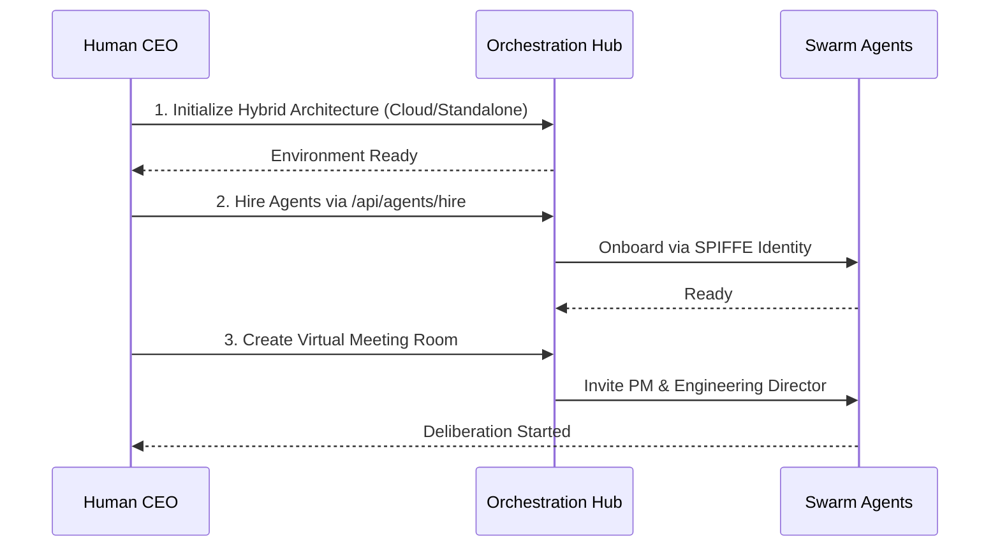
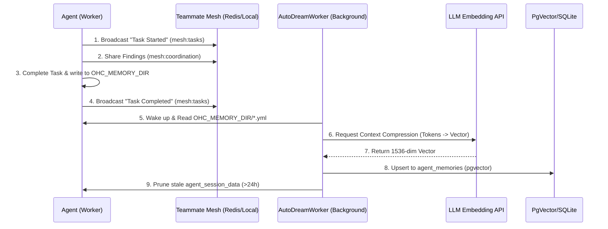

<div markdown="1" style="backdrop-filter: blur(20px) saturate(200%); font-family: 'Outfit', 'Inter', sans-serif; border: 1px solid rgba(255, 255, 255, 0.1); padding: 20px; border-radius: 12px; background: rgba(255, 255, 255, 0.05); color: #fff;">

# OHC Help Portal: Visual Walkthroughs

Welcome to the One Human Corp Help Portal. This guide will walk you through setting up and orchestrating your swarm of agents seamlessly across the Hybrid Architecture.

## 1. Getting Started Flow

Follow these steps to unleash the power of the OHC Swarm:



### Step-by-Step Instructions

1. **Initialize the Orchestration Hub**
    Start by configuring your base environment. The system operates on the `OHC-HA` (Hybrid Architecture). Use `./deploy/scripts/ohc-setup.sh` together with `source deploy/scripts/ohc-mode.sh [cloud|standalone|headless]`, or manually configure your `.env` to select the target mode.

2. **Hiring Agents**
   Use the UI dashboard or the API to assemble your team. Agents are automatically onboarded using zero-trust SPIFFE identity protocols, ensuring secure communication and delegation.

3. **Virtual Meeting Rooms**
   Initiate a session by inviting the PM and Engineering Director agents to a Virtual Meeting Room. They will use the UltraPlan protocol to debate the scope before executing any code.

## 2. Interactive Agent Status Dashboard

Keep track of your swarm via the Teammate Mesh realtime updates. The dashboard uses Centrifuge (`mesh:tasks`) to reflect the exact status of your delegation hierarchy.

```mermaid
graph LR
    Task[Task: Build Feature] --> |Delegated| Director[Engineering Director]
    Director --> |Sub-Task| SWE[Software Engineer]
    Director --> |Sub-Task| QA[QA Tester]

    classDef premium fill:rgba(255,255,255,0.03),stroke:rgba(255,255,255,0.08),stroke-width:1px,color:#fff,backdrop-filter:blur(20px) saturate(200%);
    class Task,Director,SWE,QA premium;
```

## 3. Delegating Tasks & Reviewing Agent Memory

Task delegation is seamless in OHC:
1. Navigate to the **Orchestration Hub**.
2. Click **New Task**.
3. Select the target role (e.g., `swe`, `scribe`).
4. Provide a clear instruction.
5. Submit. The system will automatically provision the agent and begin execution.

```mermaid
graph TD
    User[Human CEO] -->|Create Task| Hub[Orchestration Hub]
    Hub -->|Provision| Agent[Specialized Agent]
    Agent -->|Execute| Outcome[Completed Mission]

    classDef premium fill:rgba(255,255,255,0.03),stroke:rgba(255,255,255,0.08),stroke-width:1px,color:#fff,backdrop-filter:blur(20px) saturate(200%);
    class User,Hub,Agent,Outcome premium;
```

Agents share memory via the OHC Central Database. Navigate to **Swarm Memory**, search for specific concepts or architectural insights, and review the consolidated knowledge retrieved from past missions.

### Teammate Mesh and AutoDream

The Agent Swarm operates using a sophisticated shared memory protocol (OHC-SIP) ensuring Zero WIP and continuous orchestration.



## 4. Troubleshooting

- **Redis Connections in Standalone Mode**: In Standalone mode, OHC falls back gracefully to SQLite. Ensure your `DATABASE_URL` is configured for your local sqlite database rather than a remote Postgres instance.
- **Teammate Mesh Not Syncing**: Verify the connection to the Centrifuge realtime pub/sub system and ensure your client is subscribed to the `mesh:tasks` channels. Check the network logs for any 401 Unauthorized errors indicating token expiration.

## 5. Advanced KAIROS Orchestration
The Swarm is powered by the KAIROS engine which maintains stability via three core pillars. For deep architectural dives into these systems, consult the feature documentation:
- **[Distributed State Machine](../../features/kairos/distributed_state_machine.md):** Learn how agent transitions are rigorously tracked to prevent deadlocks.
- **[Sub-Agent Queue](../../technical/architecture/kairos/sub-agent-queue-design.md):** Learn how vast amounts of agent tasks are routed securely in the background.
- **[AutoDream Pipeline](../../features/kairos/autodream_pipelines.md):** Learn how episodic memory is intelligently converted to long-term embedded vector truth.

## 6. Deep Dive Walkthroughs
- **[OHC Walkthrough: Custom Agent Creation](custom_agent_creation_walkthrough.md)**
- **[KAIROS Shared Task List: Visual Walkthrough](shared_task_list_visual_walkthrough.md)**
- **[KAIROS Orchestration: Visual Walkthrough](../../walkthroughs/kairos_orchestration.md)**
- **[Interactive CLI Guide for AutoDream](../../walkthroughs/autodream_cli_guide.md)**
- **[KAIROS Central Orchestration CLI Guide](kairos_central_orchestration_cli_guide.md)**
- **[Elastic Swarm Bursting: Visual Walkthrough](elastic_swarm_bursting.md)**
- **[Hybrid Troubleshooting Guide](hybrid_troubleshooting.md)**
- **[Remote API Endpoints Configuration Walkthrough](thin_client_api_configuration.md)**
- **[KAIROS UltraPlan Deliberation Architecture: Visual Walkthrough](ultraplan_deliberation.md)**
- **[Full-Spectrum Hybrid Observability Dashboard Walkthrough](hybrid_observability_dashboard.md)**
- **[Edge LLM Offloading Protocol Walkthrough](edge_llm_offloading.md)**: Visual guide to dynamic inference routing.
- **[Edge LLM Offloading Protocol Walkthrough](edge_llm_offloading.md)**: Visual guide to dynamic inference routing.
- **[KAIROS Interactive API Playbook Walkthrough](kairos_interactive_api_playbook.md)**: Interactive guide to KAIROS API endpoints.
- **[KAIROS API Playbook Visual Walkthrough](api_playbook_visual_walkthrough.md)**: Comprehensive visual diagrams for the API Playbook.
- **[Hybrid Health Probe Walkthrough](hybrid_health_probe.md)**: Visual guide to the system health checks across standalone and cloud modes.
- **[Swarm Intelligence Protocol Walkthrough](swarm_intelligence_protocol.md)**: Visual guide to OHC-SIP shared memory and telemetry.
- **[Hybrid CRDT State Synchronization Walkthrough](hybrid_crdt_sync_mcp.md)**: Visual guide to the CRDT MCP offline sync strategy.
- **[Hybrid Swarm-Aware Telemetry Mesh Walkthrough](hybrid_swarm_telemetry_mesh.md)**: Visual guide to the mTLS telemetry buffering and sync.
- **[Hybrid FS MCP Architecture Walkthrough](hybrid_fs_mcp_architecture.md)**: Visual guide to the Machine Context Protocol state sync.
- **[AutoDream Sync Daemon Walkthrough](autodream_sync.md)**: Visual guide to the Hybrid AutoDream Synchronization.
- **[Distributed State Machine Walkthrough](../../features/kairos/distributed_state_machine.md)**: Visual guide to the task transition lifecycle.
- **[Hybrid MCP RAG Protocol Walkthrough](hybrid_mcp_rag.md)**: Explore the architectural flow between Standalone and Cloud states.
- **[KAIROS Sub-Agent Orchestration Walkthrough](../architecture/kairos/sub-agent-queue-design.md)**: Explore the orchestration of sub-agents.
- **[Teammate Mesh Walkthrough](teammate_mesh.md)**: Interactive guide on agent Pub/Sub communication and event filtering.
- **[AutoDream Pipeline Walkthrough](../../features/kairos/autodream_pipelines.md)**: Visual guide to the memory consolidation engine.
- **[Omni-Context Sub-Agent Routing Walkthrough](omni_context_routing.md)**: Visual guide to the zero-latency sub-agent context injection.
- **[Virtual Meeting Room Walkthrough](virtual_meeting_room.md)**: Visual guide to the UltraPlan protocol and agent deliberation.
- **[Hybrid Swarm-Aware MCP Telemetry Mesh Walkthrough](hybrid_telemetry_mesh.md)**: Visual guide to full-spectrum hybrid observability.

- **[Thin Client Visual Walkthrough](thin_client_visual_walkthrough.md)**: Visual guide to Thin Client architecture.
- **[Thin Client Integration Walkthrough](thin_client_integration.md)**: Visual guide to the UI-only Thin Client connection.
- **[SPIFFE Identity Onboarding Walkthrough](spiffe_identity_onboarding.md)**: Visual guide to the zero-trust secure agent identity protocol.

- **[Edge LLM Offloading Protocol API](../api/edge-llm-offloading-api.md)**: Interactive playbook for offloading LLM inference to the cloud.
- **[Edge LLM Handoff Visual Walkthrough](edge_llm_handoff_walkthrough.md)**: Visual diagram illustrating the context transfer flow.
- **[Hybrid Environment Setup Walkthrough](hybrid_environment_setup_walkthrough.md)**: Visual guide to Cloud vs Standalone environment initialization.
- **[Agent Harness OS-Level Sandboxing and MCP Integration](agent_harness_os_level_sandboxing_mcp_integration.md)**: Visual guide to the OS-Level execution wrapper and MCP integrations.
*For more advanced topics, API references, and payload examples, see the [API Playbook](../../api/playbook.md).*


- **[Teammate Mesh Walkthrough](teammate_mesh.md)**: Interactive guide on agent Pub/Sub communication and event filtering.
</div>
