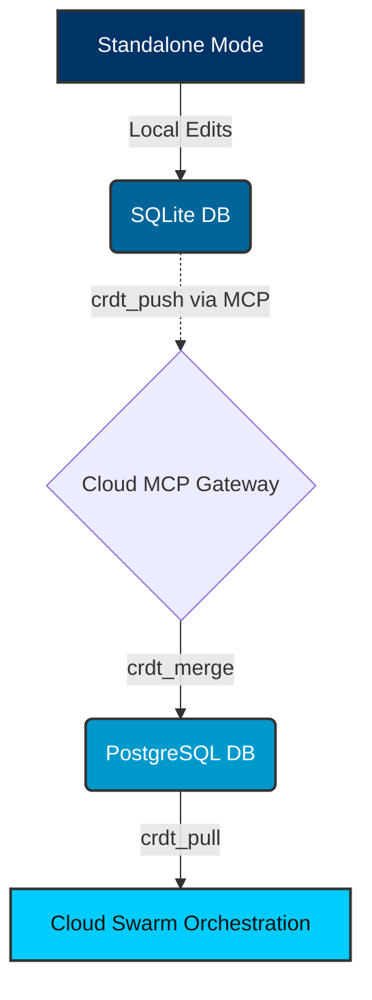

# Hybrid CRDT State Synchronization MCP: Visual Walkthrough

This guide details the architectural flow of the Hybrid CRDT State Synchronization Model Context Protocol (MCP), which enables offline-capable state convergence between Standalone SQLite and Cloud PostgreSQL.

## 1. Data Flow

The Hybrid Architecture uses CRDTs (Conflict-free Replicated Data Types) to resolve state changes when agents reconnect to the Cloud environment.

## 2. Conflict Resolution Mechanism

When the `crdt_push` tool is invoked, the payload is validated against the multi-tenant boundary. If `OHC_MULTITENANT=true`, it checks the `organization_id` in the context to prevent cross-tenant mutations.

