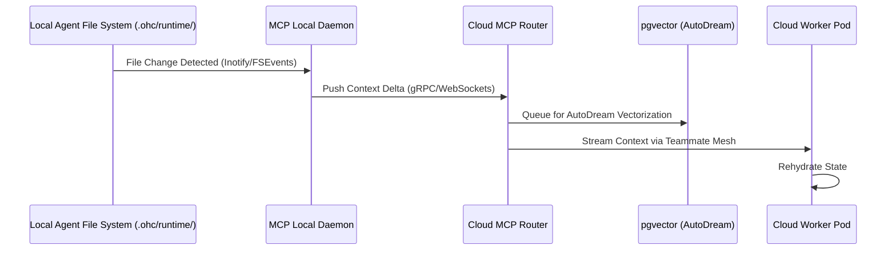

# Hybrid File System MCP Architecture: Visual Walkthrough

This document visualizes how the Machine Context Protocol (MCP) bridges the local Standalone execution environment with the Cloud-Native Postgres/Redis persistence layers.

## 1. Context Syncing Flow

Agents running locally (Zero WIP Standalone) stream their context to the Cloud MCP Router. This ensures high-fidelity observation and state-transfer during Cloud-Bursting.

## 2. Fallback Mechanism

When the Cloud Router is unreachable, the MCP Local Daemon gracefully degrades, queuing deltas in a local SQLite buffer (`mcp_sync_queue`) until connectivity is restored.

