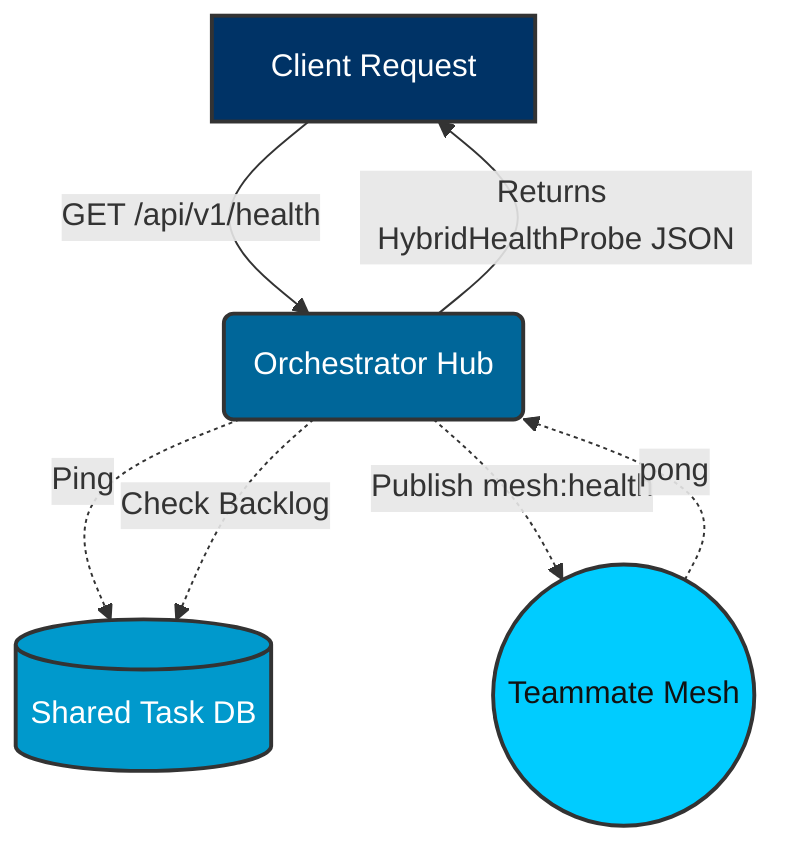

# Hybrid Health Probe: Visual Walkthrough

This guide details the architectural flow of the Hybrid Health Probe, which checks system availability across standalone and cloud modes.

## 1. Health Probe Flow

The Hybrid Architecture uses a health probe to verify database connectivity, background sync backlogs, and teammate mesh status.

