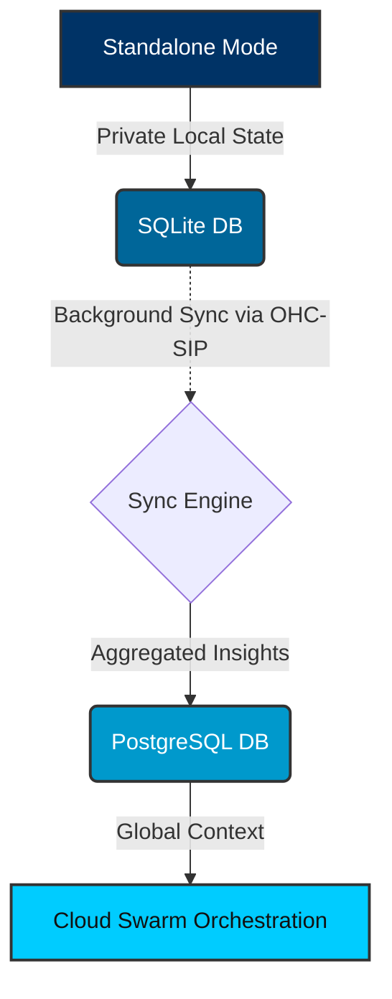

# Hybrid MCP RAG Protocol: Visual Walkthrough

This guide details the architectural flow of the Hybrid MCP RAG Protocol, which bridges Standalone SQLite and Cloud PostgreSQL.

## 1. Data Flow

The Hybrid Architecture uses a background daemon to synchronize states between Local SQLite and Cloud Postgres.

## 2. Synchronization Mechanism

The `Sync Daemon` periodically queries the local SQLite DB for rows where `sync_status = 'pending'`, batches them, and sends them via an encrypted SPIFFE/SPIRE payload to the Cloud API Gateway.

