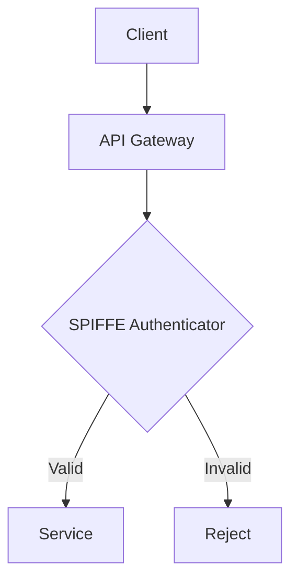

# OHC Interactive API Playbook

Welcome to the OHC Interactive API Playbook. This guide provides a seamless, visual walkthrough of our core APIs.

## Authentication
All APIs use SPIFFE/SPIRE for identity and auth to maintain "Zero Secrets".

## Endpoints
### `/api/v1/agents`
Retrieve a list of active agents in the swarm.

## KAIROS Orchestration Components
Explore the core orchestration features:
- [Distributed State Machine](../../features/kairos/distributed_state_machine.md)
- [Sub-Agent Queue](../../features/kairos/sub_agent_queue.md)
- [AutoDream Pipelines](../../features/kairos/autodream_pipelines.md)

## Usage
Explore our endpoints through this interactive guide to build out your integrations.
