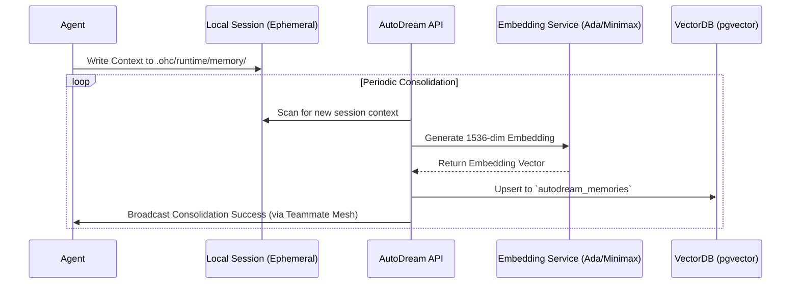

# KAIROS AutoDream Pipeline: Visual Walkthrough

This document visualizes the AutoDream Pipeline, which acts as the memory consolidation engine for the KAIROS Orchestrator.

## The AutoDream Architecture

AutoDream continuously embeds ephemeral agent session contexts into durable long-term memory via `pgvector` (in Cloud mode) and a simulated local vector store (in Standalone Desktop mode).

## Seamless Hybrid Degradation

In Standalone Mode, AutoDream falls back to local SQLite operations to ensure low resource consumption without sacrificing core autonomous capability.

