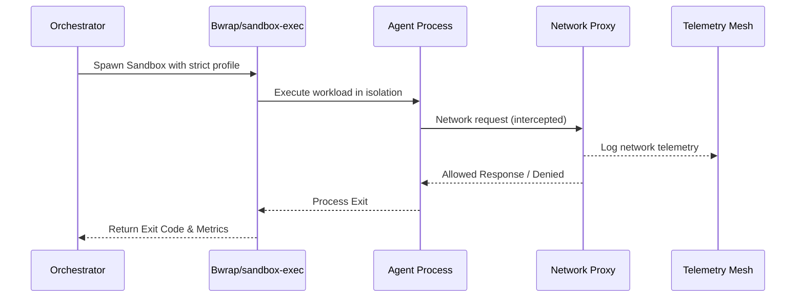

# OS-Level Sandbox Isolation Harness

  <strong>Security Note:</strong> This feature ensures zero-trust execution by wrapping agent processes in OS-level isolation (Bubblewrap for Linux, sandbox-exec for macOS).

## Architecture

The OS-Level Sandbox Isolation Harness provides strict, system-level containment for untrusted agent workflows. By utilizing native isolation mechanisms (Bubblewrap/sandbox-exec), OHC ensures that processes cannot access unauthorized network endpoints or read sensitive local files outside their designated space.

## Configuration

Sandbox profiles are configured to strictly limit agent capabilities, ensuring isolation from the host environment.

## Security Guarantees

The sandbox provides robust security guarantees against unauthorized access and privilege escalation.

## Execution Flow

