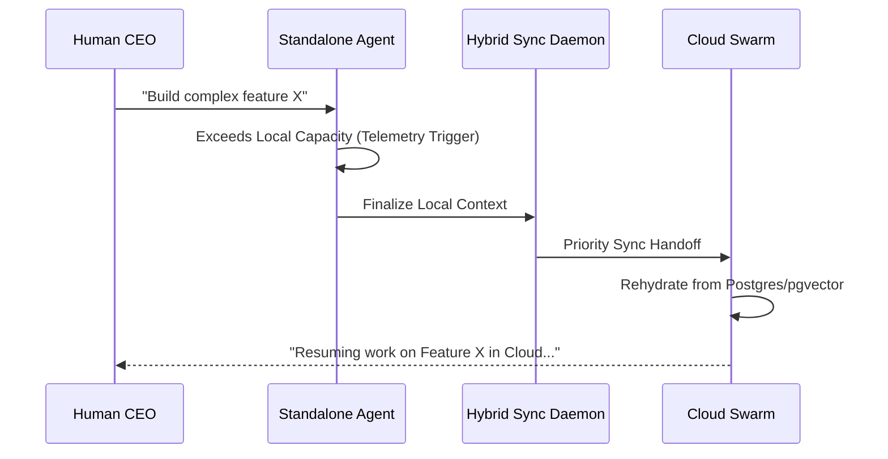

<div markdown="1" style="backdrop-filter: blur(20px) saturate(200%); font-family: 'Outfit', 'Inter', sans-serif; background: rgba(255, 255, 255, 0.03); color: #fff; padding: 20px; border-radius: 12px; border: 1px solid rgba(255, 255, 255, 0.1);">

# Scribe: Hybrid File System MCP Architecture Visual Walkthrough

This walkthrough details the **Proactive MCP** architecture, which enables OHC agents to maintain a "Zero WIP" state by bridging local file system changes with the Cloud-Native orchestration layer.

## 1. The Proactive Bridge

The Hybrid FS MCP architecture ensures that whether an agent is running in **Standalone Mode** (local desktop) or **Cloud Mode** (K8s pods), the context remains synchronized.

```mermaid
graph TD
    subgraph "Standalone Environment (Local)"
        A[Local FS: .ohc/runtime/] -->|Inotify/FSEvents| B(MCP Local Daemon)
        B -->|Buffer| C[(Local SQLite: mcp_sync_queue)]
    end

    subgraph "Sync Layer (gRPC/mTLS)"
        C -->|Sync Daemon| D{Cloud MCP Router}
    end

    subgraph "Cloud Environment"
        D -->|Write| E[(Cloud Postgres: agent_missions)]
        D -->|Vectorize| F[(pgvector: AutoDream)]
        E -->|Notify| G[Cloud Swarm Worker]
    end

    classDef premium fill:rgba(255,255,255,0.03),stroke:rgba(255,255,255,0.08),stroke-width:1px,color:#fff,backdrop-filter:blur(20px) saturate(200%);
    class A,B,C,D,E,F,G premium;
```

## 2. Proactive Synchronization Flow

The "Proactive" element comes from the system's ability to anticipate the need for cloud-bursting by constantly syncing deltas.

1.  **Observation**: The `MCP Local Daemon` monitors the `.ohc/runtime/` directory for any file modifications.
2.  **Buffering**: Changes are immediately written to the local SQLite `hybrid_mcp_sync_queue` with a status of `PENDING`.
3.  **Transmission**: A background `SyncToCloud` process batches these entries and pushes them to the Cloud Gateway via mTLS.
4.  **Integration**: The Cloud Router updates the global mission state and triggers AutoDream for background vectorization.

## 3. High-Fidelity State Handoff

When a user switches from Standalone to Cloud (e.g., "bursting" to the cloud for a complex task), the handoff is instantaneous because the state is already there.



## 4. Failure Resilience

If connectivity is lost, the system remains fully functional in Standalone mode. The `mcp_sync_queue` acts as a durable buffer, ensuring no context is lost once the connection is restored.

-   **Offline Mode**: Agent continues using local SQLite and File System.
-   **Reconnection**: Sync Daemon detects `OHC_CORE_URL` is reachable and flushes the queue.
-   **Conflict Resolution**: Uses Last-Write-Wins (LWW) based on timestamps recorded at the moment of local modification.

</div>
