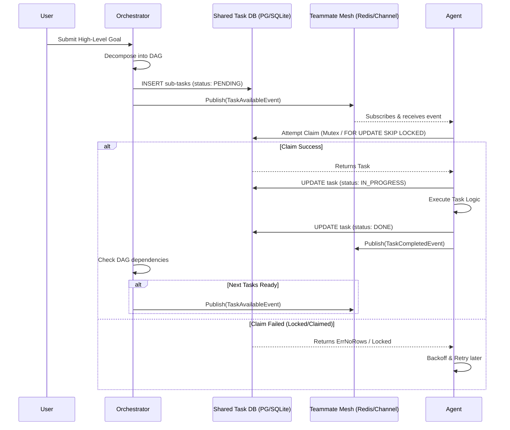

# KAIROS Shared Task List: Visual Walkthrough

This document provides a visual representation of the KAIROS Shared Task List state machine and lifecycle within the OHC Hybrid Architecture.

## State Machine Overview

The Shared Task List handles the complex Directed Acyclic Graph (DAG) dependencies for agentic workflows, orchestrating tasks across both Cloud-Native (PostgreSQL + Redis) and Standalone (SQLite) modes.

