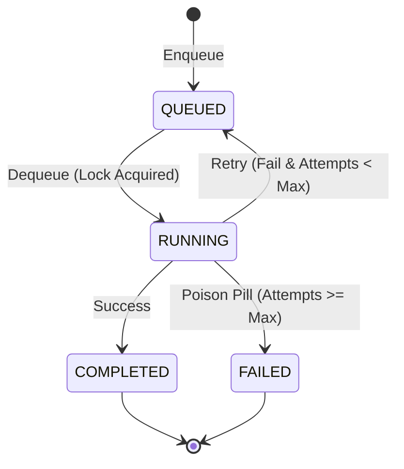

<div markdown="1" style="backdrop-filter: blur(20px) saturate(200%); font-family: 'Outfit', 'Inter', sans-serif; border: 1px solid rgba(255, 255, 255, 0.1); padding: 20px; border-radius: 12px; background: rgba(255, 255, 255, 0.05); color: #fff;">

# Sub-Agent Orchestration Queue: Visual Walkthrough

This guide details the architectural flow of the Sub-Agent Orchestration Queue, the robust background execution runtime enabling the OHC Swarm to scale and execute delegated tasks gracefully.

## 1. Overview of the Orchestration Queue

As the OHC Swarm handles more complex workloads, we require a distributed execution framework handling sub-agent task routing, retries, exponential backoffs, and execution timeouts. The Sub-Agent Orchestration Queue provides this via a seamless transition between Redis-backed (Cloud mode) and SQLite-backed (Standalone mode) queues.

### Architecture Comparison

```mermaid
graph TD
    subgraph Cloud Native Mode
        A1[Task Manager] -->|Enqueue Job| R1[(Redis Task Queue)]
        R1 -->|Dequeue via rueidis| W1[Sub-Agent Worker Pod]
        W1 -->|Execute| C1[Task Complete]
    end

    subgraph Standalone Mode
        A2[Task Manager] -->|Enqueue Job| S2[(SQLite Task Queue)]
        S2 -->|Dequeue via SQL Locks| W2[Local Sub-Agent Worker]
        W2 -->|Execute| C2[Task Complete]
    end

    classDef premium fill:rgba(255,255,255,0.03),stroke:rgba(255,255,255,0.08),stroke-width:1px,color:#fff,backdrop-filter:blur(20px) saturate(200%);
    class A1,R1,W1,C1,A2,S2,W2,C2 premium;
```

## 2. Queue Lifecycle

The job lifecycle guarantees at-least-once delivery, ensuring resilient task execution and dead-letter queuing for poisoned messages.

1. **Enqueue**: The parent agent delegates a sub-task. The `TaskManager` inserts a `Job` record with `status='QUEUED'`.
2. **Dequeue**: Worker sub-agents poll the queue for jobs matching their role.
3. **Execution**: The worker agent attempts the task, communicating progress over the Teammate Mesh.
4. **Completion/Failure**: The task transitions to `COMPLETED` on success, or `FAILED` (after retrying up to `max_attempts`).



## 3. Implementation Details

- **Cloud Mode**: Employs Redis Lists (`RPUSH`/`LPOP`) and Sorted Sets for delayed execution.
- **Standalone Mode**: Utilizes an internal `sub_agent_jobs` SQLite table. Dequeuing relies on explicit transactions with concurrent read/write locks (`FOR UPDATE SKIP LOCKED` logic simulation) to prevent `SQLITE_BUSY` contention during parallel local processing.
- **Observability**: Both queues integrate natively with OpenTelemetry, emitting queue length and processing time metrics for Grafana visualization.

</div>
