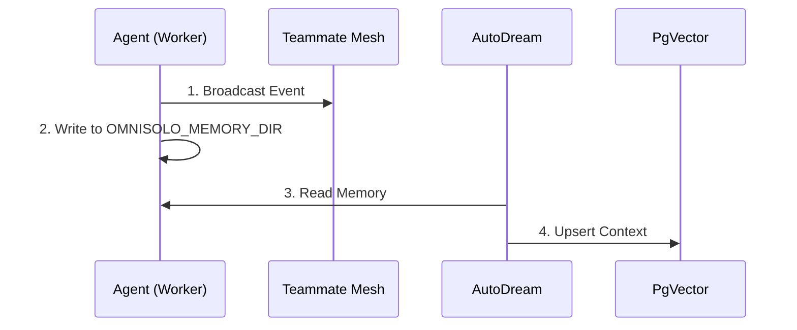

<div markdown="1" style="backdrop-filter: blur(20px) saturate(200%); font-family: 'Outfit', 'Inter', sans-serif; background: rgba(255, 255, 255, 0.03); color: #fff; padding: 20px; border-radius: 12px; border: 1px solid rgba(255, 255, 255, 0.1);">

# Swarm Intelligence Protocol (OmniSolo-SIP)

The Swarm Intelligence Protocol (OmniSolo-SIP) is the core architectural pillar enabling shared memory and continuous orchestration across the OmniSolo Swarm.



## API Endpoint Example

```http
POST /api/v1/mesh/v2/broadcast
Content-Type: application/json

{
  "channel": "mesh:tasks",
  "event_type": "status_update",
  "data": { ... }
}
```

</div>
