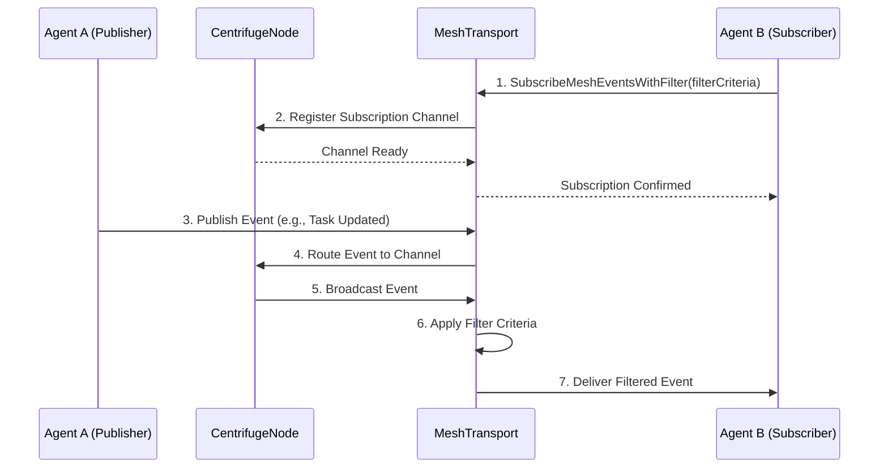

<div markdown="1" style="backdrop-filter: blur(20px) saturate(200%); font-family: 'Outfit', 'Inter', sans-serif; border: 1px solid rgba(255, 255, 255, 0.1); padding: 20px; border-radius: 12px; background: rgba(255, 255, 255, 0.05); color: #fff;">

# Teammate Mesh Walkthrough

Welcome to the Teammate Mesh visual guide! This document explains how agents inside the One Human Corp (OHC) Hybrid Architecture communicate seamlessly via the Pub/Sub workflow.

## 1. Overview

The Teammate Mesh handles inter-agent communication, enabling agents to subscribe, filter, and process mesh events natively across both Cloud-Native and Standalone modes. It relies heavily on the `MeshTransport` interface, event filtering with `SubscribeMeshEventsWithFilter`, and real-time synchronization through the `CentrifugeNode`.

## 2. Pub/Sub Workflow Architecture

Here is the high-level architecture of the Teammate Mesh Pub/Sub workflow:



### Components

- **`MeshTransport`**: The core interface defining the contract for all mesh communications. It abstracts away the underlying Pub/Sub implementation (Redis for Cloud, in-memory for Standalone).
- **`CentrifugeNode`**: The real-time messaging engine. It manages channels, client connections, and distributes messages to active subscribers with extremely low latency.
- **`SubscribeMeshEventsWithFilter`**: The specific method agents use to subscribe to topics of interest, allowing them to provide a filter function to only receive relevant events.

## 3. Event Filtering in Action

Agents often don't need to process every single event on the mesh. `SubscribeMeshEventsWithFilter` enables highly efficient targeted message delivery:

```mermaid
graph TD
    Incoming[Incoming Mesh Event] --> FilterCheck{Filter Match?}
    FilterCheck -->|Yes| Process[Process Event]
    FilterCheck -->|No| Discard[Discard Event]

    classDef premium fill:rgba(255,255,255,0.03),stroke:rgba(255,255,255,0.08),stroke-width:1px,color:#fff,backdrop-filter:blur(20px) saturate(200%);
    class Incoming,FilterCheck,Process,Discard premium;
```

This ensures agents remain performant and focused on their specific tasks without being overwhelmed by unrelated system noise.

## 4. Next Steps

- Explore the [API Playbook](../api/playbook.md) for concrete payload structures.
- Return to the [Help Portal](help_portal.md) to discover other hybrid architecture concepts.

</div>
