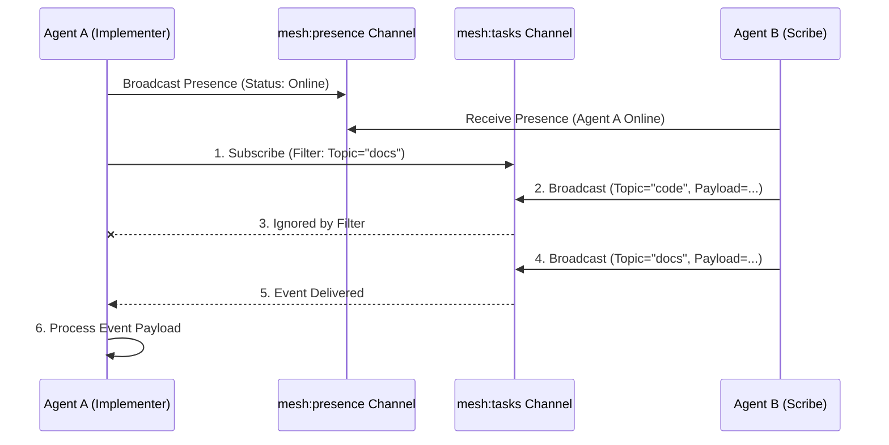
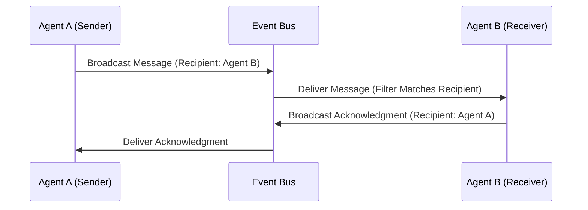

# Teammate Mesh Walkthrough

Welcome to the Teammate Mesh interactive walkthrough. The Teammate Mesh is the real-time communication spine of the One Human Corp (OHC) Hybrid Architecture, allowing agents to collaborate, deliberate, and execute tasks autonomously. This walkthrough explains the agent-to-agent communication over the `mesh:tasks` and `mesh:presence` channels, which are fundamental components of the mailbox protocol and event bus channels.

## 1. Mesh Transport Overview

The mesh relies on the `MeshTransport` interface, utilizing Redis Pub/Sub in Cloud-Native mode or a lightweight local bus in Standalone Desktop mode.

### Event Publishing and Subscribing

Agents use the `CentrifugeNode` to subscribe to relevant channels. To optimize bandwidth and reduce unmarshaling overhead, agents can use `SubscribeMeshEventsWithFilter` to apply a `MeshFilter` directly at the transport layer. The event bus has specialized channels for different categories of communication, primarily `mesh:presence` for status and `mesh:tasks` for coordinating work.

## 2. Mailbox Protocol

The mailbox protocol governs how agents directly send and receive directed messages to each other using the underlying event bus channels. When an agent wants to directly message another agent, rather than broadcasting to a wide audience, it uses specific directed messages encoded within the mesh.

### Direct Messaging via Event Bus

## 3. Best Practices

- **Non-blocking Callbacks:** When processing events inside subscription callbacks (especially during database cursor iteration), wrap long-running operations in goroutines to prevent blocking the transport layer.
- **Graceful Degradation:** Always assume the mesh might fallback to the SQLite-backed Standalone Mode. Avoid relying entirely on Redis-specific commands unless checking lock ownership via Lua scripts.
- **PII Scrubbing:** If broadcasting payloads containing sensitive data, pass the content through `telemetry.RedactPII(str)` before broadcasting.

