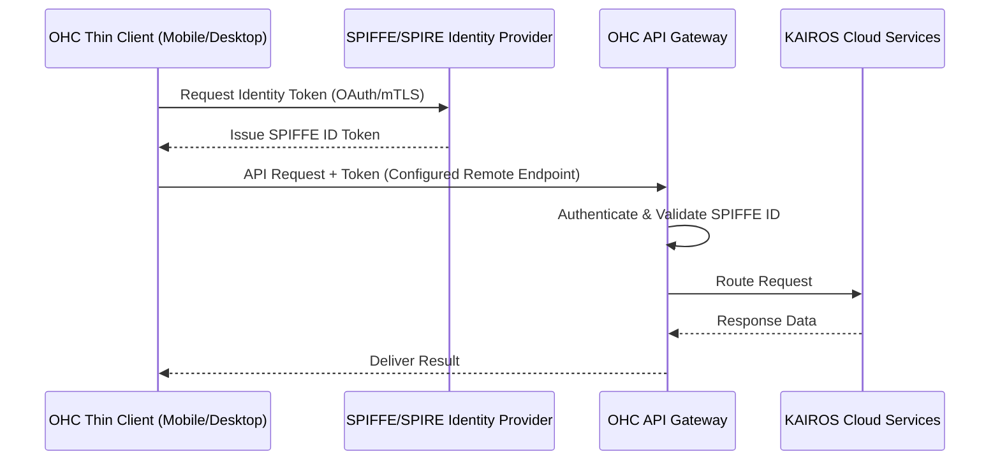

# Remote API Endpoints Configuration Walkthrough

Welcome to the One Human Corp (OHC) interactive walkthrough for configuring Remote API Endpoints in **Thin Client Mode**.

## Architecture & Flow

In Thin Client Mode, the Mobile/Desktop UI connects directly to the Cloud via API/OAuth with configurable endpoints, minimizing local resource consumption and ensuring low-latency interactions.

## Configuration Comparison

| Metric / Mode | Thin Client Mode | Standalone Desktop Mode | Cloud-Native Mode |
| :--- | :--- | :--- | :--- |
| **Data Storage** | Remote (Cloud DB) | Local (SQLite) | Remote (PostgreSQL / Redis) |
| **Compute** | Minimal (UI Rendering) | Heavy (Local LLM / Services) | Scalable (K8s / Distributed) |
| **Latency** | Network Dependent | Ultra-Low (Local) | Optimized (CDN / Edge) |
| **Auth Strategy**| OAuth / Remote SPIFFE | Local / Standalone Auth | Strict mTLS / SPIFFE |

## Endpoint Setup

To configure your Thin Client to connect to your preferred OHC Central Orchestrator, navigate to `Settings -> Network -> Remote Endpoints` and input the secure, SPIFFE-authenticated API gateway URL.

