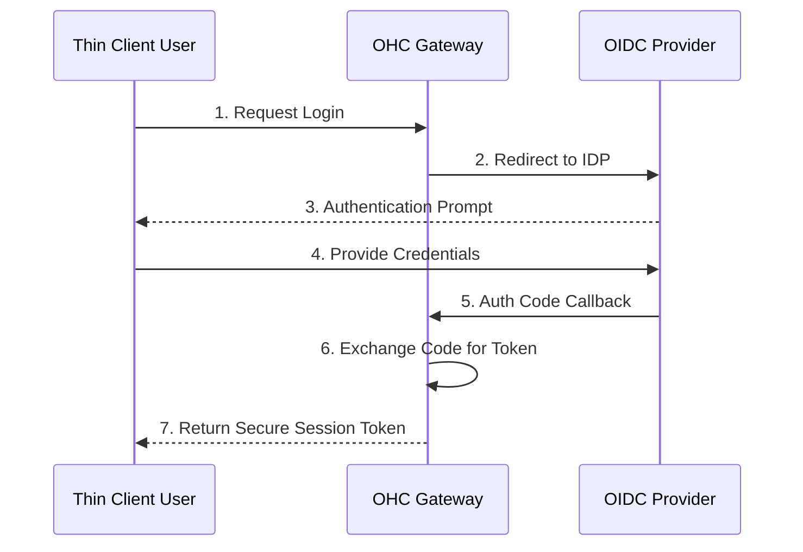

<div markdown="1" style="backdrop-filter: blur(20px) saturate(200%); font-family: 'Outfit', 'Inter', sans-serif; border: 1px solid rgba(255, 255, 255, 0.1); padding: 20px; border-radius: 12px; background: rgba(255, 255, 255, 0.05); color: #fff;">

# Thin Client Integration Walkthrough

Welcome to the Thin Client Integration interactive walkthrough. This guide explains how OHC connects lightweight UI clients (Mobile and Desktop) to the Cloud Orchestration Hub via robust API boundaries and OAuth flows.

## 1. Architectural Overview

The **Thin Client Mode** is designed for maximum API reliability, low-latency interaction, and strict separation from heavy background orchestration duties. By shifting compute to the Cloud PostgreSQL/Redis cluster, the client remains universally responsive.

```mermaid
graph TD
    UI[Thin Client UI] -->|OAuth 2.0 Auth| API[OHC Gateway API]
    API -->|Route Request| Hub[Orchestration Hub]
    Hub --> K8s[K8s Managed Swarm]
    Hub --> DB[(Cloud PostgreSQL)]

    classDef premium fill:rgba(255,255,255,0.03),stroke:rgba(255,255,255,0.08),stroke-width:1px,color:#fff,backdrop-filter:blur(20px) saturate(200%);
    class UI,API,Hub,K8s,DB premium;
```

## 2. Authentication Flow

Thin clients exclusively use external OAuth flows to acquire session tokens. Zero trust is maintained by treating all remote clients as untrusted until verified by SPIFFE/SPIRE context mappings within the gateway.



## 3. Remote Endpoint Configuration

Unlike the Standalone Mode which runs local SQLite and background processes, Thin Clients require configuration of the remote API endpoint.

Configure your Thin Client `.env` with:
- `VITE_OHC_REMOTE_HUB_URL=https://api.onehumancorp.com`
- `VITE_OHC_AUTH_DOMAIN=auth.onehumancorp.com`

When properly connected, the client utilizes the Centrifuge WebSocket (`/api/mesh/v2/broadcast`) connection to stream real-time task coordination directly into the local view.

</div>
