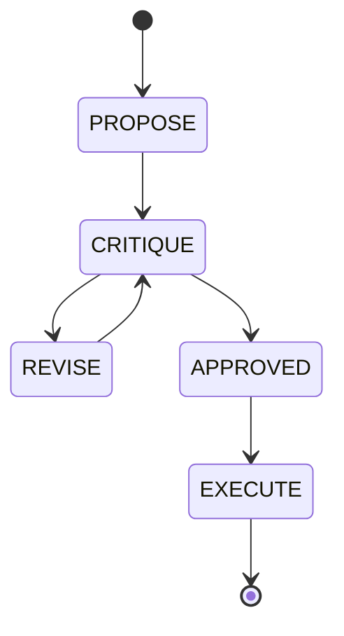

# KAIROS UltraPlan Deliberation Architecture: Visual Walkthrough

This document outlines the multi-phase UltraPlan state machine utilized by the OHC Swarm to deliberate on and execute complex architectural changes.

## State Machine Overview

The UltraPlan process cycles through proposing, critiquing, and revising plans before approval and execution. State transitions are tracked by the Swarm coordination mechanisms.

## Integration Points

- **State Machine:** Transitions are recorded and mapped within the KAIROS state machine.
- **Mesh Broadcasts:** Sub-agents communicate phases and updates via the dedicated `mesh:ultraplan` Redis Pub/Sub channel.
- **Sub-Agent Collaboration:** During `CRITIQUE` and `REVISE` phases, Sub-Agents queue and review tasks iteratively.

