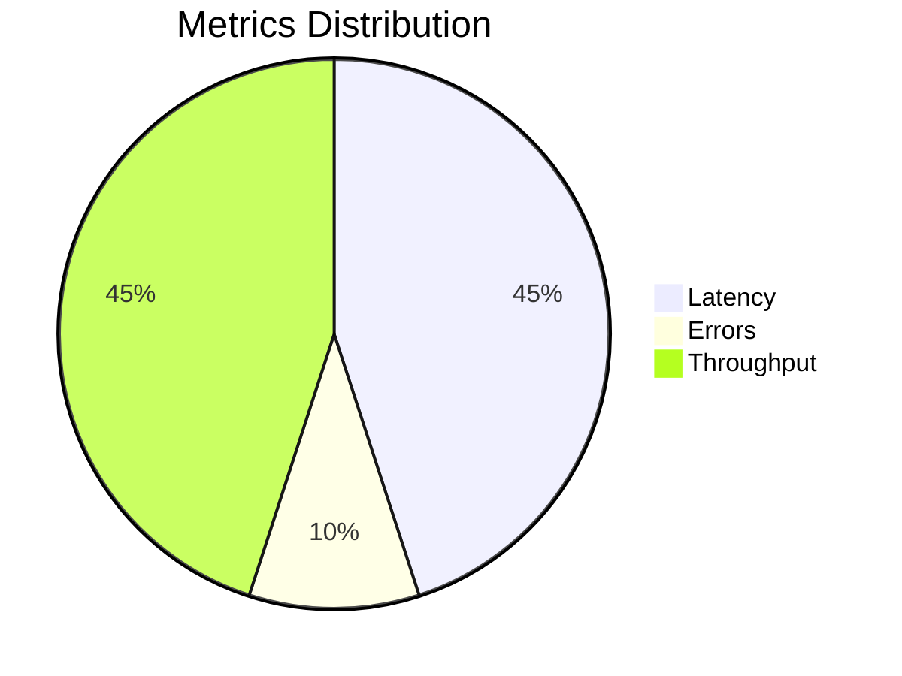

# Visual Vitality Dashboard Guide

This guide provides a walkthrough of the OHC Vitality Dashboard.

The dashboard utilizes Glassmorphism and Outfit/Inter typography for a premium aesthetic.

## Features
- Full-Spectrum Observability
- OpenTelemetry integrations
- Prometheus metrics visualization

