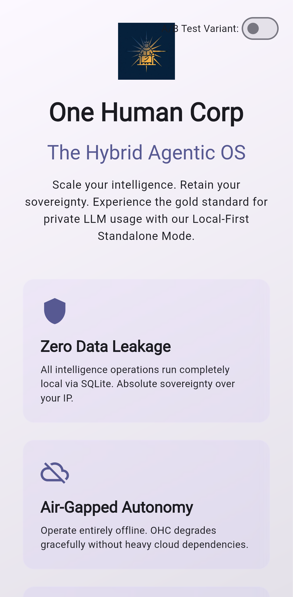
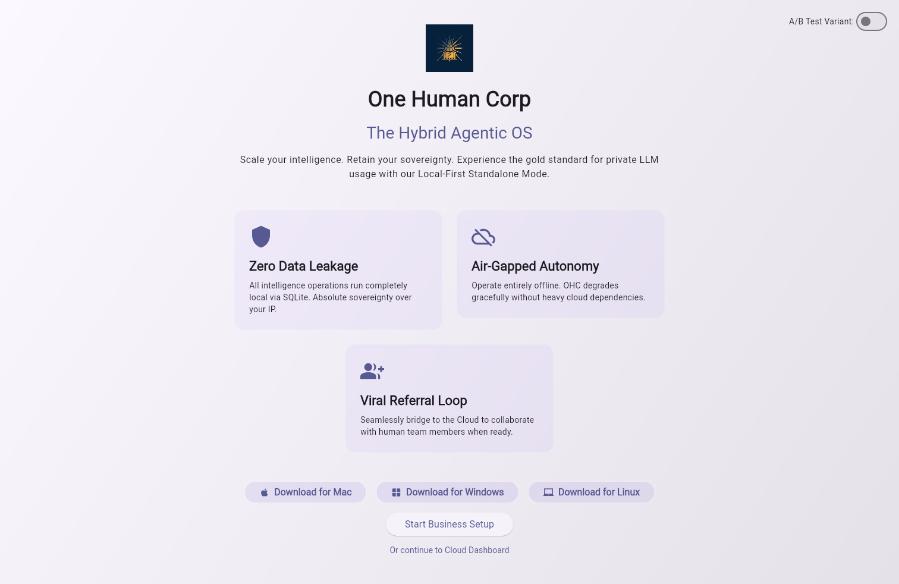

<div markdown="1" style="backdrop-filter: blur(20px) saturate(200%); background: rgba(255, 255, 255, 0.03); font-family: 'Outfit', 'Inter', sans-serif;">

# User Guide: OHC Flutter App

## 1. Overview

This guide covers the Bazel-native Flutter app workflow in `srcs/app`.
The app's screenshots are generated from the Bazel-built Flutter web bundle by
running Playwright with platform-specific viewport and device profiles.

## 2. Visual Rendering (Cloud vs Standalone)

The OHC Agentic OS maintains a strict **Visual Excellence Mandate** across both Cloud-native and Standalone Desktop environments. Whether operating via the high-scale PostgreSQL/Redis backend or the offline SQLite engine, all user interfaces share a single, unified visual representation.

To guarantee user delight, both modes implement identical Glassmorphism design tokens:
- **Backdrop Filter**: `blur(20px) saturate(200%)`
- **Background**: `rgba(255, 255, 255, 0.03)`
- **Typography**: `Outfit`, `Inter`, sans-serif

This ensures the Premium Feel is consistent, regardless of the underlying hybrid architecture.

## 3. Regenerate Screenshots

Run either of the following from the repository root:

```bash
bazelisk run //srcs/app:capture_screenshots
```

Or use the VS Code task `App: Capture Flutter screenshots`.

Generated images are written to:

- `docs/public/assets/screenshots/app/landing-page/`

## 4. Screenshot Gallery

### Web


### macOS


### Windows


### Android




### iOS


### Linux




</div>
<div markdown="1" style="backdrop-filter: blur(20px) saturate(200%); background: rgba(255, 255, 255, 0.03); font-family: 'Outfit', 'Inter', sans-serif;">

## 5. Documentation

Please refer to the detailed architecture documents in the `docs/` folder:
- [KAIROS Orchestration Design Phase 4](./kairos_orchestration_phase4.md)

</div>

<div markdown="1" style="font-family: Outfit, Inter, sans-serif; padding: 20px; font-size: 12px; color: #888;">
Last synced: 2026-04-17 03:42:41
</div>
