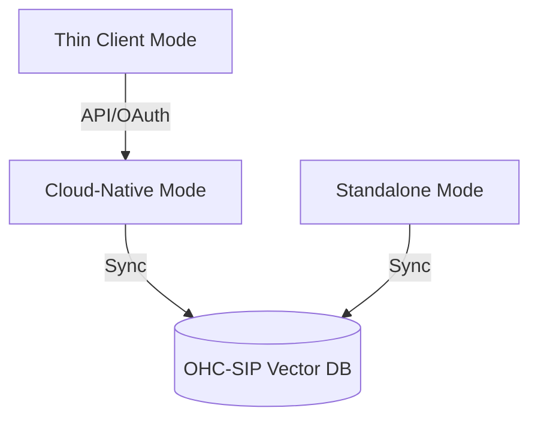

# User Guide: OHC Flutter App

## 1. Overview

This guide covers the Bazel-native Flutter app workflow in `srcs/app`.
The app's screenshots are generated from the Bazel-built Flutter web bundle by
running Playwright with platform-specific viewport and device profiles.

## 2. Regenerate Screenshots

Run either of the following from the repository root:

```bash
bazelisk run //srcs/app:capture_screenshots
```

Or use the VS Code task `App: Capture Flutter screenshots`.

Generated images are written to:

- `docs/public/assets/screenshots/app/landing-page/`

## 3. Screenshot Gallery

### Web


### macOS


### Windows


### Android


### iOS


### Linux


## 4. Documentation

Please refer to the detailed architecture documents in the `docs/` folder:
- [KAIROS Orchestration Design Phase 4](./kairos_orchestration_phase4.md)

Last synced: 2026-04-17 03:42:41


## 5. Visual Rendering Specs

The OHC visual styling mandate requires components to have premium glassmorphism styling as text-based implementation specs for downstream agents:
* `backdrop-filter: blur(20px) saturate(200%);`
* `background: rgba(255, 255, 255, 0.05);`
* `border: 1px solid rgba(255, 255, 255, 0.1);`
* `font-family: 'Outfit', 'Inter', sans-serif;`

### 5.1 Architecture



### 5.2 Comparative Analysis

| Feature | Cloud Mode | Standalone Mode | Thin Client Mode |
| :--- | :--- | :--- | :--- |
| **Orchestration** | K8s | SQLite Local | N/A |
| **Resources** | High | Low | Very Low |
| **Multi-tenant** | Yes | No | Yes |
