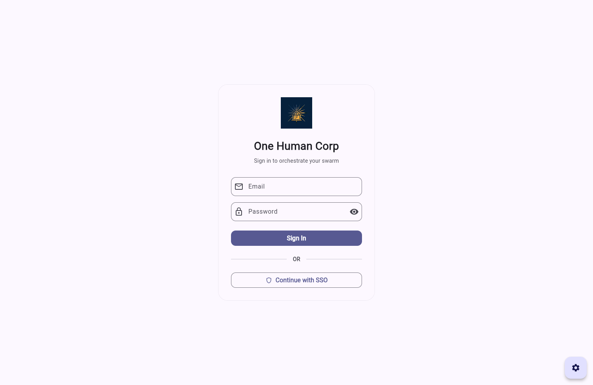
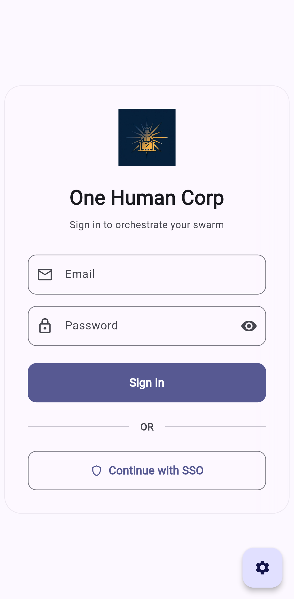
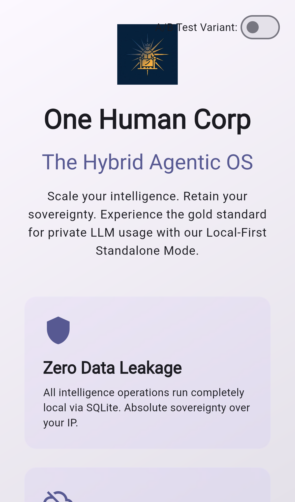
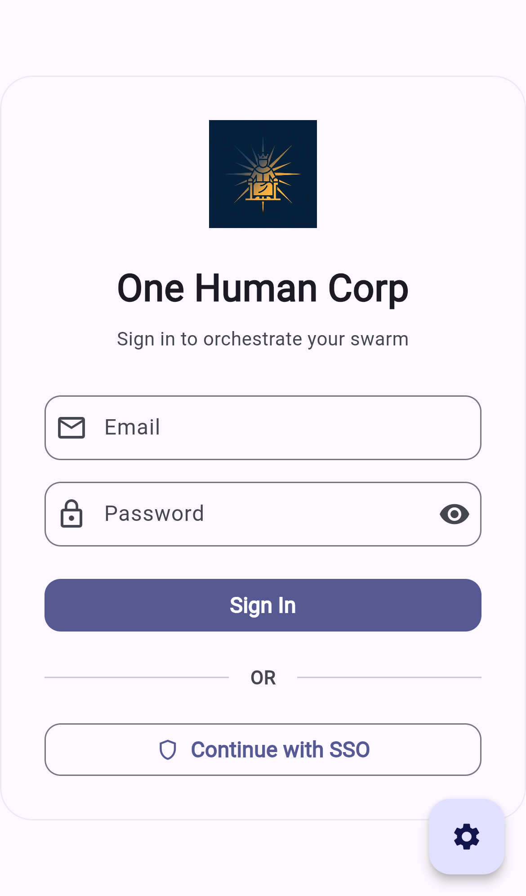

<div markdown="1" style="backdrop-filter: blur(20px) saturate(200%); font-family: Outfit, Inter, sans-serif; border: 1px solid rgba(255, 255, 255, 0.1); padding: 20px; border-radius: 12px; background: rgba(255, 255, 255, 0.05);">

# User Guide: OHC Slint App

## 1. Overview

This guide covers the Bazel-native Slint app workflow in `src/app`.
The app's screenshots are generated from the Bazel-built Slint web bundle by
running Playwright with platform-specific viewport and device profiles.

## 2. Regenerate Screenshots

Run either of the following from the repository root:

```bash
bazelisk run //src/app:capture_screenshots
```

Or use the VS Code task `App: Capture Slint screenshots`.

Generated images are written to:

- `docs/business/public/assets/screenshots/app/landing-page/`

## 3. Screenshot Gallery

### Web


### macOS


### Windows




### Android




### iOS




### Linux


</div>
<div markdown="1" style="backdrop-filter: blur(20px) saturate(200%); font-family: Outfit, Inter, sans-serif; border: 1px solid rgba(255, 255, 255, 0.1); padding: 20px; border-radius: 12px; background: rgba(255, 255, 255, 0.05);">

## 4. Documentation

Please refer to the detailed architecture documents in the `docs/` folder:
- [KAIROS Orchestration Design Phase 4](./business/features/kairos_orchestration_phase4/design-doc.md)

</div>

<div markdown="1" style="font-family: Outfit, Inter, sans-serif; padding: 20px; font-size: 12px; color: #888;">
Last synced: 2026-04-18 01:47:55
</div>
