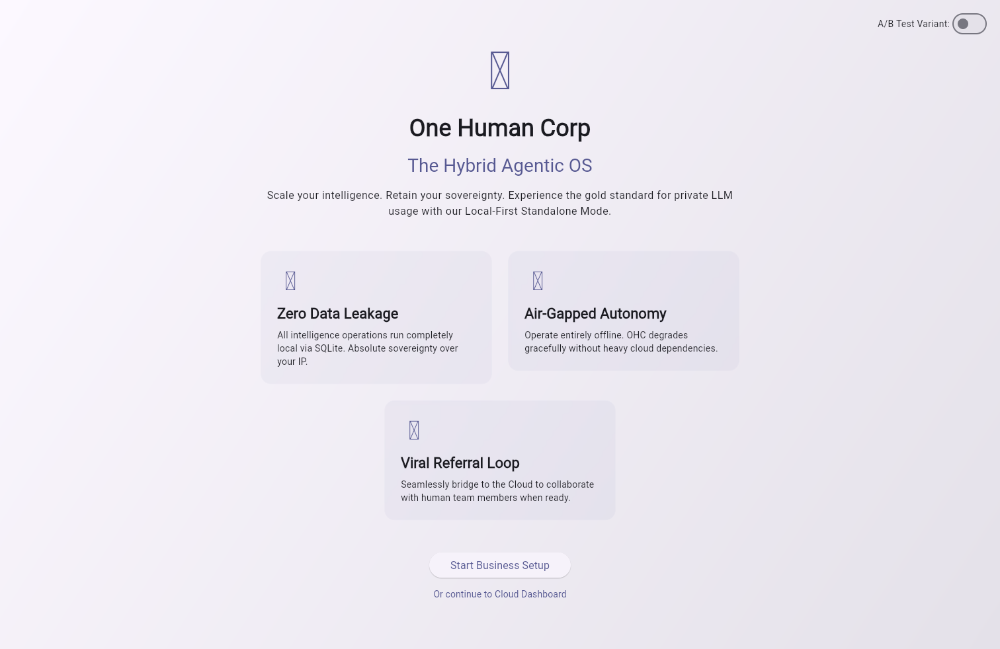

<div markdown="1" style="backdrop-filter: blur(20px) saturate(200%); font-family: Outfit, Inter, sans-serif; border: 1px solid rgba(255, 255, 255, 0.1); padding: 20px; border-radius: 12px; background: rgba(255, 255, 255, 0.05);">

# User Guide: OHC Flutter App

## 1. Overview

**One Human Corp** is the Hybrid Agentic OS — a cross-platform Flutter application backed by a Go server that lets a single human run an entire AI-powered company. It covers the full lifecycle from onboarding through daily operations:

| Category | Screens |
|---|---|
| **Onboarding** | Landing, Login, Business Setup Wizard, Setup Wizard |
| **Agent Management** | Agents list, Agent Hire Wizard, Prompt Tuning Wizard, Fix-This Wizard |
| **Collaboration** | Meetings, Chat, Channels, Handoffs |
| **AI & Skills** | AI Providers config, Skills catalogue |
| **Operations** | Dashboard, Logs, Security, Service Management, Diagnostics |
| **Orchestration** | Shared Task List, Swarm Memory, Pipelines |
| **Growth** | Referrals, Growth Experiments |
| **Cost & Scaling** | Cost Dashboard, Dynamic Scaling |
| **Integrations** | Integrations & Tools, User Management |
| **Commerce** | Upgrade Wizard, Billing Wizard |
| **Settings** | App Settings |

The app ships on **Web, Linux (.deb), macOS (.dmg), Windows (.exe), Android and iOS**. All six platform profiles are covered by the automated Playwright screenshot suite.

## 2. Regenerate Screenshots

Run either of the following from the repository root:

```bash
bazelisk run //srcs/app:capture_screenshots
```

Or use the VS Code task `App: Capture Flutter screenshots`.

Screenshots are written to `docs/public/assets/screenshots/app/<screen-name>/` with one PNG per platform profile (`web`, `linux`, `windows`, `macos`, `android`, `ios`).

## 3. Run E2E Tests

```bash
bazelisk test //srcs/app:flutter_web_e2e_test
```

The Playwright suite in `srcs/app/e2e/web.spec.ts` covers **76 test cases** across all 31 screens, including authentication flows, form interactions, navigation, chaos scenarios (high-latency, network-partition), and a performance baseline.

## 4. Screenshot Gallery

### Landing Page


### Login


### Dashboard


### Agents


### Agent Hire Wizard


### Prompt Tuning Wizard


### Meetings


### Chat


### Channels


### AI Providers


### Skills


### Logs


### Security


### Settings


### Service Management


### Setup Wizard


### Diagnostics


### Business Setup Wizard


### Handoffs


### Cost Dashboard


### Dynamic Scaling


### Pipelines


### Integrations


### User Management


### Fix-This Wizard


### Upgrade Wizard


### Billing Wizard


### Task List (Orchestration)


### Swarm Memory




### Growth Experiments


### Referrals


</div>
<div markdown="1" style="backdrop-filter: blur(20px) saturate(200%); font-family: Outfit, Inter, sans-serif; border: 1px solid rgba(255, 255, 255, 0.1); padding: 20px; border-radius: 12px; background: rgba(255, 255, 255, 0.05);">

## 5. Documentation

Please refer to the detailed architecture documents in the `docs/` folder:
- [KAIROS Orchestration Design Phase 4](./kairos_orchestration_phase4.md)

</div>
