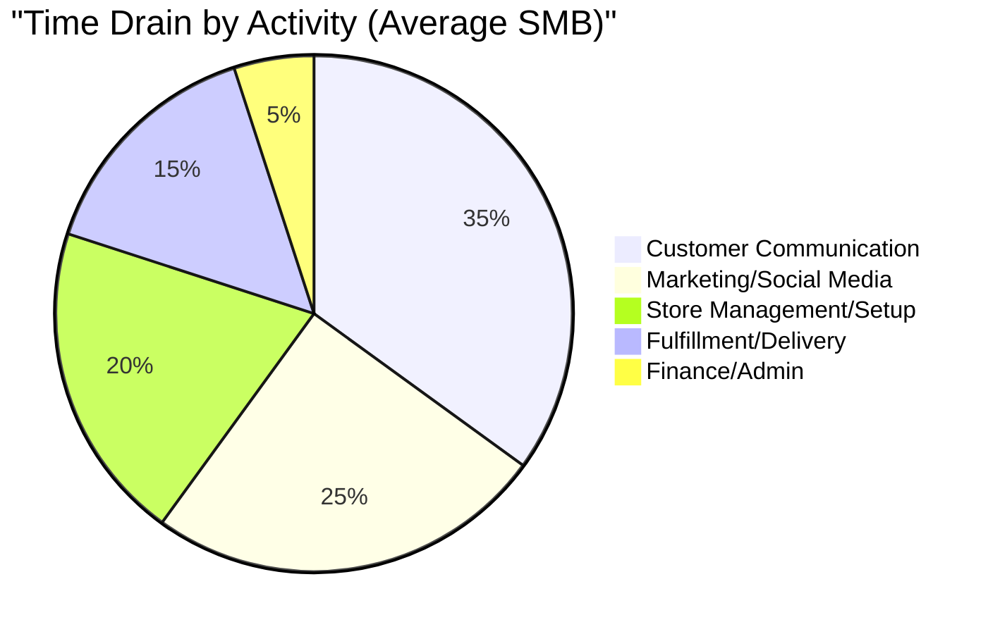

# OneHumanCorp (OHC) Market Research & Strategy Report

## Executive Summary
This report analyzes the competitive landscape of small business platforms (Shopify, Wix, Squarespace) and identifies critical gaps that OneHumanCorp (OHC) can exploit. The primary finding is that existing platforms treat AI as a reactive chatbot or a one-time onboarding tool. OHC's key differentiator must be **autonomous, background AI agents** that operate continuously, handling daily tasks (customer communication, inventory management) without user intervention, coupled with a truly mobile-first management experience.

---

## Track 1: Deep Competitor Audit

| Feature | Shopify | Wix | Squarespace | GoDaddy Airo | OHC (Vision) |
|---|---|---|---|---|---|
| **Setup Time** | 30-60 min | 20-40 min | 30-60 min | 20-40 min | **< 10 min** |
| **Tech Knowledge**| Low | Low | Low | Low | **Zero** |
| **AI Integration**| Sidekick (chat only) | Wix ADI (one-time) | Limited text generation | Logo & basic draft | **Autonomous Agents** |
| **Mobile Management**| Partial | Partial | No | No | **Yes (375px native)** |
| **Free Tier** | No | Yes (limited) | No | No | **Yes (useful)** |

### Key Competitor Weaknesses:
*   **Shopify:** Complex configuration for beginners. The mobile app is good for viewing stats but poor for initial setup and deep configuration. Sidekick requires the user to know what to ask.
*   **Wix:** The initial AI setup (ADI) is helpful, but post-launch management relies on traditional, complex dashboards.
*   **Squarespace:** Beautiful templates but lacks deep business management tools (e.g., complex booking + physical products). No meaningful AI automation for daily operations.
*   **GoDaddy Airo:** Extremely basic AI generation that often requires significant manual editing. Reputation for aggressive upselling alienates users.

---

## Track 2: SMB User Pain Point Synthesis

Based on analysis of r/smallbusiness, r/ecommerce, App Store reviews, and Trustpilot:

### Top 5 SMB Pain Points
1.  **"Setting up the store is too confusing."** (Affects: Maya, Carlos). The transition from idea to published site involves too many decisions (domain, theme, payment gateway).
2.  **"I spend hours answering the same questions."** (Affects: Maya, Priya). Repetitive inquiries ("What are your hours?", "Do you have vegan options?") drain time.
3.  **"Writing product descriptions is exhausting."** (Affects: Priya). Adding new inventory is a chore because it requires writing SEO-friendly copy for every item.
4.  **"I forget to follow up with interested customers."** (Affects: Carlos, Leo). Leads fall through the cracks because there is no automated sales pipeline.
5.  **"The mobile app is just for viewing, I can't run my business from it."** (Affects: Fatima, Maya). Many founders don't own laptops or prefer to manage everything on the go.

### Persona Mapping & Impact

---

## Track 3: AI Differentiation Manifesto

OHC will leapfrog competitors by moving from **Reactive AI** (chatbots) to **Autonomous Agents**.

### The 5 Core OHC AI Automations
1.  **The Ambassador (Customer Success):** Automatically drafts replies to incoming messages (Instagram DMs, website chat) based on business context, waiting only for user approval (or auto-sending if confidence is high).
2.  **The Promoter (Marketing):** Automatically generates and schedules social media posts when new inventory is added or a new service is listed.
3.  **The Salesperson (Sales):** Automatically follows up with leads who received a quote but haven't booked within 48 hours.
4.  **The Manager (Operations):** Automatically updates product availability and suggests reordering when inventory drops below a threshold.
5.  **The Advisor (Strategy):** Generates a weekly plain-language summary ("You sold 10% more cakes this week. Tuesday is your slowest day. Should we run a promotion?").

---

## Track 4: Market Sizing & Strategic Direction

*   **Beachhead Market:** Service-based solopreneurs (e.g., Carlos the Handyman, Leo the Tutor). They have the highest pain (no current tools fit well) and lowest complexity (no physical inventory shipping).
*   **TAM:** There are ~33.2 million small businesses in the US, of which ~27 million are non-employer firms (solopreneurs).
*   **Geographic Expansion:** Start US/English. Next priority: LATAM (Spanish) due to high mobile-only adoption rates for business management.

---

## Track 5: Feature Gap Matrix

| Feature Category | OHC (Current) | Shopify | Wix | Gap / Action |
|---|---|---|---|---|
| AI Assistants | No | Sidekick (Chat) | ADI (Setup) | **Critical Gap.** Build Autonomous Agents. |
| Mobile-First Setup | Partial | No | No | **Advantage.** Double down on 375px flows. |
| Unified Booking & E-com | No | App required | Complex | **Opportunity.** Build native combined flow. |

---

## Recommendations
1.  **Prioritize the "Agent Activity Feed" UI:** Users need to see what the AI is doing. This builds trust without requiring technical configuration.
2.  **Focus on 375px Onboarding:** The entire setup process (from idea to live store) must be completable on a phone screen using primarily AI-driven prompts.
3.  **Implement the Background Job Queue:** Ensure the backend infrastructure can reliably process autonomous agent tasks.

