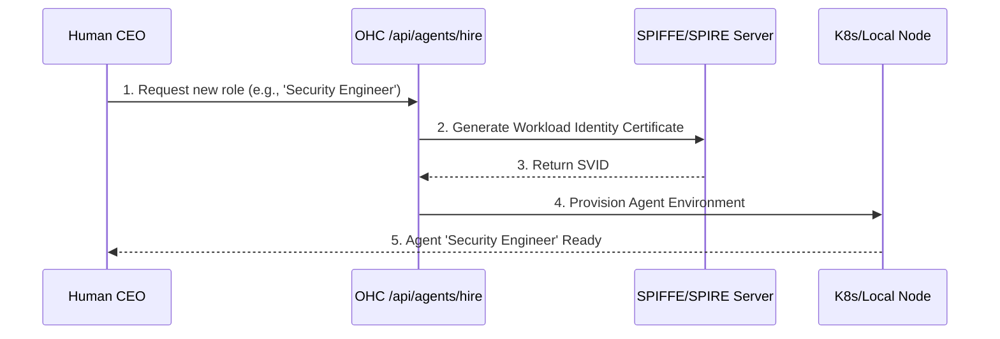

<div markdown="1" style="backdrop-filter: blur(20px) saturate(200%); font-family: 'Outfit', 'Inter', sans-serif; border: 1px solid rgba(255, 255, 255, 0.1); padding: 20px; border-radius: 12px; background: rgba(255, 255, 255, 0.05); color: #fff;">

# OHC Agent Onboarding & Lifecycle Walkthrough

This guide details the complete lifecycle of a new AI agent within the One Human Corp (OHC) ecosystem, covering the journey from instantiation to deployment, task execution, and long-term memory consolidation.

## 1. Agent Provisioning & Hiring

When a human CEO requires a new specialized skill set, they initiate the hiring process.



1. **Identity First**: Every agent is issued a unique SPIFFE Verifiable Identity Document (SVID). This "Zero Secrets" approach means there are no hardcoded API keys for internal microservices—authentication is handled transparently via mTLS.
2. **Environment**: Depending on the Hybrid Architecture mode:
   - *Cloud-Native*: A dedicated Kubernetes pod is spun up.
   - *Standalone Desktop*: A localized lightweight routine is initialized.

## 2. Capability Acquisition (MCP)

Agents are not inherently omniscient. They acquire capabilities using the Model Context Protocol (MCP).

- The `MCP_BUNDLE_DIR` contains dynamic tools (like GitHub access, Bash execution, or database querying).
- During onboarding, an agent reads its `AGENTS.md` and context parameters to bind the necessary MCP tools to its execution loop.

## 3. Joining the Teammate Mesh

Once alive, the agent must connect to the rest of the swarm.

```mermaid
graph LR
    Agent[New Agent] -->|Subscribe| TaskChan[mesh:tasks]
    Agent -->|Publish/Subscribe| CoordChan[mesh:coordination]
    Agent -->|Subscribe| Inbox[agent:{agent_id}]

    classDef premium fill:rgba(255,255,255,0.03),stroke:rgba(255,255,255,0.08),stroke-width:1px,color:#fff,backdrop-filter:blur(20px) saturate(200%);
    class Agent,TaskChan,CoordChan,Inbox premium;
```

- **`mesh:tasks`**: The global channel for task announcements.
- **`mesh:coordination`**: Used for cross-agent alignment and virtual meeting deliberation.
- **`agent:{agent_id}`**: The agent's direct inbox for explicit human overrides or private instructions.

## 4. Execution & Long-Term Memory (AutoDream)

Agents utilize a robust Think → Act → Observe → Decide master loop. After task completion, their ephemeral session data is captured.

1. The agent writes its findings to `.agent-task/memory/{timestamp}.yml`.
2. The **AutoDream Sync Engine** passively picks this up.
3. It condenses the session into vector embeddings (using Minimax or OpenAI).
4. These embeddings are stored in `autodream_memories` (or a local equivalent), making the agent's discoveries permanently available to the swarm via similarity search.

*To review the backend APIs orchestrating this flow, see the [API Playbook](../api/playbook.md).*

</div>
