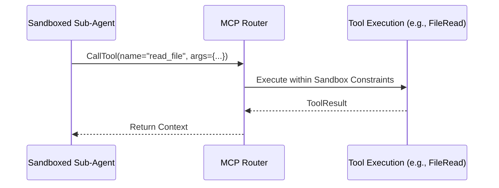

<div markdown="1" style="backdrop-filter: blur(20px) saturate(200%); font-family: 'Outfit', 'Inter', sans-serif; border: 1px solid rgba(255, 255, 255, 0.1); padding: 20px; border-radius: 12px; background: rgba(255, 255, 255, 0.05); color: #fff;">

# OHC Hybrid Agent Harness OS Sandboxing Walkthrough

Welcome to the Agent Harness OS Sandboxing walkthrough. This guide details the architecture and operational flow of the Hybrid Agent Harness, specifically focusing on process isolation, Model Context Protocol (MCP) integration, and the local memory directory fallback pattern.

## 1. OS-Level Execution Wrappers (`bwrap` & `sandbox-exec`)

To ensure Zero-Trust execution, the Hybrid Agent Harness natively wraps all sub-agent executions in an OS-level sandbox.

*   **Linux (Bubblewrap - `bwrap`)**: We enforce strict filesystem boundaries by allowing specific read paths (`allowRead`) and denying all writes (`denyWrite`) outside of the designated workspace.
*   **macOS (`sandbox-exec`)**: Similar strict profile enforcement for local development sandboxing.

```mermaid
graph TD;
    A[KAIROS Orchestrator] -->|Dispatch Task| B(Hybrid Agent Harness);
    B -->|Enforce read/write| C{OS Native Sandbox};
    C -->|Linux| D[bwrap namespace];
    C -->|macOS| E[sandbox-exec profile];
    D --> F[Sub-Agent Process];
    E --> F;

    classDef premium fill:rgba(255,255,255,0.03),stroke:rgba(255,255,255,0.08),stroke-width:1px,color:#fff,backdrop-filter:blur(20px) saturate(200%);
    class A,B,C,D,E,F premium;
```

## 2. Native MCP Tool Integration

The Hybrid Agent Harness natively implements the Model Context Protocol (MCP). This standardizes how external tools (e.g., file system access, terminal execution, and browser automation) are exposed to the isolated sub-agent.



## 3. Local Memory Directory Fallback

In Standalone Mode, where Cloud Postgres/Redis might be absent, the Agent Harness utilizes a Local Memory Directory (`memdir.ts` pattern) to safely persist context and session state.

*   A temporary directory is generated per session.
*   The Sandbox exclusively allows write access (`allowWrite`) to this scoped memory directory.
*   The AutoDream pipeline later consumes these `.yml` files for vectorization.

</div>
